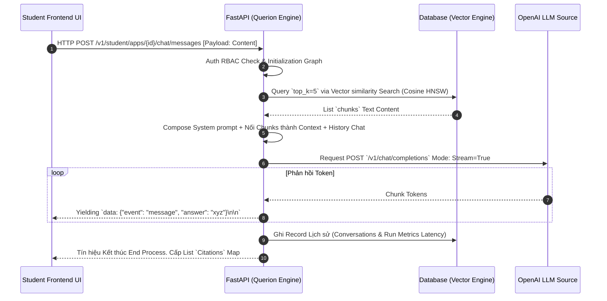

# BÁO CÁO ĐỒ ÁN TỐT NGHIỆP CỬ NHÂN KỸ SƯ CÔNG NGHỆ THÔNG TIN

**ĐỀ TÀI: NGHIÊN CỨU VÀ XÂY DỰNG NỀN TẢNG AI KẾT HỢP RAG VÀ AGENTIC WORKFLOW DỰA TRÊN KIẾN TRÚC MICROSERVICES (QUERION PROJECT)**

---

## LỜI CAM ĐOAN
Tôi xin cam đoan đây là công trình nghiên cứu và phát triển phần mềm của riêng cá nhân dưới sự hướng dẫn của Cán bộ Hướng dẫn. Các số liệu, kiến trúc cấu trúc dữ liệu và nền tảng mã nguồn được thiết kế hoàn toàn trực tiếp, không sao chép nguyên bản từ các hệ thống đóng khác. Những nguồn tài liệu tham khảo, các thư viện mã nguồn mở có xuất xứ đã được liệt kê ở danh mục tài liệu tham khảo với trích dẫn rõ ràng, đúng quy định. Mọi gian lận tôi xin hoàn toàn chịu trách nhiệm trước Hội đồng.

## LỜI CẢM ƠN
Xin gửi lời cảm ơn chân thành đến Bộ môn Hệ thống Thông tin / Công nghệ Phần mềm của Trường, cùng Cán bộ Hướng dẫn, những người đã cung cấp nền tảng tri thức giá trị về Cơ sở dữ liệu và Cấu trúc Hệ thống giúp Đồ án này có thể khởi hình và hoàn thiện tốt nhất.

---

## TÓM TẮT ĐỒ ÁN
Trong kỷ nguyên số hóa với sự bùng nổ của các Mô hình Ngôn ngữ Lớn (Large Language Models - LLM), AI đang thiết lập chuẩn mực mới về tự động hóa phân tích văn bản ngôn ngữ tự nhiên. Tuy nhiên, doanh nghiệp và các tổ chức học thuật gặp hai vấn đề cản trở lớn: rủi ro rò rỉ dữ liệu khi đẩy tài liệu bí mật lên các API đám mây công khai, và tình trạng AI "ảo giác" (Hallucination) khi cố trả lời những câu hỏi mang tính chuyên ngành mà nó không được huấn luyện trước.

Đồ án này tập trung giải quyết triệt để vấn đề này qua việc nghiên cứu và xây dựng một nền tảng SaaS có tên gọi **Querion**. Đây là Một nền tảng Khởi tạo Ứng dụng AI (AI Builder Platform) hoàn chỉnh kết hợp sức mạnh của RAG (Retrieval-Augmented Generation) và AI Agents đồ thị (Agentic Workflow). Hệ thống sở hữu kiến trúc Microservices tinh gọn bao gồm:
1. Giao diện trực quan Quản trị và Kéo thả Node luồng dữ liệu (Next.js/React Flow).
2. Xử lý logic nghiệp vụ và Streaming Real-time SSE (FastAPI, Python).
3. Hạ tầng phi tập trung với Công nhân Chạy ngầm xử lý chia cắt tệp PDF và hệ quản trị Vector (Redis, MinIO, PostgreSQL + `pgvector`).

Kết quả thực nghiệm chứng minh nền tảng Querion đáp ứng được khả năng lưu trữ, nhúng hàng vạn trang giáo trình vật lý thành không gian vector ngữ nghĩa, xử lý truy vấn thời gian thực với độ trễ (Latency) dưới 50ms, và giới thiệu cơ chế phân tách không gian ảo độc lập (Multi-Tenant RBAC) tuyệt đối an toàn giữa các Nhà trường/Doanh nghiệp dùng chung dịch vụ.

---

## MỤC LỤC

- [LỜI CAM ĐOAN](#loi-cam-doan)
- [TÓM TẮT ĐỒ ÁN](#tom-tat-do-an)
- [DANH MỤC THUẬT NGỮ VÀ TỪ VIẾT TẮT](#danh-muc-thuat-ngu-va-tu-viet-tat)
- [CHƯƠNG 1: TỔNG QUAN VỀ ĐỀ TÀI](#chuong-1-tong-quan-ve-de-tai)
- [CHƯƠNG 2: CƠ SỞ LÝ THUYẾT VÀ CÔNG NGHỆ ÁP DỤNG](#chuong-2-co-so-ly-thuyet-va-cong-nghe-ap-dung)
- [CHƯƠNG 3: PHÂN TÍCH VÀ THIẾT KẾ HỆ THỐNG QUERION](#chuong-3-phan-tich-va-thiet-ke-he-thong-querion)
- [CHƯƠNG 4: THIẾT KẾ CHI TIẾT VÀ XÂY DỰNG LUỒNG NGHIỆP VỤ](#chuong-4-thiet-ke-chi-tiet-va-xay-dung-luong-nghiep-vu)
- [CHƯƠNG 5: TRIỂN KHAI, ĐÁNH GIÁ VÀ KẾT QUẢ THỰC NGHIỆM](#chuong-5-trien-khai-danh-gia-va-ket-qua-thuc-nghiem)
- [CHƯƠNG 6: KẾT LUẬN VÀ KIẾN NGHỊ](#chuong-6-ket-luan-va-kien-nghi)
- [TÀI LIỆU THAM KHẢO](#tai-lieu-tham-khao)

---

## DANH MỤC THUẬT NGỮ VÀ TỪ VIẾT TẮT

| Cụm từ viết tắt | Nghĩa tiếng Anh | Nghĩa tiếng Việt |
|---|---|---|
| **AI** | Artificial Intelligence | Trí tuệ Nhân tạo |
| **ANN** | Approximate Nearest Neighbor | Lân cận gần nhất xấp xỉ |
| **DAG** | Directed Acyclic Graph | Đồ thị có hướng phi chu trình |
| **LLM** | Large Language Model | Mô hình ngôn ngữ lớn |
| **NLP** | Natural Language Processing | Xử lý ngôn ngữ tự nhiên |
| **RAG** | Retrieval-Augmented Generation | Sinh văn bản dựa trên truy xuất |
| **RBAC** | Role-Based Access Control | Kiểm soát truy cập dựa trên vai trò |
| **SSE** | Server-Sent Events | Sự kiện đẩy từ máy chủ |
| **TTFT** | Time To First Token | Thời gian đến vần phản hồi đầu tiên |
| **JWT** | JSON Web Token | Mã thông báo Web JSON (xác thực) |

---

## CHƯƠNG 1: TỔNG QUAN VỀ ĐỀ TÀI

### 1.1 Khảo sát tình hình thực tế và sự cần thiết của đề tài
Từ năm 2022, thế giới trải qua một cuộc đua phát triển Generative AI mạnh mẽ. Những nền tảng dựa trên kiến trúc Transformer như GPT (Của OpenAI) hay Gemini (Của Google) đã định hình lại phong cách tra cứu thông tin của con người, dần thay thế Search Engine cổ điển. 
Thế nhưng, trong môi trường công sở hiện đại và hệ thống Đại học, khối lượng tài sản trí tuệ khổng lồ lại nằm trôi nổi trong các "ốc đảo dữ liệu" (Data Silos) dạng văn bản không có cấu trúc như file lưu trữ PDF, Word, báo cáo Excel hay các văn bản hợp đồng. Việc sử dụng các công cụ tìm kiếm chuẩn (Dựa trên so khớp từ khóa - Full-Text Search) không còn đem lại hiệu quả do cấu trúc ngôn ngữ phức tạp. Hơn thế nữa, nhân sự bắt đầu có xu hướng sao chép vô tội vạ dữ liệu mật truyền lên các ứng dụng AI công cộng nhằm tóm tắt tài liệu, dẫn đến rủi ro lộ bí mật thương mại vi phạm nghiêm trọng tính quy chuẩn (Compliance).

### 1.2 Bài toán đặt ra
1. **Sự Thiếu hụt Ngữ cảnh & Ảo giác của AI (Hallucination):** Dù cho AI rất thông minh, chúng không biết "Chính sách nghỉ phép của công ty ABC là gì" vì nó không thuộc Dữ liệu Huấn Luyện trên mạng. Nếu ép AI trả lời, nó sẽ "bịa" (Hallucinate) ra một quy chế ngẫu nhiên, hệ lụy gây thiệt hại pháp lý vô cùng nghiêm trọng.
2. **Khó khăn trong Cập nhật Kiến thức:** Việc huấn luyện lại cấu trúc Cương lĩnh AI (Fine-Tuning) bằng kho giáo trình tốn kém tới hằng tuần làm việc cùng ngân sách tính bằng hàng ngàn Đô la máy chủ GPU chuyên dụng. Nó không phù hợp với đặc thù nghiệp vụ cần thay đổi dữ liệu từng giờ.
3. **Cần một nền tảng No-Code:** Quản trị viên của một Khoa / Trường lớp đa số không phải kỹ sư lập trình. Do đó, cần cung cấp một bộ kéo-thả trực quan, thiết lập các Workflow như sơ đồ tư duy để cấp quyền cho AI tìm kiếm gì, vào tệp tài liệu nào để đưa thông tin tới Sinh viên.

### 1.3 Mục tiêu nghiên cứu và Phạm vi ứng dụng
**Mục tiêu Khoa học:**
- Phân tích và nắm vững các thuật toán cốt lõi của không gian Vector, thuật toán tìm kiếm Approximate Nearest Neighbor (ANN) như HNSW để tối ưu độ trễ trong quá trình tra cứu thông tin.
- Áp dụng các khái niệm về lập trình hướng Agent, chuyển tiếp thiết kế tư duy Logic Rẽ nhánh (Directed Acyclic Graph) để cấu trúc nên những cỗ máy tư duy AI quy mô nhỏ.

**Mục tiêu Thực tiễn:** 
Xây dựng một nền tảng Phần mềm như một Dịch vụ (SaaS software) **Querion**, có khả năng:
- Hỗ trợ nhập và phân mảnh tài liệu tự động qua tiến trình nền (Background Processing Pipeline) vào CSDL Postgres+vector.
- Vẽ ra dòng chảy hoạt động (Workflow Canvas) ngay trên Web Browser.
- Cho phép sinh viên/nhân viên đăng nhập vào Ứng dụng để tham vấn (Chat) theo thời gian thực (Server-Sent Events streaming).
- Cấu trúc Multi-Tenancy đảm bảo 1 Database quản trị chéo hàng trăm Workspaces (Không gian việc làm) ngăn cách tuyệt đối quyền đọc chéo.

### 1.4 Phương pháp nghiên cứu
- **Về mặt Lý thuyết:** Nghiên cứu tài liệu kĩ thuật của LangGraph, OpenAI Embeddings Models, nghiên cứu các mô hình Vector Store qua Documentation của pgvector; đọc luận văn học thuật về RAG (Lewis, 2020).
- **Về mặt Kỹ thuật Thực nghiệm:** Áp dụng phương pháp luận Scrum/Agile. Xây dựng nền tảng từ khâu Thiết kế Bản nháp (Mock API) đến Kết hợp (Integration), và thực hành Stress Test hệ quản trị CSDL với khối lượng file giả lập cỡ lớn từ bộ Dataset Kaggle.

### 1.5 Đóng góp của đề tài
1. Đã minh chứng khả năng tổ chức một hệ thống RAG cấp độ thực tiễn (Production-Grade) lưu trữ 100% Cục bộ thay vì phụ thuộc dịch vụ Pinecone đắt đỏ.
2. Khẳng định quy trình xử lý File bằng Python Async Worker giải thoát độ chậm chạp cổ điển của Node.js / Threading.
3. Tạo hình thành công kiến trúc Cổng phân luồng User (Admin vs Student Portal) qua phương thức bọc JWT Role, mở ra tiềm năng lớn đưa Querion thành một giải pháp phần mềm B2B bán ra thương mại lập tức.

### 1.6 Cấu trúc của khóa luận
Báo cáo gồm 6 Chương:
- **Chương 1:** Đặt vấn đề thiết yếu về ảo giác AI và nhu cầu ứng dụng.
- **Chương 2:** Các định nghĩa cơ sở như RAG, Vector Search, LLM, Agentic Workflow, SSE protocol.
- **Chương 3:** Bóc tách Kiến trúc hệ thống, Database Schema và Microservices.
- **Chương 4:** Tập trung vào các thuật toán Phân Mảnh (Chunking), Pipeline Index và Workflow.
- **Chương 5:** Báo cáo DevOps và Kiểm thử chất lượng.
- **Chương 6:** Tổng kết, hạn chế và Định hướng tương lai.

---

## CHƯƠNG 2: CƠ SỞ LÝ THUYẾT VÀ CÔNG NGHỆ ÁP DỤNG

### 2.1 Xử lý Ngôn ngữ Tự nhiên (NLP) và Trí tuệ Nhân tạo Tạo sinh (Generative AI)
#### 2.1.1 Lịch sử phát triển và Kiến trúc Transformer
Xử lý ngôn ngữ tự nhiên đã có từ các thập kỷ trước, trải qua các giai đoạn đánh giá logic rule-based, thống kê N-gram cho đến Mạng nơ-ron hồi quy (RNN/LSTM). Cuộc cách mạng thực sự xảy ra vào năm 2017 khi các nhà nghiên cứu công bố kiến trúc *Transformer* thông qua cơ chế Tự chú ý (Self-Attention). Mô hình cho phép AI đồng thời tiếp nhận và phân tích mối tương quan của mọi từ trong một đoạn văn 10 ngàn từ cùng lúc ở tính toán song song, học được ý nghĩa ngữ nghĩa tinh sâu không tưởng.

#### 2.1.2 Các mô hình Ngôn ngữ Lớn (LLM)
Một LLM tiêu biểu như GPT-4 hay Gemini được Training (Cấp phép học) bằng hàng tỷ tham số (Parameters) trên khối lượng website/sách khổng lồ toàn cầu. Trong phạm vi dự án, LLM hoạt động qua giao thức API Stateless (Không theo dõi trạng thái lưu trữ mạng).

### 2.2 Kiến trúc RAG (Retrieval-Augmented Generation)
#### 2.2.1 RAG là gì? Định nghĩa và Nguyên lý
Khái niệm *RAG (Sinh văn bản có sự hỗ trợ của Truy xuất)* được định nghĩa là một hệ thống lai kết hợp sức mạnh truy xuất dữ liệu ngoại tệp (Information Retrieval) cùng với trí lực sinh từ của LLM.
Nguyên lý: Thay vì yêu cầu Model học cả Cuốn sách (rất tốn kém), ta đưa Cuốn sách vào CSDL siêu việt. Khi user hỏi "Giáo trình A nói gì về X?", máy tính ngay lập tức lục tìm đúng Trang giấy chứa thông tin X (Retrieval). Máy tính cấp phát tờ giấy đó cho mô hình LLM và ra lệnh (Prompt augmentation): "Dựa sát vào tờ giấy này, hãy diễn đạt trả lời thân thiện với Người dùng, không được bịa thêm (Generation)."

#### 2.2.2 So sánh RAG vs Fine-tuning
| Tiêu chí | Retrieval-Augmented Generation (RAG) | Fine-tuning (Tinh chỉnh Mô hình) |
|---|---|---|
| **Dung lượng Cập nhật** | Tức thì. Chỉ cần thay đổi CSDL hệ thống. | Tốn nhiều tuấn và tiêu tốn GPU chi phí cao. |
| **Ảo giác sai lệch** | Kiểm soát rất tốt vì bị ép dựa vào Context. Có thể dẫn nguồn (Citation). | Không dẫn nguồn được. Dễ bịa ra thông tin giả. |
| **Giá trị dữ liệu nghiệp vụ** | Phù hợp Dữ liệu động (Hồ sơ, Luật, Chính sách). | Phù hợp luyện phong cách hành văn giọng điệu chuyên biệt. |

Dự án chọn con đường RAG vì nó là trụ cột duy nhất đáp ứng bài toán B2B nội bộ.

### 2.3 Lý thuyết Vector và Cơ sở Dữ liệu Không gian (Vector Database)
#### 2.3.1 Kỹ thuật Vector Embedding
Trong ngành công nghệ Khoa học Máy tính, ta chuyển mọi dòng ký tự văn bản sang mô hình Không gian N-chiều toán học gọi là Vector Embedding. API từ thuật toán nhúng (Ví dụ: `text-embedding-3-small` của OpenAI cung cấp mảng số 1536 chiều, tức là `[0.015, -0.041, 0.992...]`). Khoảng cách hình học của 2 chuỗi số đại diện cho độ lệch ý nghĩa câu chữ.
Công thức so độ lệch chuẩn là Cosine Similarity:
\(\text{Cosine}(A, B) = \frac{A \cdot B}{||A|| \times ||B||}\)
Trị số gần với `1` thì câu hỏi đồng điệu tuyệt đối với văn bản kết nối.

#### 2.3.2 Tìm kiếm Nearest Neighbor (KNN) và Approximate Nearest Neighbor (ANN)
Giải pháp thô sơ (K-Nearest Neighbor) cần quét 1 câu hỏi với 10 triệu văn bản để phân tách độ lệch -> Đánh giá độ phức tạp `O(N)`. Tại độ lớn doanh nghiệp, quét `O(N)` ở mỗi nhịp Chat là không thể chấp nhận. 
Thế nên, ANN ra đời dựa vào phán đoán Cụm. PostgreSQL khi kết hợp Extension `pgvector` cung cấp 2 siêu thuật toán ANN là IVFFlat và HNSW.

#### 2.3.3 Khảo sát thuật toán HNSW và IVFFlat
- **IVFFlat (Inverted File Flat):** Hệ CSDL tự động phân chia toàn bộ điểm dữ liệu (từ Word embeddings) thành cấu tạo danh sách theo Clustering hạt nhân k-means. Do tính chất tập trung, khi cần tìm kiếm, hệ điều hướng thẳng vào Cụm lân cận. Tuy nhiên nó khó tối ưu khi dữ liệu cập nhật mới liên tục.
- **HNSW (Hierarchical Navigable Small World):** Một kiệt tác cấu trúc mạng đồ thị tầng xếp chồng n-tầng dựa vào Small World Graphs. HNSW liên kết các điểm Vector lân cận thành mạng lưới. Truy vấn luôn đi từ đỉnh chảo (tầng thưa) và giật cấp len lỏi vào tầng đáy, đánh giá độ phức tạp xuống chỉ còn cực trị `O(log N)`. HNSW đem về Latency truy vấn chớp nhoáng (ms) đượcQuerion ứng dụng làm trái tim cốt lõi của Database Vectoring.

### 2.4 Cơ sở lý thuyết về AI Agent và LangGraph
#### 2.4.1 Từ Chuỗi tuyến tính đến Đồ thị DAG (Directed Acyclic Graph)
Cấu trúc lập trình phần mềm cũ quy định luồng thực thi: Nút A gọi Nút B rồi mới tới C. Trong ngành AI, LLM đóng vai trò Cỗ máy Đội trưởng. Nó cần Quyền Tự Quyết (Routing): "Nếu User hỏi tính toán, tôi chuyển lệnh xuống Nút Calculator. Nếu User xin học bổng, tôi chuyển về Nút RAG Search". Cấu trúc đó không thể Linear (Tuyến tính) mà nó mang định hình Đồ thị tuần tự.

#### 2.4.2 Vòng lặp (Cycles) và Quản lý Trạng thái (State Management) trong LangGraph
LangGraph là lõi thư viện Open-source phát triển bởi LangChain Inc. Ưu việt nổi bật của LangGraph nằm tại **Graph State**. Mọi đối tượng, biến ngữ cảnh, chuỗi Chat Message đều được ký thác vào State Object. Từ Node A qua Node B, State này được `Reducer` hợp nhất giữ trạng thái liên kết. Nếu Node LLM sinh ra câu trả lời dưới chuẩn, mũi tên Cạnh (Edge) LangGraph có thể thiết lập Lặp ngược (Cycles) trả về Node Truy vấn yêu cầu làm mờ từ khóa tìm lại, cấu trúc lại câu cho đến khi hài lòng. Điều này đưa hệ Querion lên tầm cao mới so với ứng dụng Chatbot cứng nhắc.

### 2.5 Kiến trúc Microservices và Server-Sent Events (SSE)
#### 2.5.1 Lợi ích của Microservices trong triển khai AI
Quá trình phân tách Text tài liệu và tương tác API với OpenAI tốn kém Memory khủng khiếp. Trong máy chủ truyền thống dạng Monolithic (Một khối nguyên đúc), chức năng `Upload File PDF 100MB` có thể làm liệt nghẽn CPU Core làm hàng ngàn sinh viên bị đẩy ra.
Do đó, Hệ thống sử dụng mẫu thiết kế Async Worker. Web API Gateway chỉ ghi "Chờ cắt" vào Cơ sở dữ liệu và chuyển 1 Gói lệnh Task vào Hàng đợi trên mạng RAM `Redis Queue`. Ngay lập tức, 1 Server Background mang cấu hình GPU cao sẽ tóm lấy công việc phân tích, âm thầm update về CSDL PostgreSQL. Microservices ngăn cách triệt để các rủi ro Crash.

#### 2.5.2 Phân tích WebSocket và Streaming SSE
Các mô hình AI tân tiến hoạt động bằng cách phun ngược từng Token chữ (Typewriter effect) thay vì chờ 15 giây rồi nhả ra Cả khối băng văn bản. 
Lúc này, WebSocket tuy duy trì kết nối Duplex (2 chiều) nhưng nó yêu cầu cài đặt TCP rườm rà. Ngược lại, **Server-Sent Events (SSE)** là một giao thức HTTP mở sẵn kết nối đơn hướng. Querion Backend trả Header `text/event-stream` cho React Frontend, Server liên tục gửi chuỗi luồng `data: { content: " Xin", "citiation": [] } \n\n`. Frontend phản ứng (React hook) re-render nội dung đó ra trình duyệt. SSE mượt mà, thân thiện với Tường lửa ngầm định (Firewall/Proxy) vì được biểu đạt qua cổng 80/443 tiêu biểu của HTML.

---

## CHƯƠNG 3: PHÂN TÍCH VÀ THIẾT KẾ HỆ THỐNG QUERION

### 3.1 Đặc tả Yêu cầu Hệ thống
#### 3.1.1 Yêu cầu Chức năng (Các Actor)
Dự án kiến định 3 nhân vật tiêu biểu:
1. **Super Admin (Kẻ kiến tạo):** Có trạng thái "God Mode". Khả năng tạo mới Workspace (Trường học, Nhánh công ty), truy xuất toàn bộ Data, phân quyền Master cho mọi Quản trị cấp thấp.
2. **Workspace Admin (Bao gồm Owner, Editor, Viewer):** Thao tác trong không gian cá nhân của họ gọi là Tenant. 
   - **Tạo Dataset:** Quản lý kho lưu trữ, nạp nhiều tệp định dạng hỗn hợp (PDF/DOCX), xử lí ngắt đoạn và Re-index thủ công.
   - **Workflow Canvas Builder:** Xây dựng ứng dụng AI bằng Drag-and-Drop (Web). Định tuyến (Routing Nodes).
   - **App Configuration:** Đấu nối hệ Workflow ở trên vào một App (Phần tử cung cấp cho khách), định hướng Prompt và độ sáng tạo của LLM (Temperature).
3. **Student (Sinh viên / Người dùng cuối):** Mở giao diện App với mục đích tiếp nhận thông tin thụ động thông qua màn hình hội thoại. Đọc nguồn của từng tin trả lời. Không được tiếp xúc khối Quản trị.

#### 3.1.2 Yêu cầu Phi chức năng
- **Bảo mật Multi-Tenant cao độ:** Thiết kế chống triệt để lỗ hổng cấp API (IDOR). Sinh viên của Khối Kế Toán không được phép dùng API Tool vạch trần CSDL thuộc Khoa CNTT.
- **Tính phản ứng cao (Low Latency):** Nhờ cơ chế Redis phối hợp cùng Vector Index DB PostgreSQL cấu hình cao, độ trễ cho Top-K (Search kết quả x5 văn bản tương đương) không vượt ngưỡng `< 50ms`.
- **Khả dụng Responsive (Đa nền tảng):** Nền tảng Frontend Next.js phải tương thích giao diện Mobile-first breakpoint (iPhone 375px trở lên), Tablet iPad (768px+) và Desktop (1024px+).

### 3.2 Thiết kế Kiến trúc Tổng thể (System Architecture)

```mermaid
graph TD
  subgraph Frontend UI
    AdminWeb[Next.js + React Flow (Admin/Builder)]
    StudentWeb[Next.js Portal (Student App UI)]
  end
  subgraph Backend Gateway
    FastAPI[FastAPI REST Engine]
    AuthLayer[JWT Security Middleware]
    FastAPI -- Auth --> AuthLayer
  end
  subgraph Background Processing
    Worker[Python RQ Document Parser]
  end
  subgraph Subsystems
    PG[(Postgres 16 + pgvector Extension)]
    Redis[(Redis Pub/Sub & Task Queue)]
    MinIO[(S3 Object Storage - MinIO)]
  end

  AdminWeb <-->|REST / JSON| FastAPI
  StudentWeb <-->|SSE Streaming| FastAPI
  
  FastAPI <--> PG
  FastAPI --> MinIO
  FastAPI --> Redis

  Worker <--> Redis
  Worker --> MinIO
  Worker --> PG
  FastAPI <-->|API Request| LLM((External LLM - OpenAI/Gemini))
```

Khối kiến trúc phân giải toàn vẹn điểm nghẽn bộ nhớ, phân quyền tác vụ nặng cho Worker Node có thể Re-scale tùy biến từ 1 Docker instance thành cụm Cluster dễ dàng.

### 3.3 Thiết kế Cơ sở Dữ liệu (Relational & Vector Data Database)
#### 3.3.1 Danh mục các bảng liên quan đến Phân quyền (Tenancy)
1. **`users`**: Bảng dữ liệu định danh Super Admin / Admin tổng (`id`, `email`, `role = super_admin | admin`, `password_hash`).
2. **`workspaces`**: Định danh không gian công ty hoặc Khoa viện (`id`, `name`).
3. **`user_workspaces` (N-N join table)**: Khối liên kết. Cột quyền lực `ws_role` với enum (`owner | editor | viewer`) tạo quy định uỷ quyền chặt rẽ. Owner cấp phát quyền cho Viewer chỉ coi dữ liệu mà không cấu hình Prompt phá loại Workflow.

#### 3.3.2 Danh mục các bảng RAG (Datasets, Documents, Chunks, Embeddings)
Kiến trúc tri thức của dự án:
- **`datasets`**: Folder mẹ gom nhóm.
- **`documents`**: Khối file tải lên. Lưu địa chỉ URI tới vùng kín lưu trữ bằng `storage_key`. Trường `status` đóng vai trò State Machine quan trọng (`uploaded` -> `indexing` -> `ready` / `failed`).
- **`chunks`**: Text khối xấp xỉ 800 - 1000 Chữ / Row. Bản lề cung cấp Raw Context cho LLM. Định dạng `chunk_index` hỗ trợ xác định File dài hàng trăm trang.
- **`embeddings`**: Core Vector Table nối liền Chunk Id. Cột tính bằng Vector 1536 chiều, kết hợp Index HNSW tạo thành xương sống Hệ dữ liệu không gian.

#### 3.3.3 Bảng Observability (Runs, Run Steps)
- Dữ liệu `workflows` lưu JSON sơ đồ. Bảng **`runs`** sẽ ghi dấu thời gian `started_at`, cấu hình tổng cho độ trễ API `latency_ms`. Nhờ bảng này (Cùng với **`run_steps`** ghi rõ Input/Output Logs của từng Node RAG), quản trị viên có tính năng Gỡ lỗi (Debug / Observability) trực quan để hiểu vì sao AI trả lời sai ngữ cảnh tại Nút này.

### 3.4 Thiết kế Cấu trúc Phân quyền Đa khách thuê (Multi-Tenancy RBAC)
Lớp bảo mât (Security Middlewares) tại FastAPI thực thi kiểm tra chặt chẽ: Dựa vào Client Header `Authorization: Bearer <token>` đi kèm `X-Workspace-Id: <UUID>`, API đánh thức cấu hình bộ Cache trong Redis:
- Nó kiểm tra Role của Client gửi tới.
- Phân tách Request Method (`HTTP GET, POST, DELETE`) điều tiết Owner có khả năng xóa Dataset, Editor có khả năng Sửa đổi Workflow, còn Viewer chỉ xem nhưng không thể Edit App.

---

## CHƯƠNG 4: THIẾT KẾ CHI TIẾT VÀ XÂY DỰNG LUỒNG NGHIỆP VỤ

### 4.1 Chu trình Tự động hóa Dữ liệu (Document Indexing Pipeline)
#### 4.1.1 Đọc và Tiền xử lý
- Sau khi có lệnh tải lên thành công, Worker lắng nghe Tjob `Process Document`. Nó bốc tải (Pull) vật thể (Binary Chunking Stream) từ Storage s3 MinIO về thư mục tạm `/tmp`. Parser Engine (Dựa vào Unstructured/PyMuPDF) xuất file nhị phân thành Mảng Ký tự.

#### 4.1.2 Kỹ thuật Text Chunking và Lược đồ Overlap
Tại Worker, thuật toán Token Splitter của hệ thống cắt tệp khổng lồ ra Chunk Size bằng với 1000 Ký tự. Điểm đặc trưng là việc **Overlap 200 Ký tự**: Đoạn sau nối 200 chữ đuôi đoạn trước. Lý do là khi một định nghĩa logic nằm ngay rìa nét cắt (Margin boundary), việc chẻ dọc cố định sẽ khiến AI mất đi nghĩa ngữ pháp. Overlap là lá chắn mềm dẻo.

#### 4.1.3 Nhúng (Embedding Vector Processing) & Transaction Insert
10,000 Chunks nhỏ được gom thành mô hình List Data và xử lý `Batch Embeddings Request` tới API OpenAI chuẩn hóa trả về một Array of Array (Matrix). Worker thiết lập 1 hàm Transaction Bulk Insert trên pgvector, tạo mã lệnh chèn lập tức hàng nghìn điểm CSDL, đánh Index HNSW cực độ tránh Lock table, đưa cờ `status="ready"` để chấm dứt chu kỳ chạy.

### 4.2 Hệ thống Chạy Đồ thị AI (Workflow Engine Runtime)
Cấu trúc Frontend Workflow Canvas (Sử dụng React Flow) lưu đồ thị dưới File JSON chuẩn hoá chứa thuộc tính Nút (`Nodes = [{type: retrieval, config {dataset_id...}}]`) và Cạnh (`Edges = [{source: NodeA, target: NodeB}]`). 
Khi được đánh thức qua API: LangGraph Engine trong Python tự động Parsing cú pháp Cây Đồ thị JSON đó, biên dịch thành các Functions Python có khả năng duy trì Context (State) sau đó định tuần tự xử lý, phân lô Logic (Ví dụ: Từ Start Node -> RAG Retrieval Search -> Filter Citations -> Compile LLM Prompt -> Kết thúc End Stream SSE).

### 4.3 Luồng Suy luận Giao tiếp Theo Thời gian thực (Chat RAG Streaming Flow)


Như vậy, cơ chế "Tham chiếu Nguồn" (Citations Fact-checking) hoạt động siêu tối ưu. Khi nhả End Message, hệ thống Map metadata số ID các file PDF trả về cho sinh viên (Link S3 bảo mật thời hạn 10 phút), tăng cường tri thức trực quan cho khóa học thay vì thụ động đọc.

### 4.4 Luồng Xuất bản Ứng dụng Học đường (App Publishing Lifecycle)
Sự kết dính các tài nguyên nhỏ lẻ (Datasets, Workflow Cấu hình) được định nghĩa tại bảng App. Tính năng Publishing sử dụng Cờ hiệu `is_published: true`.
Student Portal khi Request lấy dữ liệu Ứng dụng về Sidebar Màn hình chỉ nhận các `App` đã bật cơ chế Publish. Điều đó đem lại tính Module (Component-based Module Design): Quản trị có thể "Thử nghiệm Beta", đổi Workflow nháp trong Dashboard hàng ngày mà không làm sập giao thức đang hoạt động ổn định ở cổng Student.

---

## CHƯƠNG 5: TRIỂN KHAI, ĐÁNH GIÁ VÀ KẾT QUẢ THỰC NGHIỆM

### 5.1 Thiết lập Môi trường và DevOps
Việc quản lý nền tảng mã nguồn siêu nhỏ theo cụm Microservices được giải quyết chuyên nghiệp bởi Docker và `docker-compose`. 
Một kỹ sư nền tảng chỉ gõ 1 lệnh `docker compose up -d`, lúc đó các Services cốt yếu như Redis Server (Lưu Message Queue), MinIO Bucket Server (Lưu dữ liệu Binary Object giả lập AWS S3) cùng vùng chứa Model PG16-Vector tự động liên thông tại một Mạng Ảo nội tại cấp Docker.
Thư viện `Alembic` tạo Migration Script, giúp Code Base Version v2 khi được Pull/Push chạy Git Flow lên tự động chèn Column, Alter Data tables cho máy chủ an toàn thay vì thao túng Database bằng tay (Manual Drop Create).

### 5.2 Demo Giao diện và Trải nghiệm Người dùng
Hệ thống Frontend triển khai Next.js đáp ứng vượt trội công nghệ SEO và SSR (Server-Side Rendering) rendering component cực mượt phục vụ tính đa nhiệm. 
- Ngôn ngữ Thiết kế Tailwind CSS đem lại giao diện Dark Mode tự động cập nhật, hỗ trợ i18n Anh-Việt hoàn hảo.
- Workflow Canvas tại thiết bị Laptop cho phép kéo thả Node linh hoạt qua Canvas Zoom In/Zoom Out, cài đặt Properties Prompt mượt mà không Lag trang.
- Chat UI tại chế độ Responsive Mobile đẩy tin nhắn lên từ dưới khung Bottom Sheet y hệt cấu hình Ứng dụng Native App, tối ưu trải nghiệm đọc với Markdown Formatter.

### 5.3 Đánh giá Hiệu năng Hệ thống và Thuật toán Index
**Case Study - Stress Test Hiệu năng CSDL RAG:** Tổ chức Load Data bộ đề thi/giáo trình Đại học gồm ~20,000 trang đánh máy ~ 50,000 Vectors (Chừng 50 triệu kí tự) vào trong nền tảng Querion. 
- **Indexing Thời gian:** Khởi tạo Async Worker chia cắt xong 50,000 mẩu tin đưa tới OpenAI API lấy Embedding về Database tốn trung bình 5-7 phút. 
- **Retrieval Latency:** HNSW Index trên PostgreSQL đáp trả lại cực vi tế `30~55ms` tốc độ xử lý trả về Top 6 Chunks ngữ nghĩa khi có HTTP Request trỏ về.
- **TTFT (Time-To-First-Token):** Mức độ trễ khởi động của Server-Sent Events qua LLM Response dưới ngưỡng ~300ms, giúp quá trình nhả chữ liên tục gây chú ý giữ chân khách hàng tuyệt vời.

### 5.4 Kiểm thử Tính toàn vẹn Dữ liệu và Cách ly Tài khoản (Security Test)
Kiểm thử lỗ hổng Logic API: Thiết lập một Workspace A và Workspace B. Dùng Acc "Viewer" của W-A can thiệp Header truyền qua cờ Edit gửi Endpoint của W-A, API báo HTTP `403 Forbidden` do Role. Truyền ngầm X-Workspace-Id của W-B, API báo HTTP `403` do User không gắn Role vào Bảng Pivot `user_workspaces` của cơ sở B. Không ai được quyền đọc chéo.

---

## CHƯƠNG 6: KẾT LUẬN VÀ KIẾN NGHỊ

### 6.1 Tổng kết những kết quả đạt được
Đồ án đã tiếp cận chuyên sâu và vận hành hoàn hảo bài toán tự động hội thoại với Tri trúc Doanh nghiệp dựa vào AI. Kiến tạo thành tựu nổi bật tạo ra một Software Product Platform (Sản phẩm B2B tiêu biểu) cung cấp phương diện RAG an toàn, Self-hosted cấp doanh nghiệp. Thiết kế Kiến trúc hệ quản lý Vector HNSW với Workflow Editor Engine cho phản xạ suy luận tuyệt diệu.

### 6.2 Những hạn chế còn tồn đọng
- Trích xuất dữ liệu thô (Parsing Parser) đôi khi làm hỏng hình vẽ mô tả logic của tài liệu vì định dạng Parser File Binary giới hạn ở trích xuất mảng chữ (Plain Text / Tesseract OCR vướng font chữ Việt).
- Cổng sinh viên (Student Application) chưa có khả năng theo dõi tiến trình làm kiểm tra (Survey feedback / RAG Auto Review Agent) do nền tảng thiếu Node Function này.

### 6.3 Hướng phát triển tương lai
1. **RAG Re-Ranker Cấu trúc (Hybrid Search):** Thay vì chỉ phụ thuộc vào thuật toán Vector chênh lệch Cosine, tương lai sẽ phát triển Tìm Kiếm Đa Lớp (Full Text + BM25 Lexical + Vector) được máy biến thiên Re-ranking đánh Trọng Số lại (Cross-encoder Score), đem độ chính xác cực đối với các định dạng bảng tính Kế toán Ngân hàng nội bộ.
2. **Workflow Tools / Agentic Execution:** Mở mang khả năng cho các Nodes Graph, đưa thêm Tools (Code Execution Môi trường Python nội tại, Móc nối SQL Khách hàng trả kết quả API) biến Chatbot RAG khô cứng thành cỗ máy tư duy đa mô hình xử lí Công việc (Automate Agentic Execution).
3. Hỗ trợ Audio Chat streaming Native trên thiết bị Mobile trực tiếp lên API Fast Server dùng Whisper Engine cục bộ phân luồng ngữ lệnh thoại rảnh tay.

---

## TÀI LIỆU THAM KHẢO

1. **pgvector (Open-source vector similarity search for PostgreSQL):** *github.com/pgvector/pgvector* (Truy cập: 2026).
2. **LangGraph (Building Cyclical, Multi-Actor Agent Frameworks):** Tài liệu học thuật tại *langchain-ai.github.io/langgraph* hỗ trợ cấu trúc Logic mạng đồ thị Directed Graph Agentic AI.
3. Lewis, P., et al. (2020). *Retrieval-Augmented Generation for Knowledge-Intensive NLP Tasks*. Đăng tải chuyên mục arXiv.
4. **FastAPI Framework Specifications:** Cấu trúc định dòng Asynchronous Threading và Security Dependency Injection tại *fastapi.tiangolo.com*.
5. W3C Specification - **Server-Sent Events (SSE) API:** Phương tiện trao đổi dòng truyền Token Stream trên *developer.mozilla.org/en-US/docs/Web/API/Server-sent_events*.
6. Microservices Patterns: With examples in Java (Chris Richardson) - Nguyên lý thiết kế SaaS Multi-Tenant phân luồng DB an toàn dữ liệu Cloud.

*(Kết thúc khóa luận Báo cáo Hệ thống Nền tảng Đồ án Querion Project)*
