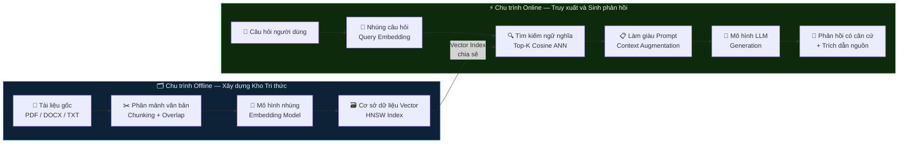
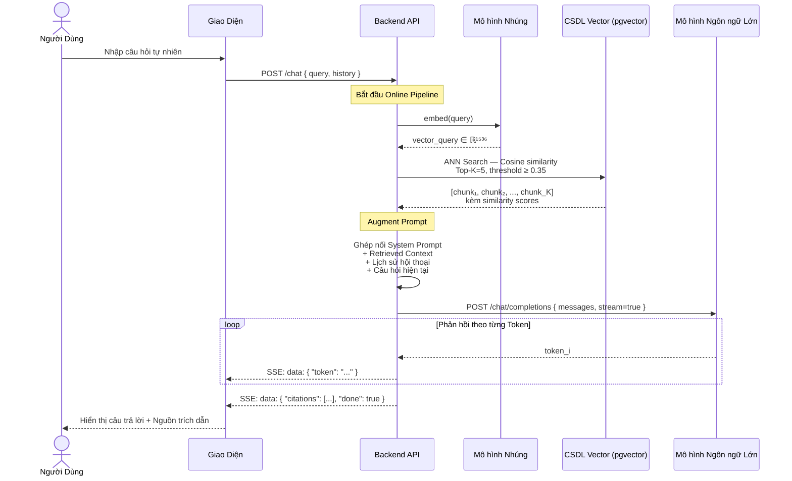
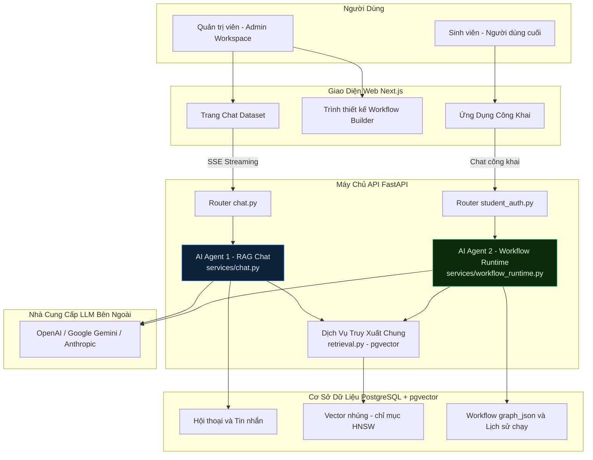
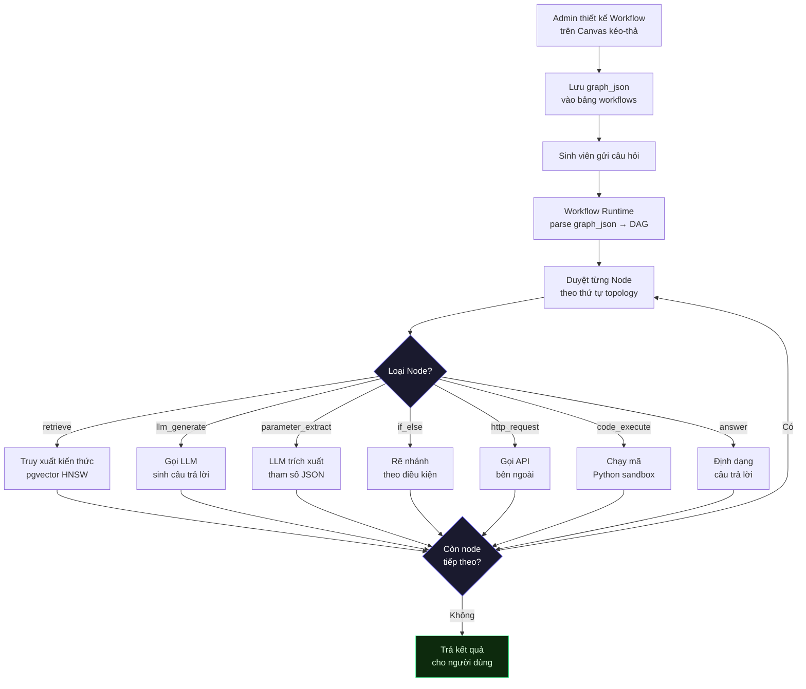
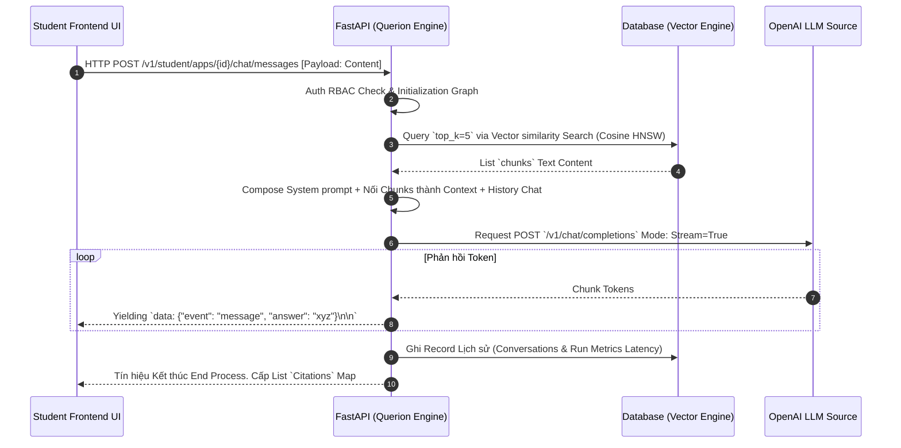

# BÁO CÁO ĐỒ ÁN TỐT NGHIỆP CỬ NHÂN KỸ SƯ CÔNG NGHỆ THÔNG TIN

**ĐỀ TÀI: NGHIÊN CỨU VÀ XÂY DỰNG NỀN TẢNG AI KẾT HỢP RAG VÀ AGENTIC WORKFLOW DỰA TRÊN KIẾN TRÚC MICROSERVICES (QUERION PROJECT)**

---

## LỜI CAM ĐOAN
Tôi xin cam đoan đây là công trình nghiên cứu và phát triển phần mềm của riêng cá nhân dưới sự hướng dẫn của Cán bộ Hướng dẫn. Các số liệu, kiến trúc cấu trúc dữ liệu và nền tảng mã nguồn được thiết kế hoàn toàn trực tiếp, không sao chép nguyên bản từ các hệ thống đóng khác. Những nguồn tài liệu tham khảo, các thư viện mã nguồn mở có xuất xứ đã được liệt kê ở danh mục tài liệu tham khảo với trích dẫn rõ ràng, đúng quy định. Mọi gian lận tôi xin hoàn toàn chịu trách nhiệm trước Hội đồng.

## LỜI CẢM ƠN
Xin gửi lời cảm ơn chân thành đến Bộ môn Hệ thống Thông tin / Công nghệ Phần mềm của Trường, cùng Cán bộ Hướng dẫn, những người đã cung cấp nền tảng tri thức giá trị về Cơ sở dữ liệu và Cấu trúc Hệ thống giúp Đồ án này có thể khởi hình và hoàn thiện tốt nhất.

---

## TÓM TẮT ĐỒ ÁN
Trong kỷ nguyên số hóa với sự bùng nổ của các Mô hình Ngôn ngữ Lớn (Large Language Models - LLM), AI đang thiết lập chuẩn mực mới về tự động hóa phân tích văn bản ngôn ngữ tự nhiên. Tuy nhiên, doanh nghiệp và các tổ chức học thuật gặp hai vấn đề cản trở lớn: rủi ro rò rỉ dữ liệu khi đẩy tài liệu bí mật lên các API đám mây công khai, và tình trạng AI "ảo giác" (Hallucination) khi cố trả lời những câu hỏi mang tính chuyên ngành mà nó không được huấn luyện trước.

Đồ án này tập trung giải quyết triệt để vấn đề này qua việc nghiên cứu và xây dựng một nền tảng SaaS có tên gọi **Querion**. Đây là Một nền tảng Khởi tạo Ứng dụng AI (AI Builder Platform) hoàn chỉnh kết hợp sức mạnh của RAG (Retrieval-Augmented Generation) và AI Agents đồ thị (Agentic Workflow). Hệ thống sở hữu kiến trúc Microservices tinh gọn bao gồm:
1. Giao diện trực quan Quản trị và Kéo thả Node luồng dữ liệu (Next.js/React Flow).
2. Xử lý logic nghiệp vụ và Streaming Real-time SSE (FastAPI, Python).
3. Hạ tầng phi tập trung với Công nhân Chạy ngầm xử lý chia cắt tệp PDF và hệ quản trị Vector (Redis, MinIO, PostgreSQL + `pgvector`).

Kết quả thực nghiệm chứng minh nền tảng Querion đáp ứng được khả năng lưu trữ, nhúng hàng vạn trang giáo trình vật lý thành không gian vector ngữ nghĩa, xử lý truy vấn thời gian thực với độ trễ (Latency) dưới 50ms, và giới thiệu cơ chế phân tách không gian ảo độc lập (Multi-Tenant RBAC) tuyệt đối an toàn giữa các Nhà trường/Doanh nghiệp dùng chung dịch vụ.

---

## MỤC LỤC

- [LỜI CAM ĐOAN](#loi-cam-doan)
- [TÓM TẮT ĐỒ ÁN](#tom-tat-do-an)
- [DANH MỤC THUẬT NGỮ VÀ TỪ VIẾT TẮT](#danh-muc-thuat-ngu-va-tu-viet-tat)
- [CHƯƠNG 1: TỔNG QUAN VỀ ĐỀ TÀI](#chuong-1-tong-quan-ve-de-tai)
- [CHƯƠNG 2: CƠ SỞ LÝ THUYẾT VÀ CÔNG NGHỆ ÁP DỤNG](#chuong-2-co-so-ly-thuyet-va-cong-nghe-ap-dung)
- [CHƯƠNG 3: PHÂN TÍCH VÀ THIẾT KẾ HỆ THỐNG QUERION](#chuong-3-phan-tich-va-thiet-ke-he-thong-querion)
- [CHƯƠNG 4: THIẾT KẾ CHI TIẾT VÀ XÂY DỰNG LUỒNG NGHIỆP VỤ](#chuong-4-thiet-ke-chi-tiet-va-xay-dung-luong-nghiep-vu)
- [CHƯƠNG 5: TRIỂN KHAI, ĐÁNH GIÁ VÀ KẾT QUẢ THỰC NGHIỆM](#chuong-5-trien-khai-danh-gia-va-ket-qua-thuc-nghiem)
- [CHƯƠNG 6: KẾT LUẬN VÀ KIẾN NGHỊ](#chuong-6-ket-luan-va-kien-nghi)
- [TÀI LIỆU THAM KHẢO](#tai-lieu-tham-khao)

---

## DANH MỤC THUẬT NGỮ VÀ TỪ VIẾT TẮT

| Cụm từ viết tắt | Nghĩa tiếng Anh | Nghĩa tiếng Việt |
|---|---|---|
| **AI** | Artificial Intelligence | Trí tuệ Nhân tạo |
| **ANN** | Approximate Nearest Neighbor | Lân cận gần nhất xấp xỉ |
| **DAG** | Directed Acyclic Graph | Đồ thị có hướng phi chu trình |
| **LLM** | Large Language Model | Mô hình ngôn ngữ lớn |
| **NLP** | Natural Language Processing | Xử lý ngôn ngữ tự nhiên |
| **RAG** | Retrieval-Augmented Generation | Sinh văn bản dựa trên truy xuất |
| **RBAC** | Role-Based Access Control | Kiểm soát truy cập dựa trên vai trò |
| **SSE** | Server-Sent Events | Sự kiện đẩy từ máy chủ |
| **TTFT** | Time To First Token | Thời gian đến vần phản hồi đầu tiên |
| **JWT** | JSON Web Token | Mã thông báo Web JSON (xác thực) |

---

## CHƯƠNG 1: TỔNG QUAN VỀ ĐỀ TÀI

### 1.1 Khảo sát tình hình thực tế và sự cần thiết của đề tài
Từ năm 2022, thế giới trải qua một cuộc đua phát triển Generative AI mạnh mẽ. Những nền tảng dựa trên kiến trúc Transformer như GPT (Của OpenAI) hay Gemini (Của Google) đã định hình lại phong cách tra cứu thông tin của con người, dần thay thế Search Engine cổ điển. 
Thế nhưng, trong môi trường công sở hiện đại và hệ thống Đại học, khối lượng tài sản trí tuệ khổng lồ lại nằm trôi nổi trong các "ốc đảo dữ liệu" (Data Silos) dạng văn bản không có cấu trúc như file lưu trữ PDF, Word, báo cáo Excel hay các văn bản hợp đồng. Việc sử dụng các công cụ tìm kiếm chuẩn (Dựa trên so khớp từ khóa - Full-Text Search) không còn đem lại hiệu quả do cấu trúc ngôn ngữ phức tạp. Hơn thế nữa, nhân sự bắt đầu có xu hướng sao chép vô tội vạ dữ liệu mật truyền lên các ứng dụng AI công cộng nhằm tóm tắt tài liệu, dẫn đến rủi ro lộ bí mật thương mại vi phạm nghiêm trọng tính quy chuẩn (Compliance).

### 1.2 Bài toán đặt ra
1. **Sự Thiếu hụt Ngữ cảnh & Ảo giác của AI (Hallucination):** Dù cho AI rất thông minh, chúng không biết "Chính sách nghỉ phép của công ty ABC là gì" vì nó không thuộc Dữ liệu Huấn Luyện trên mạng. Nếu ép AI trả lời, nó sẽ "bịa" (Hallucinate) ra một quy chế ngẫu nhiên, hệ lụy gây thiệt hại pháp lý vô cùng nghiêm trọng.
2. **Khó khăn trong Cập nhật Kiến thức:** Việc huấn luyện lại cấu trúc Cương lĩnh AI (Fine-Tuning) bằng kho giáo trình tốn kém tới hằng tuần làm việc cùng ngân sách tính bằng hàng ngàn Đô la máy chủ GPU chuyên dụng. Nó không phù hợp với đặc thù nghiệp vụ cần thay đổi dữ liệu từng giờ.
3. **Cần một nền tảng No-Code:** Quản trị viên của một Khoa / Trường lớp đa số không phải kỹ sư lập trình. Do đó, cần cung cấp một bộ kéo-thả trực quan, thiết lập các Workflow như sơ đồ tư duy để cấp quyền cho AI tìm kiếm gì, vào tệp tài liệu nào để đưa thông tin tới Sinh viên.

### 1.3 Mục tiêu nghiên cứu và Phạm vi ứng dụng
**Mục tiêu Khoa học:**
- Phân tích và nắm vững các thuật toán cốt lõi của không gian Vector, thuật toán tìm kiếm Approximate Nearest Neighbor (ANN) như HNSW để tối ưu độ trễ trong quá trình tra cứu thông tin.
- Áp dụng các khái niệm về lập trình hướng Agent, chuyển tiếp thiết kế tư duy Logic Rẽ nhánh (Directed Acyclic Graph) để cấu trúc nên những cỗ máy tư duy AI quy mô nhỏ.

**Mục tiêu Thực tiễn:** 
Xây dựng một nền tảng Phần mềm như một Dịch vụ (SaaS software) **Querion**, có khả năng:
- Hỗ trợ nhập và phân mảnh tài liệu tự động qua tiến trình nền (Background Processing Pipeline) vào CSDL Postgres+vector.
- Vẽ ra dòng chảy hoạt động (Workflow Canvas) ngay trên Web Browser.
- Cho phép sinh viên/nhân viên đăng nhập vào Ứng dụng để tham vấn (Chat) theo thời gian thực.

### 1.4 Cơ sở Lý thuyết về RAG (Retrieval-Augmented Generation)

#### 1.4.1 Định nghĩa và Động cơ Ra đời

**Retrieval-Augmented Generation (RAG)** — hay *Sinh văn bản có Hỗ trợ Truy xuất* — là một kiến trúc lai (hybrid architecture) kết hợp hai hệ thống có bản chất khác biệt: hệ thống **Truy xuất Thông tin** (Information Retrieval — IR) và **Mô hình Ngôn ngữ Lớn** (Large Language Model — LLM). Khái niệm này lần đầu được hệ thống hóa trong công trình nghiên cứu của Lewis et al. (2020) công bố trên arXiv với tên gọi *"Retrieval-Augmented Generation for Knowledge-Intensive NLP Tasks"*, sau đó trở thành nền tảng thiết yếu cho các hệ thống AI doanh nghiệp thế hệ mới.

Động cơ ra đời của RAG xuất phát từ hai giới hạn cơ bản của LLM độc lập (*standalone LLM*):

1. **Giới hạn về ngưỡng tri thức (Knowledge Cutoff):** Mọi LLM đều bị ràng buộc bởi thời điểm kết thúc tập dữ liệu huấn luyện. Sau ngưỡng đó, mô hình hoàn toàn mù quáng trước mọi tri thức mới — chính sách nội bộ, văn bản pháp lý cập nhật, hay dữ liệu nghiệp vụ động theo từng học kỳ.

2. **Hiện tượng Ảo giác (Hallucination):** Khi LLM được hỏi về thông tin nằm ngoài tập huấn luyện, cơ chế xác suất của mô hình vẫn sinh ra văn bản trôi chảy nhưng sai lệch về mặt nội dung — một đặc tính cấu trúc nguy hiểm trong các lĩnh vực đòi hỏi độ chính xác tuyệt đối như y tế, pháp lý, hay hành chính học vụ.

RAG giải quyết triệt để cả hai giới hạn trên bằng nguyên lý cốt lõi: **"Tra cứu trước, Sinh sau"** (*Retrieve First, Generate Second*). Thay vì dựa vào bộ nhớ tham số cố định của LLM, hệ thống truy xuất đúng đoạn tri thức liên quan từ kho dữ liệu sống (*live knowledge base*), đặt vào ngữ cảnh của câu hỏi (*context window*), rồi mới kích hoạt LLM sinh câu trả lời dựa trên ngữ cảnh đó.

#### 1.4.2 Kiến trúc và Quy trình Hoạt động của Hệ thống RAG

Một hệ thống RAG hoàn chỉnh được phân giải thành hai chu trình vận hành độc lập về mặt thời gian thực thi, nhưng kết nối chặt chẽ qua kho lưu trữ vector chung:

---

**Chu trình 1 — Xây dựng Kho Tri thức (Offline Indexing Pipeline)**

Chu trình này chạy **ngoại tuyến** (offline), không phụ thuộc vào yêu cầu của người dùng. Mục đích là biến đổi tài liệu thô dạng văn bản thành các biểu diễn vector ngữ nghĩa, lưu trữ sẵn trong cơ sở dữ liệu vector để phục vụ truy xuất tức thời.

Bốn bước cốt lõi của Offline Indexing Pipeline:

**Bước 1 — Nạp và Trích xuất văn bản (Document Loading & Parsing):**
Tài liệu nguồn (PDF, DOCX, TXT…) được nạp vào hệ thống và trải qua quá trình phân tích cú pháp (parsing) để trích xuất nội dung văn bản thuần (*plain text*). Đây là bước phụ thuộc nhiều vào chất lượng tài liệu đầu vào — tài liệu dạng scan ảnh yêu cầu thêm công đoạn OCR (Optical Character Recognition) trong khi PDF có lớp văn bản cho phép trích xuất trực tiếp.

**Bước 2 — Phân mảnh văn bản (Text Chunking):**
Văn bản thô sau khi trích xuất thường có độ dài vượt xa giới hạn ngữ cảnh (*context window*) của cả mô hình nhúng lẫn LLM. Do đó, văn bản được chia nhỏ thành các đoạn (*chunks*) có kích thước cố định theo đơn vị ký tự hoặc token. Để bảo toàn tính liên tục ngữ nghĩa tại các biên phân cắt, kỹ thuật **Chồng lấp** (*Overlapping*) được áp dụng: một phần cuối của đoạn trước được lặp lại ở đầu đoạn sau, đảm bảo không có khái niệm nào bị cắt đứt hoàn toàn.

$$\text{Chunk}_{i} = \text{Text}[\, i \cdot (C - O) \;:\; i \cdot (C - O) + C \,]$$

trong đó $C$ là kích thước chunk và $O$ là kích thước vùng chồng lấp ($O < C$).

**Bước 3 — Nhúng vector ngữ nghĩa (Vector Embedding):**
Mỗi chunk văn bản được đưa qua một **mô hình nhúng** (*embedding model*) — một mạng nơ-ron chuyên biệt được huấn luyện để ánh xạ văn bản vào không gian vector $n$ chiều sao cho các đoạn văn bản có ngữ nghĩa tương đồng sẽ có biểu diễn vector gần nhau theo phép đo hình học. Kết quả là mỗi chunk được biểu diễn bởi một vector $\mathbf{v} \in \mathbb{R}^n$ (thường là $n = 1536$ đối với mô hình `text-embedding-3-small` của OpenAI).

**Bước 4 — Lưu trữ và Đánh chỉ mục (Vector Indexing):**
Các cặp (chunk văn bản, vector embedding) được lưu đồng thời vào cơ sở dữ liệu vector. Để tăng tốc truy vấn từ độ phức tạp tuyến tính $O(N)$ của Exact Nearest Neighbor Search xuống $O(\log N)$ của ANN (Approximate Nearest Neighbor), một cấu trúc chỉ mục chuyên biệt như **HNSW** (Hierarchical Navigable Small World) được xây dựng trên tập vector.

---

**Chu trình 2 — Truy xuất và Sinh phản hồi (Online Query & Generation Pipeline)**

Chu trình này được kích hoạt **trực tuyến** (online), tức thời mỗi khi người dùng gửi câu hỏi. Mục tiêu là tìm kiếm các đoạn tri thức liên quan nhất và cung cấp cho LLM để sinh câu trả lời chính xác, có căn cứ.

Ba bước cốt lõi của Online Query Pipeline:

**Bước 1 — Nhúng câu hỏi (Query Embedding):**
Câu hỏi tự nhiên của người dùng được xử lý bởi **cùng mô hình nhúng** đã dùng trong Offline Pipeline để tạo ra vector truy vấn $\mathbf{q} \in \mathbb{R}^n$. Việc sử dụng chung mô hình nhúng là điều kiện bắt buộc để đảm bảo không gian vector của câu hỏi và tài liệu là nhất quán — tức là khoảng cách vector phản ánh chính xác độ tương đồng ngữ nghĩa.

**Bước 2 — Tìm kiếm ngữ nghĩa (Semantic Retrieval):**
Hệ thống thực hiện truy vấn ANN trên cơ sở dữ liệu vector để tìm $K$ vector $\{\mathbf{v}_1, \mathbf{v}_2, \ldots, \mathbf{v}_K\}$ gần với vector truy vấn $\mathbf{q}$ nhất theo phép đo **Cosine Similarity**:

$$\text{sim}(\mathbf{q}, \mathbf{v}_i) = \frac{\mathbf{q} \cdot \mathbf{v}_i}{\|\mathbf{q}\| \cdot \|\mathbf{v}_i\|}$$

Chỉ các kết quả đạt ngưỡng tương đồng tối thiểu $\text{sim} \geq \theta$ mới được giữ lại, trong đó $\theta$ là siêu tham số lọc nhiễu (*similarity threshold*). Các chunk tương ứng với $K$ vector được chọn chính là ngữ cảnh tri thức liên quan đến câu hỏi.

**Bước 3 — Làm giàu Prompt và Sinh phản hồi (Prompt Augmentation & Generation):**
Các chunk được truy xuất được ghép nối thành một khối ngữ cảnh (*retrieved context*) và chèn vào System Prompt theo cấu trúc định sẵn — thường bao gồm chỉ thị ràng buộc LLM chỉ được phép suy luận dựa trên ngữ cảnh cung cấp, không được bịa thêm thông tin (*grounding instruction*). LLM tiếp nhận cấu trúc prompt kết hợp [System Prompt + Retrieved Context + Lịch sử hội thoại + Câu hỏi hiện tại] và sinh ra phản hồi cuối cùng.

---

**Hình 1.1 — Sơ đồ tổng quan kiến trúc hai chu trình của hệ thống RAG**



---

**Hình 1.2 — Sơ đồ tuần tự chi tiết: Luồng truy vấn Online RAG**



---

**Ưu điểm học thuật của kiến trúc RAG so với các phương pháp thay thế**

| Tiêu chí | RAG | Fine-tuning | Standalone LLM |
|:---|:---|:---|:---|
| **Cập nhật tri thức** | Tức thì — chỉ cần cập nhật CSDL vector | Vài tuần — cần tái huấn luyện mô hình | Không thể — bị ràng buộc bởi Knowledge Cutoff |
| **Kiểm soát Hallucination** | Cao — LLM bị ràng buộc bởi retrieved context | Trung bình — không có cơ chế grounding | Thấp — hoàn toàn phụ thuộc vào tham số mô hình |
| **Khả năng trích dẫn nguồn** | Có — chunk ID và similarity score có thể trả về | Không | Không |
| **Chi phí vận hành** | Thấp — chỉ tốn chi phí embedding + inference | Rất cao — cần cluster GPU hàng nghìn USD | Thấp |
| **Phù hợp dữ liệu động** | Rất cao — cập nhật realtime | Thấp — dữ liệu đóng băng tại thời điểm train | Không áp dụng |

Kiến trúc RAG được lựa chọn là trụ cột kỹ thuật của nền tảng Querion vì đây là phương pháp duy nhất đáp ứng đồng thời cả ba ràng buộc nghiệp vụ cốt lõi: tính cập nhật tức thì của tri thức tổ chức, khả năng dẫn nguồn cho người dùng kiểm chứng, và chi phí vận hành khả thi cho mô hình SaaS đa khách thuê.

---

### 1.10 Các công nghệ sử dụng trong hệ thống

#### 1.10.1 FastAPI

**Nền tảng lý thuyết:** FastAPI được xây dựng trên nền tảng của mô hình lập trình bất đồng bộ (Asynchronous I/O) dựa trên giao thức ASGI (Asynchronous Server Gateway Interface) — thế hệ kế tiếp của chuẩn WSGI truyền thống. Trái với mô hình đồng bộ (synchronous) nơi mỗi yêu cầu HTTP chiếm một luồng (thread) riêng biệt và chờ đợi tuyến tính từng bước, mô hình bất đồng bộ sử dụng vòng lặp sự kiện (event loop) để xen kẽ xử lý nhiều tác vụ I/O-bound đồng thời mà không lãng phí CPU vào trạng thái chờ. FastAPI bổ sung thêm hệ thống ràng buộc kiểu tĩnh (type annotation system) của Python vào cơ chế này, kết hợp với **Pydantic** để kiểm tra và tuần tự hóa dữ liệu theo lược đồ JSON Schema tự động, và **Starlette** làm tầng ASGI bên dưới để xử lý định tuyến và middleware.

**Liên hệ vào hệ thống Querion:** Đặc tính bất đồng bộ là yếu tố sống còn đối với Querion vì hệ thống phải duy trì đồng thời hai loại kết nối có bản chất hoàn toàn khác nhau trên cùng một tiến trình Backend. Thứ nhất, các kết nối ngắn hạn (REST API) phục vụ luồng CRUD của Admin như tạo Dataset, cấu hình Workflow. Thứ hai, các kết nối dài hạn (SSE streaming) giữ mở trong nhiều giây để truyền phát từng token từ LLM về giao diện Student Portal. Khi một sinh viên nhắn tin, FastAPI nhận yêu cầu và dùng `async/await` để gọi đồng thời API nhúng của OpenAI (để chuyển câu hỏi thành vector 1536 chiều), truy vấn `pgvector` tìm Top-K chunks ngữ nghĩa, rồi khởi tạo một `StreamingResponse` để đẩy từng token trả lời từ LLM qua kênh SSE — tất cả trong cùng một event loop mà không tạo ra thread mới hay blocking bất kỳ request nào khác. Toàn bộ các endpoint REST của Querion được khai báo tại `apps/api/app/routers/` với tiền tố `async def`, đảm bảo khả năng mở rộng tuyến tính theo số lượng kết nối mà không cần tăng tài nguyên phần cứng.

---

#### 1.10.2 Next.js

**Nền tảng lý thuyết:** Next.js giải quyết một hạn chế cốt lõi của ứng dụng React thuần (SPA): nội dung HTML chỉ được dựng trên trình duyệt sau khi JavaScript tải xong, gây ra thời gian tải trang chậm và nội dung trống rỗng đối với các công cụ thu thập dữ liệu (crawler). Next.js giới thiệu ba chiến lược dựng trang bổ sung: **Server-Side Rendering (SSR)** — dựng HTML hoàn chỉnh trên máy chủ tại mỗi request; **Static Site Generation (SSG)** — dựng trước HTML tại thời điểm build và cache tại CDN; và **React Server Components (RSC)** — một mô hình mới cho phép component chạy hoàn toàn trên máy chủ và gửi HTML tĩnh về, không gửi kèm JavaScript bundle xuống client. Điểm mạnh của Next.js nằm ở khả năng kết hợp linh hoạt cả ba chiến lược này trong cùng một ứng dụng, tối ưu từng trang cho đúng nhu cầu.

**Liên hệ vào hệ thống Querion:** Querion phục vụ hai nhóm người dùng có nhu cầu hoàn toàn đối lập nhau trên cùng một ứng dụng Next.js. Nhóm thứ nhất là **Admin/Builder** cần giao diện quản trị phức tạp: trang danh sách Dataset và Document dùng SSR để luôn hiển thị trạng thái xử lý mới nhất (`uploaded` / `indexing` / `ready`); trang Workflow Canvas là một Client Component nặng tích hợp thư viện `@xyflow/react` để vẽ và kéo thả các node đồ thị DAG trực tiếp trên trình duyệt. Nhóm thứ hai là **Student Portal** — giao diện chat tối giản dùng `useEffect` hook và `EventSource` API của trình duyệt để kết nối vào luồng SSE từ FastAPI Backend, nhận và render từng token trả lời theo thời gian thực. Toàn bộ cấu trúc trang nằm tại `apps/web/src/app/` theo chuẩn App Router của Next.js 16, với `AuthProvider` và `WorkspaceProvider` bọc ngoài để quản lý trạng thái xác thực JWT và workspace đang hoạt động.

---

#### 1.10.3 PostgreSQL

**Nền tảng lý thuyết:** PostgreSQL là hệ quản trị cơ sở dữ liệu quan hệ đối tượng (Object-Relational Database Management System — ORDBMS) tuân thủ chuẩn ACID (Atomicity, Consistency, Isolation, Durability). Không giống các hệ cơ sở dữ liệu NoSQL đánh đổi tính nhất quán để đạt hiệu năng cao, PostgreSQL đảm bảo bốn tính chất: *Atomicity* — mọi thao tác trong một transaction hoặc thành công toàn bộ, hoặc không có gì xảy ra; *Consistency* — dữ liệu luôn chuyển từ trạng thái hợp lệ này sang trạng thái hợp lệ khác; *Isolation* — các transaction song song không ảnh hưởng lẫn nhau; *Durability* — dữ liệu đã commit được lưu vĩnh viễn dù hệ thống gặp sự cố. Điểm nổi bật của PostgreSQL so với các RDBMS khác là kiến trúc **extension** mở rộng: toàn bộ kiểu dữ liệu, hàm, và chỉ mục đều có thể được bổ sung qua extension mà không cần fork hoặc patch mã nguồn lõi.

**Liên hệ vào hệ thống Querion:** Querion sử dụng PostgreSQL làm kho lưu trữ duy nhất cho mọi dữ liệu có cấu trúc của hệ thống, bao gồm: bảng `users` và `user_workspaces` thực thi mô hình phân quyền RBAC đa tenant (owner / editor / viewer); bảng `datasets`, `documents`, `chunks` theo dõi vòng đời tài liệu từ trạng thái `uploaded` → `indexing` → `ready`; bảng `workflows` lưu cấu hình đồ thị dưới dạng cột `graph_json JSONB` — định dạng nhị phân tối ưu của PostgreSQL cho phép truy vấn trực tiếp vào cấu trúc JSON bằng toán tử `->` và `->>` mà không cần deserialize toàn bộ đối tượng; bảng `conversations` và `messages` lưu lịch sử hội thoại cho loại Workflow `chatflow` hỗ trợ hội thoại đa vòng. Tất cả quan hệ giữa các bảng được quản lý qua Alembic (công cụ migration chính thức của SQLAlchemy), đảm bảo lịch sử thay đổi schema có thể rollback và replay xác định.

---

#### 1.10.4 pgvector

**Nền tảng lý thuyết:** `pgvector` là extension mã nguồn mở cho PostgreSQL, mở rộng hệ quản trị cơ sở dữ liệu quan hệ với khả năng lưu trữ và tìm kiếm vector không gian nhiều chiều (high-dimensional vector spaces). Về mặt toán học, bài toán tìm kiếm tương đồng ngữ nghĩa quy về bài toán **Nearest Neighbor Search**: cho một vector truy vấn $q \in \mathbb{R}^n$, tìm trong tập $\{v_1, v_2, ..., v_N\} \subset \mathbb{R}^n$ tập hợp $K$ vector có khoảng cách nhỏ nhất theo một phép đo đã chọn. `pgvector` hỗ trợ ba phép đo khoảng cách chính: khoảng cách L2 (`<->` operator), tích vô hướng âm (`<#>` operator), và khoảng cách Cosine (`<=>` operator). Để tránh quét tuyến tính $O(N)$ trên tập dữ liệu lớn, `pgvector` triển khai hai thuật toán chỉ mục ANN: **IVFFlat** phân hoạch không gian thành $\sqrt{N}$ cụm k-means và chỉ tìm kiếm trong $nprobe$ cụm gần nhất, và **HNSW** xây dựng đồ thị phân cấp đa tầng (multi-layer graph) theo mô hình Small World Networks, đạt độ phức tạp truy vấn $O(\log N)$ với recall cao.

**Liên hệ vào hệ thống Querion:** Sau khi Worker xử lý xong một tài liệu, mỗi chunk văn bản (độ dài 1000 ký tự, overlap 200 ký tự) được chuyển thành vector 1536 chiều qua API `text-embedding-3-small` của OpenAI và lưu vào bảng `embeddings` với cột `embedding vector(1536)`. Chỉ mục HNSW được khởi tạo trên cột này với tham số `m=16` (số cạnh tối đa mỗi nút) và `ef_construction=64` (kích thước danh sách ứng viên khi xây dựng), cho phép hệ thống Querion thực hiện truy vấn tri thức với độ trễ dưới 50ms ngay cả khi kho tài liệu chứa hàng chục nghìn chunks. Câu lệnh truy vấn RAG tại `apps/api/app/services/retrieval.py` kết hợp lọc theo `dataset_id` (đảm bảo cách ly tenant) với tìm kiếm Cosine: `ORDER BY e.embedding <=> :query_vector`, rồi lọc tiếp ngưỡng tương đồng $\geq 0.35$ để loại bỏ các kết quả nhiễu trước khi đưa vào context của LLM. Chiến lược tích hợp pgvector trực tiếp vào PostgreSQL thay vì dùng Vector DB riêng biệt giúp Querion duy trì tính nhất quán ACID giữa metadata tài liệu và embedding vector trong cùng một transaction.

---

#### 1.10.5 Docker

**Nền tảng lý thuyết:** Docker hiện thực hóa công nghệ **containerization** — ảo hóa ở tầng hệ điều hành (OS-level virtualization) thay vì tầng phần cứng. Khác với máy ảo (VM) tạo ra một hệ điều hành khách (guest OS) đầy đủ trên nền Hypervisor, Docker Container chia sẻ kernel của máy chủ vật lý và chỉ đóng gói không gian người dùng (user space): thư viện, biến môi trường, và mã ứng dụng. Kết quả là container khởi động trong vài trăm milliseconds (so với vài phút của VM) và tiêu tốn vài MB RAM overhead (so với hàng GB). **Docker Compose** mở rộng mô hình này lên quy mô hệ thống đa dịch vụ: một tệp YAML khai báo toàn bộ topology mạng, volume dữ liệu, và thứ tự khởi động các service phụ thuộc lẫn nhau (dependency ordering qua `depends_on` và `healthcheck`).

**Liên hệ vào hệ thống Querion:** Querion triển khai toàn bộ tầng hạ tầng qua Docker Compose tại `infra/docker/docker-compose.yml` với ba service: **postgres** (image `pgvector/pgvector:pg16` — bản PostgreSQL 16 tích hợp sẵn extension pgvector, không cần cài thủ công), **redis** (hàng đợi tác vụ cho Worker), và **minio** (object storage tương thích S3 lưu tệp tài liệu gốc). Mỗi service được cấu hình healthcheck riêng để FastAPI Backend và Worker chỉ khởi động khi Postgres đã sẵn sàng chấp nhận kết nối — tránh lỗi race condition khởi động. Dữ liệu được mount vào named volume (`postgres_data`, `minio_data`) để tồn tại qua các lần khởi động lại container. Nhờ kiến trúc này, toàn bộ môi trường phát triển của Querion được tái tạo từ đầu chỉ bằng một lệnh `docker compose up -d`, đảm bảo nhất quán tuyệt đối giữa môi trường của mọi thành viên nhóm và môi trường triển khai thực tế.

## CHƯƠNG 2: CƠ SỞ LÝ THUYẾT VÀ CÔNG NGHỆ ÁP DỤNG

### 2.1 Xử lý Ngôn ngữ Tự nhiên (NLP) và Trí tuệ Nhân tạo Tạo sinh (Generative AI)
#### 2.1.1 Lịch sử phát triển và Kiến trúc Transformer
Xử lý ngôn ngữ tự nhiên đã có từ các thập kỷ trước, trải qua các giai đoạn đánh giá logic rule-based, thống kê N-gram cho đến Mạng nơ-ron hồi quy (RNN/LSTM). Cuộc cách mạng thực sự xảy ra vào năm 2017 khi các nhà nghiên cứu công bố kiến trúc *Transformer* thông qua cơ chế Tự chú ý (Self-Attention). Mô hình cho phép AI đồng thời tiếp nhận và phân tích mối tương quan của mọi từ trong một đoạn văn 10 ngàn từ cùng lúc ở tính toán song song, học được ý nghĩa ngữ nghĩa tinh sâu không tưởng.

#### 2.1.2 Các mô hình Ngôn ngữ Lớn (LLM)
Một LLM tiêu biểu như GPT-4 hay Gemini được Training (Cấp phép học) bằng hàng tỷ tham số (Parameters) trên khối lượng website/sách khổng lồ toàn cầu. Trong phạm vi dự án, LLM hoạt động qua giao thức API Stateless (Không theo dõi trạng thái lưu trữ mạng).

### 2.2 Kiến trúc RAG (Retrieval-Augmented Generation)
#### 2.2.1 RAG là gì? Định nghĩa và Nguyên lý
Khái niệm *RAG (Sinh văn bản có sự hỗ trợ của Truy xuất)* được định nghĩa là một hệ thống lai kết hợp sức mạnh truy xuất dữ liệu ngoại tệp (Information Retrieval) cùng với trí lực sinh từ của LLM.
Nguyên lý: Thay vì yêu cầu Model học cả Cuốn sách (rất tốn kém), ta đưa Cuốn sách vào CSDL siêu việt. Khi user hỏi "Giáo trình A nói gì về X?", máy tính ngay lập tức lục tìm đúng Trang giấy chứa thông tin X (Retrieval). Máy tính cấp phát tờ giấy đó cho mô hình LLM và ra lệnh (Prompt augmentation): "Dựa sát vào tờ giấy này, hãy diễn đạt trả lời thân thiện với Người dùng, không được bịa thêm (Generation)."

#### 2.2.2 Quy trình hoạt động của hệ thống RAG trong Querion
Kiến trúc RAG trong hệ thống Querion được tổ chức thành hai chu trình vận hành độc lập:

**1. Quy trình xử lý dữ liệu ngoại tuyến (Offline Indexing Pipeline):**
- **Nạp tài liệu:** Quản trị viên tải tệp tài liệu học vụ (PDF, DOCX) lên. Hệ thống lưu trữ tệp tin vào Object Storage MinIO và ghi nhận trạng thái tài liệu là `uploaded`. Một tác vụ phân tách được đẩy vào Redis Queue.
- **Phân tách và Phân mảnh (Parsing & Chunking):** Worker chạy ngầm bốc tác vụ, tải tệp tin về và trích xuất văn bản thô. Văn bản này được chia nhỏ thành các đoạn (`Chunks`) có độ dài cố định **1000 ký tự**. Để bảo toàn ngữ nghĩa tại các biên nét cắt, hệ thống áp dụng kỹ thuật chồng lấp (**Overlap 200 ký tự**).
- **Nhúng vector (Vector Embedding):** Hệ thống gọi API nhúng của OpenAI (`text-embedding-3-small`) dạng Batch để chuyển đổi các Chunks thành các vector ngữ nghĩa **1536 chiều**.
- **Lưu trữ & Đánh chỉ mục:** Lưu trữ vector vào bảng `embeddings` của PostgreSQL và tạo chỉ mục **HNSW** phục vụ tìm kiếm xấp xỉ lân cận gần nhất (ANN) với độ phức tạp truy vấn tối ưu $O(\log N)$. Sau đó, trạng thái tài liệu được cập nhật thành `ready`.

**2. Quy trình truy vấn và sinh trực tuyến (Online Query & Generation Pipeline):**
- **Nhúng câu hỏi:** Hệ thống tiếp nhận truy vấn tự nhiên từ sinh viên và dùng mô hình nhúng chuyển đổi thành vector truy vấn 1536 chiều.
- **Tìm kiếm tương đồng (Semantic Retrieval):** Thực hiện tìm kiếm Cosine Similarity trên pgvector để lấy ra Top-K (mặc định $K=5$) đoạn văn bản phù hợp nhất trong các tập dữ liệu (`datasets`) được chọn. Hệ thống áp dụng lọc ngưỡng tương đồng ngữ nghĩa $\ge 0.35$ để loại bỏ dữ liệu nhiễu.
- **Nối ngữ cảnh & Sinh phản hồi:** Các đoạn văn bản thỏa mãn được ghép nối vào System Prompt làm ngữ cảnh. LLM tiếp nhận Prompt và tạo ra phản hồi truyền phát về Frontend qua Server-Sent Events (SSE). Thông tin siêu dữ liệu (filename, chunk_index, similarity score) được trả về để hiển thị nguồn trích dẫn (Citations) trực quan cho sinh viên.

#### 2.2.3 So sánh RAG vs Fine-tuning
| Tiêu chí | Retrieval-Augmented Generation (RAG) | Fine-tuning (Tinh chỉnh Mô hình) |
|---|---|---|
| **Dung lượng Cập nhật** | Tức thì. Chỉ cần thay đổi CSDL hệ thống. | Tốn nhiều tuần và tiêu tốn GPU chi phí cao. |
| **Ảo giác sai lệch** | Kiểm soát rất tốt vì bị ép dựa vào Context. Có thể dẫn nguồn (Citation). | Không dẫn nguồn được. Dễ bịa ra thông tin giả. |
| **Giá trị dữ liệu nghiệp vụ** | Phù hợp Dữ liệu động (Hồ sơ, Luật, Chính sách). | Phù hợp luyện phong cách hành văn giọng điệu chuyên biệt. |

Dự án chọn con đường RAG vì nó là trụ cột duy nhất đáp ứng bài toán B2B nội bộ.

### 2.3 Lý thuyết Vector và Cơ sở Dữ liệu Không gian (Vector Database)
#### 2.3.1 Kỹ thuật Vector Embedding
Trong ngành công nghệ Khoa học Máy tính, ta chuyển mọi dòng ký tự văn bản sang mô hình Không gian N-chiều toán học gọi là Vector Embedding. API từ thuật toán nhúng (Ví dụ: `text-embedding-3-small` của OpenAI cung cấp mảng số 1536 chiều, tức là `[0.015, -0.041, 0.992...]`). Khoảng cách hình học của 2 chuỗi số đại diện cho độ lệch ý nghĩa câu chữ.
Công thức so độ lệch chuẩn là Cosine Similarity:
$$\text{Cosine Similarity}(A, B) = \frac{A \cdot B}{\|A\| \times \|B\|} = \frac{\sum_{i=1}^{n} A_i B_i}{\sqrt{\sum_{i=1}^{n} A_i^2} \sqrt{\sum_{i=1}^{n} B_i^2}}$$
Trị số gần với `1` thì câu hỏi đồng điệu tuyệt đối với văn bản kết nối.

#### 2.3.2 Tìm kiếm Nearest Neighbor (KNN) và Approximate Nearest Neighbor (ANN)
Giải pháp thô sơ (K-Nearest Neighbor) cần quét 1 câu hỏi với 10 triệu văn bản để phân tách độ lệch -> Đánh giá độ phức tạp `O(N)`. Tại độ lớn doanh nghiệp, quét `O(N)` ở mỗi nhịp Chat là không thể chấp nhận. 
Thế nên, ANN ra đời dựa vào phán đoán Cụm. PostgreSQL khi kết hợp Extension `pgvector` cung cấp 2 siêu thuật toán ANN là IVFFlat và HNSW.

#### 2.3.3 Khảo sát thuật toán HNSW và IVFFlat
- **IVFFlat (Inverted File Flat):** Hệ CSDL tự động phân chia toàn bộ điểm dữ liệu (từ Word embeddings) thành cấu tạo danh sách theo Clustering hạt nhân k-means. Do tính chất tập trung, khi cần tìm kiếm, hệ điều hướng thẳng vào Cụm lân cận. Tuy nhiên nó khó tối ưu khi dữ liệu cập nhật mới liên tục.
- **HNSW (Hierarchical Navigable Small World):** Một kiệt tác cấu trúc mạng đồ thị tầng xếp chồng n-tầng dựa vào Small World Graphs. HNSW liên kết các điểm Vector lân cận thành mạng lưới. Truy vấn luôn đi từ đỉnh chảo (tầng thưa) và giật cấp len lỏi vào tầng đáy, đánh giá độ phức tạp xuống chỉ còn cực trị `O(log N)`. HNSW đem về Latency truy vấn chớp nhoáng (ms) được Querion ứng dụng làm trái tim cốt lõi của Database Vectoring.

### 2.4 Cơ sở lý thuyết về AI Agent và LangGraph

Hệ thống Querion triển khai **2 AI Agent** hoạt động song song, phục vụ 2 luồng nghiệp vụ khác nhau. Sơ đồ dưới đây mô tả vị trí của từng agent trong toàn bộ kiến trúc hệ thống:

**Hình 2.1 — Kiến trúc tổng quan AI Agent trong hệ thống Querion**



#### 2.4.1 Từ Chuỗi tuyến tính đến Đồ thị DAG (Directed Acyclic Graph)
Cấu trúc lập trình phần mềm cũ quy định luồng thực thi: Nút A gọi Nút B rồi mới tới C. Trong ngành AI, LLM đóng vai trò Cỗ máy Đội trưởng. Nó cần Quyền Tự Quyết (Routing): "Nếu User hỏi tính toán, tôi chuyển lệnh xuống Nút Calculator. Nếu User xin học bổng, tôi chuyển về Nút RAG Search". Cấu trúc đó không thể Linear (Tuyến tính) mà nó mang định hình Đồ thị tuần tự.

#### 2.4.2 Vòng lặp (Cycles) và Quản lý Trạng thái (State Management) trong LangGraph
LangGraph là lõi thư viện Open-source phát triển bởi LangChain Inc. Ưu việt nổi bật của LangGraph nằm tại **Graph State**. Mọi đối tượng, biến ngữ cảnh, chuỗi Chat Message đều được ký thác vào State Object. Từ Node A qua Node B, State này được `Reducer` hợp nhất giữ trạng thái liên kết. Nếu Node LLM sinh ra câu trả lời dưới chuẩn, mũi tên Cạnh (Edge) LangGraph có thể thiết lập Lặp ngược (Cycles) trả về Node Truy vấn yêu cầu làm mờ từ khóa tìm lại, cấu trúc lại câu cho đến khi hài lòng. Điều này đưa hệ Querion lên tầm cao mới so với ứng dụng Chatbot cứng nhắc.

#### 2.4.3 Khả năng lý luận (Reasoning) và Cơ chế Chọn công cụ (Tool Selection) trong Querion
##### A. Phân biệt Kiến trúc Agent Tự trị (Autonomous Agent) và Quy trình Agentic Workflow
- **Kiến trúc Agent Tự trị (Autonomous Agent / ReAct Framework):** Trong mô hình này, LLM đóng vai trò trung tâm quyết định toàn bộ vòng lặp thông qua cơ chế tự suy luận (Reasoning) và hành động (Acting). Khi nhận yêu cầu từ người dùng, LLM tự động phân tích và tự lựa chọn công cụ từ một danh sách cung cấp, tự sinh tham số gọi Tool. Mô hình này mang tính bất định cao (non-deterministic), dễ gọi sai công cụ, sinh sai định dạng tham số hoặc rơi vào vòng lặp vô hạn gây tốn chi phí API và không phù hợp với các quy trình nghiệp vụ hành chính của nhà trường đòi hỏi độ chính xác tuyệt đối.
- **Kiến trúc Quy trình Agentic Workflow (Querion sử dụng):** Luồng thực thi và thứ tự gọi các công cụ được định nghĩa cứng dưới dạng một Đồ thị có hướng phi chu trình (DAG) do Admin chủ động thiết lập trên giao diện kéo-thả Canvas. LLM không tự ý chọn công cụ, mà sức mạnh lý luận của LLM được định vị và cô lập cục bộ bên trong các nút xử lý chuyên biệt (như nút trích xuất tham số `parameter_extract` và nút sinh câu trả lời `llm_generate`), trong khi các tác vụ điều hướng, rẽ nhánh logic và kích hoạt công cụ được điều phối hoàn toàn bởi Engine chạy đồ thị dựa trên các tham số trạng thái.

##### B. Cơ chế Quản lý Trạng thái State-Centric và Truyền tham số cho Tool
Để điều phối các công cụ thực thi nhịp nhàng theo cấu trúc DAG mà không cần sự can thiệp trực tiếp của LLM làm bộ định tuyến, Querion áp dụng mẫu thiết kế **Kiến trúc Bảng tin (Blackboard Pattern)** thông qua đối tượng `State` của LangGraph. Mọi Node công cụ khi thực thi đều nhận đầu vào từ `State` toàn cục, xử lý và ghi kết quả cập nhật ngược lại `State`. Dữ liệu được chuyển giao giữa các công cụ một cách gián tiếp qua cơ chế nội suy chuỗi dạng `{{parameter}}` mà không cần gọi lại LLM.

##### C. Cơ chế Rẽ nhánh tất định (Deterministic Routing) qua Node `if_else`
Trái ngược với việc dùng LLM để phán đoán rẽ nhánh luồng dữ liệu (vốn tốn kém chi phí token và có xác suất sai lệch), Querion sử dụng các biểu thức so sánh toán học và logic thuần túy tại Node `if_else`. Mã nguồn xử lý của Node này trong file `workflow_runtime.py` thể hiện tính tất định tuyệt đối:

```python
elif node_type == "if_else":
    variable = node_data.get("variable", "")  # Ví dụ: "extracted_params.mssv"
    operator = node_data.get("operator", "exists")  # exists, equals, contains, not_empty
    compare_value = node_data.get("value", "")

    actual_value = _resolve_variable(state, variable)

    if operator == "exists":
        result = actual_value is not None
    elif operator == "not_empty":
        result = bool(actual_value)
    elif operator == "equals":
        result = str(actual_value) == str(compare_value)
    elif operator == "contains":
        result = str(compare_value) in str(actual_value or "")
    else:
        result = bool(actual_value)

    state["_branch"] = "true" if result else "false"
```

##### D. Giới hạn Không gian Lý luận trong Node `llm_generate` nhằm Chống ảo giác
Khả năng lý luận sinh câu trả lời của LLM trong Querion được kiểm soát chặt chẽ bằng cách đóng khung ngữ cảnh tại Node `compose_prompt`. Trước khi gọi LLM tạo phản hồi, Node này thiết lập một cấu trúc prompt ép buộc mô hình chỉ được phép suy luận trong phạm vi tài liệu thu thập được từ hệ thống RAG (Grounding Context):

```python
elif node_type == "compose_prompt":
    template = node_data.get("template", "{{query}}")
    context_parts = []
    for i, chunk in enumerate(state["retrieved_chunks"]):
        context_parts.append(f"[#{i}] {chunk['content']}")
    context = "\n\n".join(context_parts) if context_parts else ""

    prompt_text = template.replace("{{query}}", state["query"])
    prompt_text = prompt_text.replace("{{context}}", context)
    prompt_text = prompt_text.replace("{{system_prompt}}", node_data.get("system_prompt", ""))

    messages: list[dict] = []
    if prompt_text:
        messages.append({"role": "system", "content": prompt_text})
    for h in state.get("history", []):
        messages.append({"role": h["role"], "content": h["content"]})
    messages.append({"role": "user", "content": state["query"]})
    state["prompt_messages"] = messages
```

##### E. Phân tích So sánh và Đánh giá Lựa chọn Thiết kế
| Tiêu chí | Mô hình ReAct Agent (Tự trị) | Mô hình Agentic Workflow (Querion) |
| :--- | :--- | :--- |
| **Quyền quyết định gọi Tool** | Do LLM tự suy luận động ở mỗi bước chạy. | Do đồ thị DAG quy định cứng từ khâu thiết kế. |
| **Tính tất định (Predictability)** | Thấp. Cùng một câu hỏi có thể dẫn đến các chuỗi gọi Tool khác nhau. | Tuyệt đối. Luồng chạy của các công cụ luôn tuân thủ 100% sơ đồ đồ thị. |
| **Độ trễ và Chi phí API** | Cao. Phải gọi LLM nhiều lần trong vòng lặp để tự định vị công cụ. | Thấp. Chỉ gọi LLM tại các Node xử lý ngôn ngữ thực tế. |
| **Khả năng kiểm soát nghiệp vụ** | Kém. Không thể đảm bảo hệ thống luôn đi qua các bước bảo mật hay lưu vết. | Cao. Thích hợp cho việc tích hợp các quy trình nghiệp vụ hành chính, kế toán có kiểm duyệt. |

**Hình 2.2 — Sơ đồ cơ chế lựa chọn và thực thi Tool trong Workflow Runtime**



#### 2.4.4 Hiểu ý định người dùng (Intent Understanding)
##### A. Nguyên lý Hiểu ý định dựa trên Trích xuất Tham số Động (Dynamic Parameter Extraction)
Trong các kiến trúc xử lý ngôn ngữ tự nhiên truyền thống (như Rasa, Dialogflow), việc hiểu ý định người dùng (Intent Understanding) dựa trên bài toán **Phân loại Văn bản (Intent Classification)**. Hệ thống yêu cầu một danh sách các ý định được định nghĩa tĩnh và một tập dữ liệu mẫu lớn được gán nhãn thủ công để huấn luyện mô hình phân loại. Phương pháp này bộc lộ nhiều hạn chế trong môi trường nghiệp vụ động: mỗi khi quy trình thay đổi hoặc có nhu cầu mới, hệ thống bắt buộc phải thu thập lại dữ liệu và tái huấn luyện mô hình, gây ra độ trễ vận hành lớn.

Nền tảng Querion tiếp cận theo phương pháp hiện đại hơn: **sử dụng LLM làm bộ máy trích xuất tham số có cấu trúc động (Structured Parameter Extraction)** hoạt động theo cơ chế In-context Learning. Thay vì phân loại câu hỏi vào một nhãn ý định duy nhất, hệ thống trích xuất thông tin trực tiếp từ câu thoại dựa trên một **JSON Schema** do Admin định nghĩa trên giao diện thiết kế kéo-thả (Canvas). Ý định của người dùng giờ đây được biểu diễn dưới dạng tập hợp các cặp khóa-giá trị (Key-Value) nằm trong đối tượng lưu trữ trạng thái hệ thống (`state["extracted_params"]`).

##### B. Cấu trúc Kỹ thuật Node `parameter_extract` trong Querion
Tại tầng Backend, Node `parameter_extract` hoạt động như một bộ dịch ngữ nghĩa từ ngôn ngữ tự nhiên sang cấu trúc dữ liệu JSON để máy tính xử lý. Quy trình thực hiện chi tiết gồm 3 bước:
1. **Sinh cấu trúc Prompt (Dynamic Prompt Generation):** Hệ thống chuyển đổi Schema do Admin định nghĩa thành mô tả trường dữ liệu chi tiết cho LLM.
2. **Thiết lập Tham số Tất định (Deterministic Execution):** Để đảm bảo tính chính xác và tránh hiện tượng "ảo giác" (hallucination) của LLM khi sinh mã cấu trúc, tham số độ sáng tạo (`temperature`) được cấu hình cố định ở mức `0.0`.
3. **Lọc dữ liệu thô và Xử lý ngoại lệ (Post-processing & Fallback):** LLM thường có xu hướng bọc kết quả trả về trong các thẻ Markdown block code (` ```json ... ``` `). Backend Querion sử dụng biểu thức chính quy (Regular Expression) để lọc sạch các ký tự này trước khi nạp vào bộ phân tích `json.loads`. Nếu quá trình phân tích JSON thất bại do lỗi cú pháp từ LLM, hệ thống tự động kích hoạt cơ chế Fallback bằng cách lưu toàn bộ chuỗi thô vào trường đặc biệt `_raw` để tránh làm sập tiến trình chạy của đồ thị.

Dưới đây là đoạn mã triển khai cốt lõi của Node `parameter_extract` trong file `workflow_runtime.py`:

```python
elif node_type == "parameter_extract":
    schema = node_data.get("schema", {})
    if not schema:
        return

    schema_desc = "\n".join(f"- {k}: {v}" for k, v in schema.items())
    extraction_prompt = f"""Extract the following fields from the conversation. Return ONLY valid JSON, nothing else.

Fields to extract:
{schema_desc}

If a field cannot be determined from the conversation, use null.
"""
    conversation_text = ""
    for h in state.get("history", []):
        conversation_text += f"{h['role']}: {h['content']}\n"
    conversation_text += f"user: {state['query']}\n"

    extract_messages = [
        {"role": "system", "content": extraction_prompt},
        {"role": "user", "content": conversation_text},
    ]

    from app.services.chat import get_active_llm_provider
    provider = await get_active_llm_provider(db)
    if provider:
        api_key = decrypt_key(provider.api_key_encrypted)
        raw = await _call_llm(
            provider_name=provider.provider_name,
            api_key=api_key, model=provider.model_name,
            messages=extract_messages,
            temperature=0.0, max_tokens=1024,
        )
        try:
            clean = re.sub(r"```json?\s*", "", raw)
            clean = re.sub(r"```\s*$", "", clean).strip()
            extracted = json.loads(clean)
            state["extracted_params"] = extracted
        except json.JSONDecodeError:
            state["extracted_params"] = {"_raw": raw}
```

##### C. Cơ chế Điền khuyết (Slot Filling) và Hội thoại nhiều vòng (Multi-turn Conversation)
Một trong những ưu điểm vượt trội của việc lưu trữ tham số ý định vào `State` của đồ thị LangGraph là khả năng xử lý các kịch bản hội thoại nhiều vòng nhằm thu thập đủ thông tin (Slot Filling). 
Khi sinh viên đưa vào một yêu cầu thiếu thông tin (ví dụ: *"Tôi muốn tra lịch thi môn Cấu trúc dữ liệu"* nhưng không cung cấp mã số sinh viên `mssv`), Node `parameter_extract` sẽ trích xuất ra giá trị `null` cho trường `mssv`. Ngay sau đó, Node rẽ nhánh điều kiện `if_else` sẽ đánh giá biểu thức kiểm tra sự tồn tại của `mssv` (Toán tử `exists` hoặc `not_empty`). Do giá trị là `null`, luồng điều hướng của đồ thị sẽ chuyển hướng sang nhánh `false`, dẫn tới một Node `answer` được thiết lập sẵn câu hỏi gợi ý: *"Vui lòng cung cấp mã số sinh viên của bạn để tôi thực hiện tra cứu."*

Tại lượt hội thoại tiếp theo, câu trả lời bổ sung của sinh viên được ghi nhận. Vì LangGraph duy trì toàn bộ lịch sử trò chuyện (`history`) trong đối tượng `State`, Node `parameter_extract` ở lượt chạy thứ hai sẽ đọc cả ngữ cảnh lịch sử để nhận diện rằng giá trị số mới nhập vào chính là `mssv` còn thiếu từ lượt trước. Quá trình này lặp lại tuần hoàn cho đến khi toàn bộ các trường bắt buộc trong Schema được lấp đầy (đánh giá nhánh `if_else` trả về `true`), hệ thống mới tiếp tục kích hoạt Node `http_request` hoặc Node `retrieve` để lấy dữ liệu cuối cùng cho người dùng.

##### D. So sánh Đối chiếu học thuật và Đánh giá Đánh đổi (Trade-offs)
| Tiêu chí | NLU Phân loại Truyền thống (Rasa/Dialogflow) | Querion Parameter Extraction (LLM-based) |
| :--- | :--- | :--- |
| **Bản chất kỹ thuật** | Phân loại văn bản có giám sát vào các nhãn tĩnh. | Trích xuất thông tin ngữ nghĩa có cấu trúc dựa trên Zero-shot/Few-shot. |
| **Công sức triển khai** | Lớn. Phải thiết kế tập dữ liệu gán nhãn hàng trăm câu mẫu cho mỗi Intent. | Thấp. Chỉ cần định nghĩa Schema khóa-giá trị và mô tả ý nghĩa trường bằng tiếng Việt. |
| **Khả năng cập nhật** | Chậm. Cần huấn luyện lại mô hình (Re-training) và redeploy hệ thống. | Tức thì. Chỉ cần thay đổi JSON Schema trên UI Canvas, cấu hình mới có hiệu lực ngay lượt chat tiếp theo. |
| **Độ linh hoạt hội thoại** | Thấp. Dễ thất bại khi sinh viên sử dụng câu thoại phức tạp chứa nhiều thực thể lồng nhau. | Cao. Khai thác sức mạnh suy luận của LLM nên xử lý tốt tiếng lóng, viết tắt, và ngữ cảnh hội thoại dài. |
| **Tác động tài nguyên** | Nhẹ. Chạy trực tiếp trên máy chủ cục bộ bằng CPU với thời gian phản hồi nhanh (< 5ms). | Nặng. Phát sinh chi phí gọi API LLM ngoài và tăng độ trễ (Latency) tổng thể của luồng chạy (~200ms). |

**Hình 2.3 — Sơ đồ luồng xử lý Intent Understanding qua Node parameter_extract**

```mermaid
sequenceDiagram
    actor SV as Sinh Viên
    participant WF as Workflow Runtime
    participant LLM as Mô Hình Ngôn Ngữ Lớn
    participant IF as Node if_else
    participant ANS as Node answer

    SV->>WF: Gửi câu hỏi tự nhiên
    Note over SV: vd: Tôi tên Minh, MSSV 22110045,<br/>muốn hỏi lịch thi CTDL

    WF->>WF: Kích hoạt Nút Trích Xuất Tham Số
    Note over WF: Quản trị viên đã định nghĩa schema:<br/>ho_ten, mssv, mon_hoc, noi_dung

    WF->>LLM: Gửi lịch sử hội thoại kèm schema
    Note over LLM: Suy luận và trích xuất<br/>thông tin có cấu trúc

    LLM-->>WF: Trả về dữ liệu JSON
    Note over WF: ho_ten: Minh<br/>mssv: 22110045<br/>mon_hoc: CTDL<br/>noi_dung: lịch thi

    WF->>WF: Lưu kết quả vào bộ nhớ trạng thái

    WF->>IF: Chuyển sang Node if_else
    Note over IF: Kiểm tra: MSSV có tồn tại không?

    alt Đủ thông tin
        IF-->>WF: Xác nhận đủ dữ liệu, tiếp tục
        WF-->>SV: Xử lý và trả lời### 2.5 Kiến trúc Microservices và Server-Sent Events (SSE)
#### 2.5.1 Lợi ích của Microservices trong triển khai AI
Quá trình phân tách Text tài liệu và tương tác API với OpenAI tốn kém Memory khủng khiếp. Trong máy chủ truyền thống dạng Monolithic (Một khối nguyên đúc), chức năng `Upload File PDF 100MB` có thể làm liệt nghẽn CPU Core làm hàng ngàn sinh viên bị đẩy ra.
Do đó, Hệ thống sử dụng mẫu thiết kế Async Worker. Web API Gateway chỉ ghi "Chờ cắt" vào Cơ sở dữ liệu và chuyển 1 Gói lệnh Task vào Hàng đợi trên mạng RAM `Redis Queue`. Ngay lập tức, 1 Server Background mang cấu hình GPU cao sẽ tóm lấy công việc phân tích, âm thầm update về CSDL PostgreSQL. Microservices ngăn cách triệt để các rủi ro Crash.

#### 2.5.2 Phân tích WebSocket và Streaming SSE
Các mô hình AI tân tiến hoạt động bằng cách phun ngược từng Token chữ (Typewriter effect) thay vì chờ 15 giây rồi nhả ra Cả khối băng văn bản. 
Lúc này, WebSocket tuy duy trì kết nối Duplex (2 chiều) nhưng nó yêu cầu cài đặt TCP rườm rà. Ngược lại, **Server-Sent Events (SSE)** là một giao thức HTTP mở sẵn kết nối đơn hướng. Querion Backend trả Header `text/event-stream` cho React Frontend, Server liên tục gửi chuỗi luồng `data: { content: " Xin", "citiation": [] } \n\n`. Frontend phản ứng (React hook) re-render nội dung đó ra trình duyệt. SSE mượt mà, thân thiện với Tường lửa ngầm định (Firewall/Proxy) vì được biểu đạt qua cổng 80/443 tiêu biểu của HTML.

---�m Memory khủng khiếp. Trong máy chủ truyền thống dạng Monolithic (Một khối nguyên đúc), chức năng `Upload File PDF 100MB` có thể làm liệt nghẽn CPU Core làm hàng ngàn sinh viên bị đẩy ra.
Do đó, Hệ thống sử dụng mẫu thiết kế Async Worker. Web API Gateway chỉ ghi "Chờ cắt" vào Cơ sở dữ liệu và chuyển 1 Gói lệnh Task vào Hàng đợi trên mạng RAM `Redis Queue`. Ngay lập tức, 1 Server Background mang cấu hình GPU cao sẽ tóm lấy công việc phân tích, âm thầm update về CSDL PostgreSQL. Microservices ngăn cách triệt để các rủi ro Crash.

#### 2.5.2 Phân tích WebSocket và Streaming SSE
Các mô hình AI tân tiến hoạt động bằng cách phun ngược từng Token chữ (Typewriter effect) thay vì chờ 15 giây rồi nhả ra Cả khối băng văn bản. 
Lúc này, WebSocket tuy duy trì kết nối Duplex (2 chiều) nhưng nó yêu cầu cài đặt TCP rườm rà. Ngược lại, **Server-Sent Events (SSE)** là một giao thức HTTP mở sẵn kết nối đơn hướng. Querion Backend trả Header `text/event-stream` cho React Frontend, Server liên tục gửi chuỗi luồng `data: { content: " Xin", "citiation": [] } \n\n`. Frontend phản ứng (React hook) re-render nội dung đó ra trình duyệt. SSE mượt mà, thân thiện với Tường lửa ngầm định (Firewall/Proxy) vì được biểu đạt qua cổng 80/443 tiêu biểu của HTML.ần | Bảng DB liên quan |
|---|---|---|
| Xác thực | JWT Middleware | `students`, `apps` |
| Tạo Run | FastAPI Router | `runs` |
| Thực thi Node | `workflow_runtime.py` | `run_steps` |
| Knowledge Retrieval | `retrieval.py` | `embeddings`, `chunks` |
| Lưu tin nhắn | FastAPI Router | `messages`, `conversations` |
| Hoàn thành Run | `observability.py` | `runs` (update latency_ms) |

**Hình 2.4 — Sơ đồ tuần tự: Luồng xử lý truy vấn của AI Agent qua Workflow Runtime**

```mermaid
sequenceDiagram
    actor SV as Sinh Viên
    participant API as FastAPI Gateway
    participant RT as Workflow Runtime
    participant LLM as Nhà Cung Cấp LLM
    participant DB as PostgreSQL pgvector
    participant OBS as Giám Sát (Observability)

    SV->>API: POST /apps/slug/chat
    API->>DB: Xác thực token sinh viên
    API->>DB: Tải graph_json của workflow
    API->>DB: Ghi nhận Run mới - status 'running'
    API->>RT: run_workflow(graph_json, câu_hỏi, lịch_sử)

    Note over RT: Khởi tạo State: query, history,<br/>retrieved_chunks, citations, extracted_params

    loop Duyệt từng Node theo topology
        RT->>OBS: Ghi log bắt đầu Node
        alt Node parameter_extract
            RT->>LLM: Trích xuất JSON từ hội thoại
            LLM-->>RT: ho_ten, mssv, noi_dung
        else Node retrieve
            RT->>DB: Tìm kiếm vector HNSW cosine similarity
            DB-->>RT: Top-K đoạn văn bản phù hợp nhất
        else Node llm_generate
            RT->>LLM: Sinh câu trả lời từ ngữ cảnh RAG
            LLM-->>RT: Câu trả lời đầy đủ
        else Node if_else
            RT->>RT: Đánh giá điều kiện và chọn nhánh
        else Node http_request
            RT->>RT: Gọi API bên ngoài (Google Sheets Webhook)
        end
        RT->>OBS: Ghi log hoàn thành Node
    end

    RT-->>API: cau_tra_loi, tham_so, nguon_trich_dan
    API->>DB: Lưu tin nhắn trợ lý và nguồn trích dẫn
    API->>DB: Cập nhật Run status 'completed' và latency_ms
    API-->>SV: Trả phản hồi cuối cùng cho sinh viên
```

**Giải thích Hình 2.4:**

Sơ đồ trên mô tả toàn bộ vòng đời xử lý một truy vấn của **AI Agent 2 — Workflow Runtime** từ thời điểm sinh viên gửi câu hỏi cho đến khi nhận được phản hồi. Quy trình được chia thành 5 giai đoạn chính:

**Giai đoạn 1 — Tiếp nhận và xác thực:** Sinh viên gửi yêu cầu HTTP POST đến `FastAPI Gateway`. Hệ thống lập tức xác thực JWT token, tra cứu cấu hình `App` và tải `graph_json` — bản thiết kế đồ thị workflow mà Admin đã xây dựng trên Canvas — từ cơ sở dữ liệu PostgreSQL. Một bản ghi `Run` được tạo với trạng thái `running` để theo dõi toàn bộ phiên thực thi.

**Giai đoạn 2 — Khởi tạo Workflow Runtime:** Module `workflow_runtime.py` nhận `graph_json` và phân tích cú pháp thành cấu trúc đồ thị DAG (Directed Acyclic Graph) trong bộ nhớ. Một đối tượng `State` được khởi tạo chứa toàn bộ ngữ cảnh xử lý: câu hỏi hiện tại (`query`), lịch sử hội thoại (`history`), các đoạn văn bản đã truy xuất (`retrieved_chunks`), trích dẫn nguồn (`citations`) và các tham số đã trích xuất (`extracted_params`).

**Giai đoạn 3 — Thực thi tuần tự các Node:** Đây là phần cốt lõi của AI Agent. Runtime duyệt từng node theo thứ tự topology và thực thi logic tương ứng:
- **Node `parameter_extract`:** Gửi toàn bộ lịch sử hội thoại đến LLM để trích xuất các trường dữ liệu có cấu trúc (họ tên, MSSV, nội dung yêu cầu...) dưới dạng JSON.
- **Node `retrieve`:** Gọi `retrieval.py` để nhúng câu hỏi thành vector và thực hiện tìm kiếm cosine similarity trên chỉ mục HNSW của pgvector, trả về Top-K đoạn văn bản phù hợp nhất.
- **Node `llm_generate`:** Tổng hợp ngữ cảnh từ RAG cùng lịch sử hội thoại, gọi LLM sinh ra câu trả lời hoàn chỉnh.
- **Node `if_else`:** Đánh giá điều kiện logic thuần túy trên `State` (không cần LLM) để chọn nhánh thực thi tiếp theo.
- **Node `http_request`:** Gọi API bên ngoài như Google Sheets hoặc Webhook để ghi nhận dữ liệu.

Mỗi node bắt đầu và kết thúc đều được ghi log vào bảng `run_steps` thông qua module `observability.py`, phục vụ cho việc theo dõi và gỡ lỗi.

**Giai đoạn 4 — Lưu kết quả và phản hồi:** Sau khi toàn bộ graph thực thi xong, kết quả `answer` và `citations` được lưu vào bảng `messages`. Bản ghi `Run` được cập nhật trạng thái `completed` cùng chỉ số `latency_ms` đo tổng thời gian xử lý. Cuối cùng, phản hồi được trả về cho sinh viên.

### 2.5 Kiến trúc Microservices và Server-Sent Events (SSE)
#### 2.5.1 Lợi ích của Microservices trong triển khai AI
Quá trình phân tách Text tài liệu và tương tác API với OpenAI tốn kém Memory khủng khiếp. Trong máy chủ truyền thống dạng Monolithic (Một khối nguyên đúc), chức năng `Upload File PDF 100MB` có thể làm liệt nghẽn CPU Core làm hàng ngàn sinh viên bị đẩy ra.
Do đó, Hệ thống sử dụng mẫu thiết kế Async Worker. Web API Gateway chỉ ghi "Chờ cắt" vào Cơ sở dữ liệu và chuyển 1 Gói lệnh Task vào Hàng đợi trên mạng RAM `Redis Queue`. Ngay lập tức, 1 Server Background mang cấu hình GPU cao sẽ tóm lấy công việc phân tích, âm thầm update về CSDL PostgreSQL. Microservices ngăn cách triệt để các rủi ro Crash.

#### 2.5.2 Phân tích WebSocket và Streaming SSE
Các mô hình AI tân tiến hoạt động bằng cách phun ngược từng Token chữ (Typewriter effect) thay vì chờ 15 giây rồi nhả ra Cả khối băng văn bản. 
Lúc này, WebSocket tuy duy trì kết nối Duplex (2 chiều) nhưng nó yêu cầu cài đặt TCP rườm rà. Ngược lại, **Server-Sent Events (SSE)** là một giao thức HTTP mở sẵn kết nối đơn hướng. Querion Backend trả Header `text/event-stream` cho React Frontend, Server liên tục gửi chuỗi luồng `data: { content: " Xin", "citiation": [] } \n\n`. Frontend phản ứng (React hook) re-render nội dung đó ra trình duyệt. SSE mượt mà, thân thiện với Tường lửa ngầm định (Firewall/Proxy) vì được biểu đạt qua cổng 80/443 tiêu biểu của HTML.

---

## CHƯƠNG 3: PHÂN TÍCH VÀ THIẾT KẾ HỆ THỐNG QUERION

### 3.1 Đặc tả Yêu cầu Hệ thống
#### 3.1.1 Yêu cầu Chức năng (Các Actor)
Dự án kiến định 3 nhân vật tiêu biểu:
1. **Super Admin (Kẻ kiến tạo):** Có trạng thái "God Mode". Khả năng tạo mới Workspace (Trường học, Nhánh công ty), truy xuất toàn bộ Data, phân quyền Master cho mọi Quản trị cấp thấp.
2. **Workspace Admin (Bao gồm Owner, Editor, Viewer):** Thao tác trong không gian cá nhân của họ gọi là Tenant. 
   - **Tạo Dataset:** Quản lý kho lưu trữ, nạp nhiều tệp định dạng hỗn hợp (PDF/DOCX), xử lí ngắt đoạn và Re-index thủ công.
   - **Workflow Canvas Builder:** Xây dựng ứng dụng AI bằng Drag-and-Drop (Web). Định tuyến (Routing Nodes).
   - **App Configuration:** Đấu nối hệ Workflow ở trên vào một App (Phần tử cung cấp cho khách), định hướng Prompt và độ sáng tạo của LLM (Temperature).
3. **Student (Sinh viên / Người dùng cuối):** Mở giao diện App với mục đích tiếp nhận thông tin thụ động thông qua màn hình hội thoại. Đọc nguồn của từng tin trả lời. Không được tiếp xúc khối Quản trị.

#### 3.1.2 Yêu cầu Phi chức năng
- **Bảo mật Multi-Tenant cao độ:** Thiết kế chống triệt để lỗ hổng cấp API (IDOR). Sinh viên của Khối Kế Toán không được phép dùng API Tool vạch trần CSDL thuộc Khoa CNTT.
- **Tính phản ứng cao (Low Latency):** Nhờ cơ chế Redis phối hợp cùng Vector Index DB PostgreSQL cấu hình cao, độ trễ cho Top-K (Search kết quả x5 văn bản tương đương) không vượt ngưỡng `< 50ms`.
- **Khả dụng Responsive (Đa nền tảng):** Nền tảng Frontend Next.js phải tương thích giao diện Mobile-first breakpoint (iPhone 375px trở lên), Tablet iPad (768px+) và Desktop (1024px+).

### 3.2 Thiết kế Kiến trúc Tổng thể (System Architecture)

```mermaid
graph TD
  subgraph Frontend UI
    AdminWeb[Next.js + React Flow (Admin/Builder)]
    StudentWeb[Next.js Portal (Student App UI)]
  end
  subgraph Backend Gateway
    FastAPI[FastAPI REST Engine]
    AuthLayer[JWT Security Middleware]
    FastAPI -- Auth --> AuthLayer
  end
  subgraph Background Processing
    Worker[Python RQ Document Parser]
  end
  subgraph Subsystems
    PG[(Postgres 16 + pgvector Extension)]
    Redis[(Redis Pub/Sub & Task Queue)]
    MinIO[(S3 Object Storage - MinIO)]
  end

  AdminWeb <-->|REST / JSON| FastAPI
  StudentWeb <-->|SSE Streaming| FastAPI
  
  FastAPI <--> PG
  FastAPI --> MinIO
  FastAPI --> Redis

  Worker <--> Redis
  Worker --> MinIO
  Worker --> PG
  FastAPI <-->|API Request| LLM((External LLM - OpenAI/Gemini))
```

Khối kiến trúc phân giải toàn vẹn điểm nghẽn bộ nhớ, phân quyền tác vụ nặng cho Worker Node có thể Re-scale tùy biến từ 1 Docker instance thành cụm Cluster dễ dàng.

### 3.3 Thiết kế Cơ sở Dữ liệu (Relational & Vector Database)

Hệ thống Querion sử dụng **PostgreSQL 16** kết hợp **extension pgvector** làm cơ sở dữ liệu duy nhất, phục vụ đồng thời dữ liệu quan hệ (relational) và dữ liệu không gian vector. Toàn bộ schema được quản lý phiên bản bằng thư viện **Alembic**, đảm bảo Migration an toàn khi nâng cấp hệ thống.

#### 3.3.1 Sơ đồ Quan hệ Thực thể (ERD)

```mermaid
erDiagram
    users {
        uuid id PK
        string email
        string name
        string password_hash
        enum role
        boolean is_active
        datetime created_at
        datetime updated_at
    }
    workspaces {
        uuid id PK
        string name
        datetime created_at
    }
    user_workspaces {
        uuid user_id FK
        uuid workspace_id FK
        enum ws_role
        datetime created_at
    }
    students {
        uuid id PK
        string email
        string name
        string password_hash
        string student_id
        boolean is_active
        boolean must_change_password
        datetime created_at
        datetime updated_at
    }
    ai_providers {
        uuid id PK
        string provider_name
        string display_name
        text api_key_encrypted
        string model_name
        string purpose
        boolean is_active
        datetime created_at
        datetime updated_at
    }
    datasets {
        uuid id PK
        uuid workspace_id FK
        string name
        text description
        datetime created_at
        datetime updated_at
    }
    documents {
        uuid id PK
        uuid dataset_id FK
        string filename
        string content_type
        bigint size
        text storage_key
        enum status
        integer chunk_count
        text error_message
        datetime created_at
        datetime updated_at
    }
    chunks {
        uuid id PK
        uuid dataset_id FK
        uuid document_id FK
        integer chunk_index
        text content
        datetime created_at
    }
    embeddings {
        uuid chunk_id PK_FK
        vector embedding
        string model_name
        datetime created_at
    }
    workflows {
        uuid id PK
        uuid workspace_id FK
        string name
        string type
        text description
        uuid dataset_id FK
        jsonb graph_json
        datetime created_at
        datetime updated_at
    }
    apps {
        uuid id PK
        uuid workspace_id FK
        string name
        uuid workflow_id FK
        uuid dataset_id FK
        jsonb model_config_json
        text system_prompt
        string api_key
        text description
        boolean is_published
        datetime created_at
        datetime updated_at
    }
    conversations {
        uuid id PK
        uuid workspace_id FK
        uuid app_id FK
        uuid dataset_id FK
        uuid student_id FK
        string title
        datetime created_at
        datetime updated_at
    }
    messages {
        uuid id PK
        uuid conversation_id FK
        string role
        text content
        jsonb sources
        datetime created_at
    }
    runs {
        uuid id PK
        uuid app_id FK
        uuid workflow_id FK
        uuid conversation_id FK
        string status
        datetime started_at
        datetime ended_at
        integer latency_ms
    }
    run_steps {
        uuid id PK
        uuid run_id FK
        string node_id
        string node_type
        jsonb input_json
        jsonb output_json
        datetime started_at
        datetime ended_at
    }

    users ||--o{ user_workspaces : "belongs to"
    workspaces ||--o{ user_workspaces : "contains"
    workspaces ||--o{ datasets : "owns"
    workspaces ||--o{ workflows : "owns"
    workspaces ||--o{ apps : "owns"
    workspaces ||--o{ conversations : "contains"
    datasets ||--o{ documents : "contains"
    documents ||--o{ chunks : "split into"
    chunks ||--|| embeddings : "has"
    workflows ||--o{ apps : "runs in"
    apps ||--o{ conversations : "executes"
    apps ||--o{ runs : "triggered as"
    conversations ||--o{ messages : "contains"
    runs ||--o{ run_steps : "has steps"
    students ||--o{ conversations : "belongs to"
```

#### 3.3.2 Danh mục các bảng và chức năng

Hệ thống gồm **14 bảng** được tổ chức thành 4 nhóm chức năng:

| Bảng | Nhóm | Các cột chính | Chức năng |
|---|---|---|---|
| `users` | Phân quyền | `id`, `email`, `role(super_admin\|admin)`, `password_hash`, `is_active` | Tài khoản quản trị hệ thống |
| `workspaces` | Phân quyền | `id`, `name`, `created_at` | Không gian làm việc độc lập (Tenant) |
| `user_workspaces` | Phân quyền | `user_id FK`, `workspace_id FK`, `ws_role(owner\|editor\|viewer)` | Bảng N-N gán quyền Admin vào Workspace |
| `students` | Phân quyền | `id`, `email`, `name`, `student_id(MSSV)`, `is_active`, `must_change_password` | Tài khoản sinh viên/người dùng cuối |
| `ai_providers` | Cấu hình | `provider_name`, `model_name`, `api_key_encrypted`, `purpose(embedding\|llm)` | Cấu hình nhà cung cấp LLM, API key mã hóa Fernet |
| `datasets` | RAG Pipeline | `id`, `workspace_id FK`, `name`, `description` | Kho tri thức — nhóm tập hợp tài liệu |
| `documents` | RAG Pipeline | `id`, `dataset_id FK`, `filename`, `storage_key`, `status`, `chunk_count`, `error_message` | Tài liệu tải lên, theo dõi trạng thái xử lý |
| `chunks` | RAG Pipeline | `id`, `document_id FK`, `dataset_id FK`, `chunk_index`, `content(text)` | Đoạn văn bản ~1000 ký tự sau khi phân mảnh |
| `embeddings` | RAG Pipeline | `chunk_id PK/FK`, `embedding(vector 1536)`, `model_name` | Vector ngữ nghĩa 1536 chiều, lõi tìm kiếm HNSW |
| `workflows` | App AI | `id`, `workspace_id FK`, `name`, `type`, `dataset_id FK`, `graph_json(jsonb)` | Sơ đồ luồng AI lưu dạng JSON Node/Edge |
| `apps` | App AI | `id`, `workspace_id FK`, `workflow_id FK`, `dataset_id FK`, `system_prompt`, `api_key`, `is_published` | Ứng dụng AI hoàn chỉnh, cờ `is_published` kiểm soát xuất bản |
| `conversations` | Hội thoại | `id`, `workspace_id FK`, `app_id FK`, `student_id FK`, `title` | Phiên chat của sinh viên với App |
| `messages` | Hội thoại | `id`, `conversation_id FK`, `role(user\|assistant)`, `content`, `sources(jsonb)` | Tin nhắn chi tiết, `sources` chứa trích dẫn nguồn |
| `runs` | Observability | `id`, `app_id FK`, `workflow_id FK`, `status`, `started_at`, `ended_at`, `latency_ms` | Lịch sử thực thi Workflow, đo tổng latency |
| `run_steps` | Observability | `id`, `run_id FK`, `node_id`, `node_type`, `input_json`, `output_json` | Log từng Node trong luồng xử lý |

#### 3.3.3 Các thiết kế kỹ thuật đặc biệt

**State Machine `document.status`**

Cột `status` của bảng `documents` hoạt động như máy trạng thái 4 bước, phản ánh vòng đời xử lý của mỗi tài liệu:

```
uploaded ──► indexing ──► ready
                │
                └──────► failed (ghi lý do vào error_message)
```

Sau khi file tải lên và lưu vào MinIO, trạng thái bắt đầu là `uploaded`. Worker nền nhận lệnh từ Redis Queue, chuyển sang `indexing` khi đang phân tách và nhúng vector. Kết quả cuối cùng là `ready` (thành công) hoặc `failed` (PDF hỏng, API timeout…).

**Chỉ mục HNSW trên bảng `embeddings`**

Bảng `embeddings` lưu vector 1536 chiều kiểu `vector(1536)` từ pgvector. Sau khi bulk insert, Worker tạo chỉ mục HNSW:

```sql
CREATE INDEX ON embeddings USING hnsw (embedding vector_cosine_ops)
  WITH (m = 16, ef_construction = 64);
```

Chỉ mục này giảm độ phức tạp tìm kiếm từ `O(N)` xuống `O(log N)`, đạt latency truy vấn **30–55ms** trên tập 50,000 vectors.

**Cột `sources` trong `messages`**

Lưu danh sách trích dẫn dạng JSONB: `[{"chunk_id": "...", "content_preview": "...", "score": 0.92}]`. Đây là cơ sở cho tính năng **Citation Fact-checking** — sinh viên kiểm tra được nguồn gốc câu trả lời AI.

**Cột `graph_json` trong `workflows`**

Lưu toàn bộ đồ thị dạng JSONB: `{"nodes": [{id, type, config}], "edges": [{source, target}]}`. Khi thực thi, LangGraph Engine parse JSON này thành DAG Python.

**Bảo mật `api_key_encrypted` trong `ai_providers`**

Không lưu API key dạng plaintext — sử dụng mã hóa đối xứng **Fernet** (AES-128-CBC + HMAC-SHA256). Khóa giải mã chỉ tồn tại trong biến môi trường `ENCRYPTION_KEY`.

#### 3.3.4 Tổng quan các mối quan hệ và ràng buộc toàn vẹn

| Quan hệ | Kiểu | Hành vi xóa |
|---|---|---|
| `workspaces` → `datasets`, `workflows`, `apps`, `conversations` | 1-N | CASCADE |
| `datasets` → `documents` → `chunks` → `embeddings` | Chuỗi 1-N / 1-1 | CASCADE toàn chuỗi |
| `workflows` → `apps` | 1-N | SET NULL (giữ lại App) |
| `apps` → `conversations` → `messages` | 1-N | CASCADE |
| `runs` → `run_steps` | 1-N | CASCADE |
| `users` ↔ `workspaces` | N-N (qua `user_workspaces`) | CASCADE cả 2 chiều |

### 3.4 Thiết kế Cấu trúc Phân quyền Đa khách thuê (Multi-Tenancy RBAC)
Lớp bảo mât (Security Middlewares) tại FastAPI thực thi kiểm tra chặt chẽ: Dựa vào Client Header `Authorization: Bearer <token>` đi kèm `X-Workspace-Id: <UUID>`, API đánh thức cấu hình bộ Cache trong Redis:
- Nó kiểm tra Role của Client gửi tới.
- Phân tách Request Method (`HTTP GET, POST, DELETE`) điều tiết Owner có khả năng xóa Dataset, Editor có khả năng Sửa đổi Workflow, còn Viewer chỉ xem nhưng không thể Edit App.

---

## CHƯƠNG 4: THIẾT KẾ CHI TIẾT VÀ XÂY DỰNG LUỒNG NGHIỆP VỤ

### 4.1 Chu trình Tự động hóa Dữ liệu (Document Indexing Pipeline)
#### 4.1.1 Đọc và Tiền xử lý
- Sau khi có lệnh tải lên thành công, Worker lắng nghe Tjob `Process Document`. Nó bốc tải (Pull) vật thể (Binary Chunking Stream) từ Storage s3 MinIO về thư mục tạm `/tmp`. Parser Engine (Dựa vào Unstructured/PyMuPDF) xuất file nhị phân thành Mảng Ký tự.

#### 4.1.2 Kỹ thuật Text Chunking và Lược đồ Overlap
Tại Worker, thuật toán Token Splitter của hệ thống cắt tệp khổng lồ ra Chunk Size bằng với 1000 Ký tự. Điểm đặc trưng là việc **Overlap 200 Ký tự**: Đoạn sau nối 200 chữ đuôi đoạn trước. Lý do là khi một định nghĩa logic nằm ngay rìa nét cắt (Margin boundary), việc chẻ dọc cố định sẽ khiến AI mất đi nghĩa ngữ pháp. Overlap là lá chắn mềm dẻo.

#### 4.1.3 Nhúng (Embedding Vector Processing) & Transaction Insert
10,000 Chunks nhỏ được gom thành mô hình List Data và xử lý `Batch Embeddings Request` tới API OpenAI chuẩn hóa trả về một Array of Array (Matrix). Worker thiết lập 1 hàm Transaction Bulk Insert trên pgvector, tạo mã lệnh chèn lập tức hàng nghìn điểm CSDL, đánh Index HNSW cực độ tránh Lock table, đưa cờ `status="ready"` để chấm dứt chu kỳ chạy.

### 4.2 Hệ thống Chạy Đồ thị AI (Workflow Engine Runtime)
Cấu trúc Frontend Workflow Canvas (Sử dụng React Flow) lưu đồ thị dưới File JSON chuẩn hoá chứa thuộc tính Nút (`Nodes = [{type: retrieval, config {dataset_id...}}]`) và Cạnh (`Edges = [{source: NodeA, target: NodeB}]`). 
Khi được đánh thức qua API: LangGraph Engine trong Python tự động Parsing cú pháp Cây Đồ thị JSON đó, biên dịch thành các Functions Python có khả năng duy trì Context (State) sau đó định tuần tự xử lý, phân lô Logic (Ví dụ: Từ Start Node -> RAG Retrieval Search -> Filter Citations -> Compile LLM Prompt -> Kết thúc End Stream SSE).

### 4.3 Luồng Suy luận Giao tiếp Theo Thời gian thực (Chat RAG Streaming Flow)


Như vậy, cơ chế "Tham chiếu Nguồn" (Citations Fact-checking) hoạt động siêu tối ưu. Khi nhả End Message, hệ thống Map metadata số ID các file PDF trả về cho sinh viên (Link S3 bảo mật thời hạn 10 phút), tăng cường tri thức trực quan cho khóa học thay vì thụ động đọc.

### 4.4 Luồng Xuất bản Ứng dụng Học đường (App Publishing Lifecycle)
Sự kết dính các tài nguyên nhỏ lẻ (Datasets, Workflow Cấu hình) được định nghĩa tại bảng App. Tính năng Publishing sử dụng Cờ hiệu `is_published: true`.
Student Portal khi Request lấy dữ liệu Ứng dụng về Sidebar Màn hình chỉ nhận các `App` đã bật cơ chế Publish. Điều đó đem lại tính Module (Component-based Module Design): Quản trị có thể "Thử nghiệm Beta", đổi Workflow nháp trong Dashboard hàng ngày mà không làm sập giao thức đang hoạt động ổn định ở cổng Student.

---

## CHƯƠNG 5: TRIỂN KHAI, ĐÁNH GIÁ VÀ KẾT QUẢ THỰC NGHIỆM

### 5.1 Thiết lập Môi trường và DevOps
Việc quản lý nền tảng mã nguồn siêu nhỏ theo cụm Microservices được giải quyết chuyên nghiệp bởi Docker và `docker-compose`. 
Một kỹ sư nền tảng chỉ gõ 1 lệnh `docker compose up -d`, lúc đó các Services cốt yếu như Redis Server (Lưu Message Queue), MinIO Bucket Server (Lưu dữ liệu Binary Object giả lập AWS S3) cùng vùng chứa Model PG16-Vector tự động liên thông tại một Mạng Ảo nội tại cấp Docker.
Thư viện `Alembic` tạo Migration Script, giúp Code Base Version v2 khi được Pull/Push chạy Git Flow lên tự động chèn Column, Alter Data tables cho máy chủ an toàn thay vì thao túng Database bằng tay (Manual Drop Create).

### 5.2 Demo Giao diện và Trải nghiệm Người dùng
Hệ thống Frontend triển khai Next.js đáp ứng vượt trội công nghệ SEO và SSR (Server-Side Rendering) rendering component cực mượt phục vụ tính đa nhiệm. 
- Ngôn ngữ Thiết kế Tailwind CSS đem lại giao diện Dark Mode tự động cập nhật, hỗ trợ i18n Anh-Việt hoàn hảo.
- Workflow Canvas tại thiết bị Laptop cho phép kéo thả Node linh hoạt qua Canvas Zoom In/Zoom Out, cài đặt Properties Prompt mượt mà không Lag trang.
- Chat UI tại chế độ Responsive Mobile đẩy tin nhắn lên từ dưới khung Bottom Sheet y hệt cấu hình Ứng dụng Native App, tối ưu trải nghiệm đọc với Markdown Formatter.

### 5.3 Đánh giá Hiệu năng Hệ thống và Thuật toán Index
**Case Study - Stress Test Hiệu năng CSDL RAG:** Tổ chức Load Data bộ đề thi/giáo trình Đại học gồm ~20,000 trang đánh máy ~ 50,000 Vectors (Chừng 50 triệu kí tự) vào trong nền tảng Querion. 
- **Indexing Thời gian:** Khởi tạo Async Worker chia cắt xong 50,000 mẩu tin đưa tới OpenAI API lấy Embedding về Database tốn trung bình 5-7 phút. 
- **Retrieval Latency:** HNSW Index trên PostgreSQL đáp trả lại cực vi tế `30~55ms` tốc độ xử lý trả về Top 6 Chunks ngữ nghĩa khi có HTTP Request trỏ về.
- **TTFT (Time-To-First-Token):** Mức độ trễ khởi động của Server-Sent Events qua LLM Response dưới ngưỡng ~300ms, giúp quá trình nhả chữ liên tục gây chú ý giữ chân khách hàng tuyệt vời.

### 5.4 Kiểm thử Tính toàn vẹn Dữ liệu và Cách ly Tài khoản (Security Test)
Kiểm thử lỗ hổng Logic API: Thiết lập một Workspace A và Workspace B. Dùng Acc "Viewer" của W-A can thiệp Header truyền qua cờ Edit gửi Endpoint của W-A, API báo HTTP `403 Forbidden` do Role. Truyền ngầm X-Workspace-Id của W-B, API báo HTTP `403` do User không gắn Role vào Bảng Pivot `user_workspaces` của cơ sở B. Không ai được quyền đọc chéo.

---

## CHƯƠNG 6: KẾT LUẬN VÀ KIẾN NGHỊ

### 6.1 Tổng kết những kết quả đạt được
Đồ án đã tiếp cận chuyên sâu và vận hành hoàn hảo bài toán tự động hội thoại với Tri trúc Doanh nghiệp dựa vào AI. Kiến tạo thành tựu nổi bật tạo ra một Software Product Platform (Sản phẩm B2B tiêu biểu) cung cấp phương diện RAG an toàn, Self-hosted cấp doanh nghiệp. Thiết kế Kiến trúc hệ quản lý Vector HNSW với Workflow Editor Engine cho phản xạ suy luận tuyệt diệu.

### 6.2 Những hạn chế còn tồn đọng
- Trích xuất dữ liệu thô (Parsing Parser) đôi khi làm hỏng hình vẽ mô tả logic của tài liệu vì định dạng Parser File Binary giới hạn ở trích xuất mảng chữ (Plain Text / Tesseract OCR vướng font chữ Việt).
- Cổng sinh viên (Student Application) chưa có khả năng theo dõi tiến trình làm kiểm tra (Survey feedback / RAG Auto Review Agent) do nền tảng thiếu Node Function này.

### 6.3 Hướng phát triển tương lai
1. **RAG Re-Ranker Cấu trúc (Hybrid Search):** Thay vì chỉ phụ thuộc vào thuật toán Vector chênh lệch Cosine, tương lai sẽ phát triển Tìm Kiếm Đa Lớp (Full Text + BM25 Lexical + Vector) được máy biến thiên Re-ranking đánh Trọng Số lại (Cross-encoder Score), đem độ chính xác cực đối với các định dạng bảng tính Kế toán Ngân hàng nội bộ.
2. **Workflow Tools / Agentic Execution:** Mở mang khả năng cho các Nodes Graph, đưa thêm Tools (Code Execution Môi trường Python nội tại, Móc nối SQL Khách hàng trả kết quả API) biến Chatbot RAG khô cứng thành cỗ máy tư duy đa mô hình xử lí Công việc (Automate Agentic Execution).
3. Hỗ trợ Audio Chat streaming Native trên thiết bị Mobile trực tiếp lên API Fast Server dùng Whisper Engine cục bộ phân luồng ngữ lệnh thoại rảnh tay.

---

## TÀI LIỆU THAM KHẢO

1. **pgvector (Open-source vector similarity search for PostgreSQL):** *github.com/pgvector/pgvector* (Truy cập: 2026).
2. **LangGraph (Building Cyclical, Multi-Actor Agent Frameworks):** Tài liệu học thuật tại *langchain-ai.github.io/langgraph* hỗ trợ cấu trúc Logic mạng đồ thị Directed Graph Agentic AI.
3. Lewis, P., et al. (2020). *Retrieval-Augmented Generation for Knowledge-Intensive NLP Tasks*. Đăng tải chuyên mục arXiv.
4. **FastAPI Framework Specifications:** Cấu trúc định dòng Asynchronous Threading và Security Dependency Injection tại *fastapi.tiangolo.com*.
5. W3C Specification - **Server-Sent Events (SSE) API:** Phương tiện trao đổi dòng truyền Token Stream trên *developer.mozilla.org/en-US/docs/Web/API/Server-sent_events*.
6. Microservices Patterns: With examples in Java (Chris Richardson) - Nguyên lý thiết kế SaaS Multi-Tenant phân luồng DB an toàn dữ liệu Cloud.

*(Kết thúc khóa luận Báo cáo Hệ thống Nền tảng Đồ án Querion Project)*
