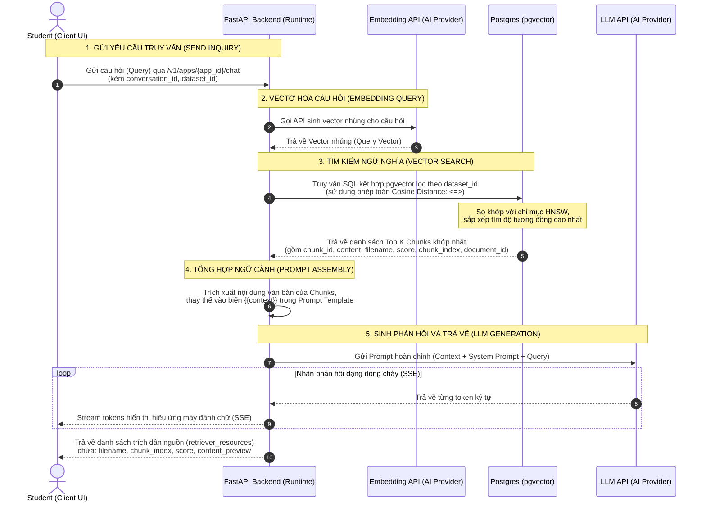

# SƠ ĐỒ TRÌNH TỰ LUỒNG NẠP VÀ TRUY XUẤT TRI THỨC THỰC TẾ (MERMAID)

Tài liệu này chứa mã nguồn **Mermaid** của hai luồng xử lý cốt lõi đang hoạt động thực tế trên hệ thống **Querion**:
1. **Luồng xử lý nạp tri thức (Knowledge Ingestion/Indexing Pipeline)**: Quy trình tải tài liệu lên MinIO, đăng ký CSDL, đưa vào Redis Queue và chạy Worker ngầm để tách chunks + tạo embeddings lưu vào PostgreSQL (pgvector).
2. **Luồng truy xuất tri thức thực tế (Knowledge Retrieval Pipeline)**: Quy trình tìm kiếm ngữ nghĩa thực tế đang chạy trên backend (không bao gồm bước tạo Presigned URL của MinIO vốn chưa được kích hoạt).

---

## 1. Luồng xử lý nạp tri thức (Knowledge Ingestion/Indexing Pipeline)

```mermaid
sequenceDiagram
    autonumber
    actor Admin as Admin (Client UI)
    participant MinIO as MinIO Object Storage
    participant API as FastAPI Backend
    participant DB as Postgres (pgvector)
    participant Redis as Redis Queue (RQ)
    participant Worker as Background Worker
    participant Embed as Embedding API (AI Provider)

    %% Step 1: Uploading the file
    Note over Admin, MinIO: 1. PHA TẢI LÊN FILE (FILE UPLOAD)
    Admin->>MinIO: Tải trực tiếp file tài liệu lên (PDF, DOCX, TXT, MD)
    MinIO-->>Admin: Trả về storage_key (S3 key)

    %% Step 2: Register Document
    Note over Admin, DB: 2. ĐĂNG KÝ TÀI LIỆU (REGISTER DOCUMENT)
    Admin->>API: POST /v1/datasets/{dataset_id}/documents/upload<br/>(gửi filename, storage_key)
    API->>DB: Lưu thông tin tài liệu (status = "uploaded")
    DB-->>API: Xác nhận đã lưu tài liệu
    API-->>Admin: Trả về document_id và status "uploaded"

    %% Step 3: Trigger Indexing
    Note over Admin, Redis: 3. KÍCH HOẠT TIẾN TRÌNH INDEXING (TRIGGER INDEXING)
    Admin->>API: POST /v1/documents/{document_id}/index
    API->>DB: Cập nhật trạng thái tài liệu sang "indexing"
    API->>Redis: Đẩy job "index_document(document_id)" vào hàng đợi
    API-->>Admin: Trả về xác nhận đã đẩy vào hàng đợi (status = "indexing")

    %% Step 4: Worker Processing
    Note over Redis, Worker: 4. XỬ LÝ BẤT ĐỒNG BỘ (ASYNC WORKER PIPELINE)
    Redis->>Worker: Nhận job "index_document(document_id)" từ queue
    Worker->>DB: Lấy thông tin tài liệu & storage_key
    DB-->>Worker: Trả về thông tin chi tiết tài liệu
    Worker->>MinIO: Tải file tài liệu về bộ nhớ tạm bằng storage_key
    MinIO-->>Worker: Trả về file nhị phân (binary content)
    
    Note over Worker: Trích xuất văn bản thô (Text Extraction)<br/>dùng PyMuPDF, python-docx...
    Note over Worker: Phân mảnh văn bản (Chunking)<br/>Size: ~1000 chars, Overlap: ~200 chars

    Worker->>Embed: Gọi API sinh vector nhúng (Embedding) cho các chunks
    Embed-->>Worker: Trả về danh sách Vector embeddings (1536 dims)

    Worker->>DB: Lưu các phân đoạn vào bảng `chunks`<br/>và lưu vector vào bảng `embeddings` (Bulk Insert)
    DB-->>Worker: Xác nhận lưu thành công dữ liệu
    
    Worker->>DB: Cập nhật tài liệu: status = "ready", chunk_count = X
    DB-->>Worker: Xác nhận hoàn tất cập nhật

    %% Step 5: Client Polling
    Note over Admin, API: 5. KIỂM TRA TRẠNG THÁI (STATUS POLLING)
    loop Đợi xử lý hoàn tất
        Admin->>API: GET /v1/documents/{document_id}
        API->>DB: Truy vấn trạng thái tài liệu
        DB-->>API: Trả về trạng thái hiện tại (indexing / ready / failed)
        API-->>Admin: Trả về thông tin trạng thái cho Client
    end
```

---

## 2. Luồng truy xuất tri thức thực tế (Knowledge Retrieval Pipeline)

Sơ đồ mô tả quy trình tìm kiếm ngữ nghĩa và phản hồi RAG đang chạy trực tiếp trên hệ thống hiện tại (sử dụng API chat/workflow của FastAPI Backend):

