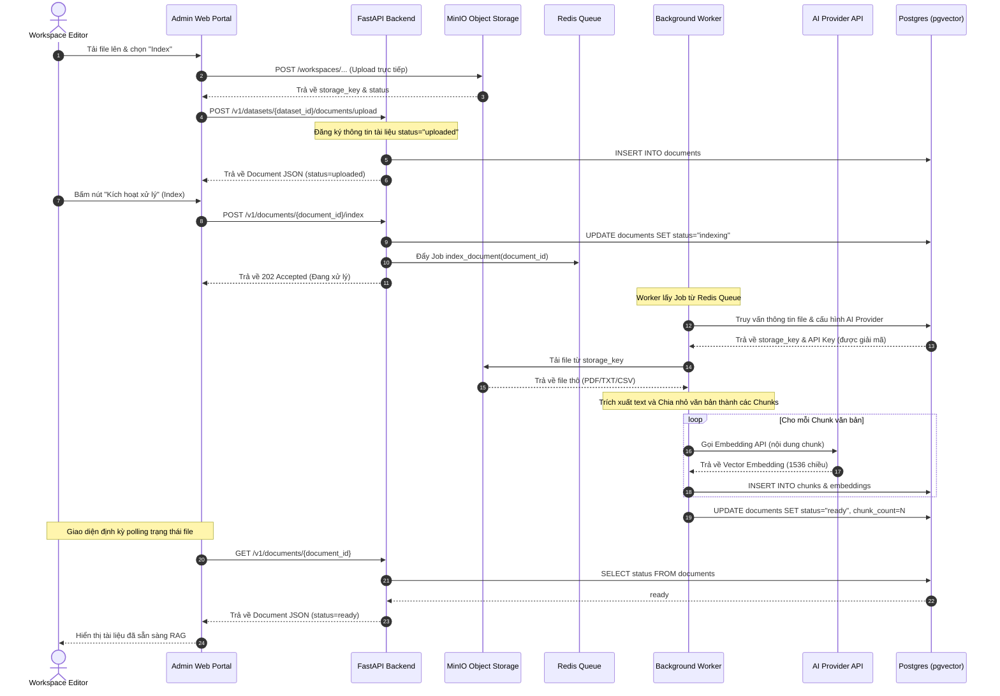
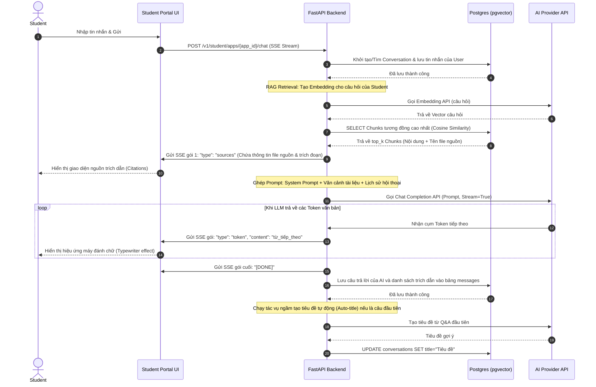
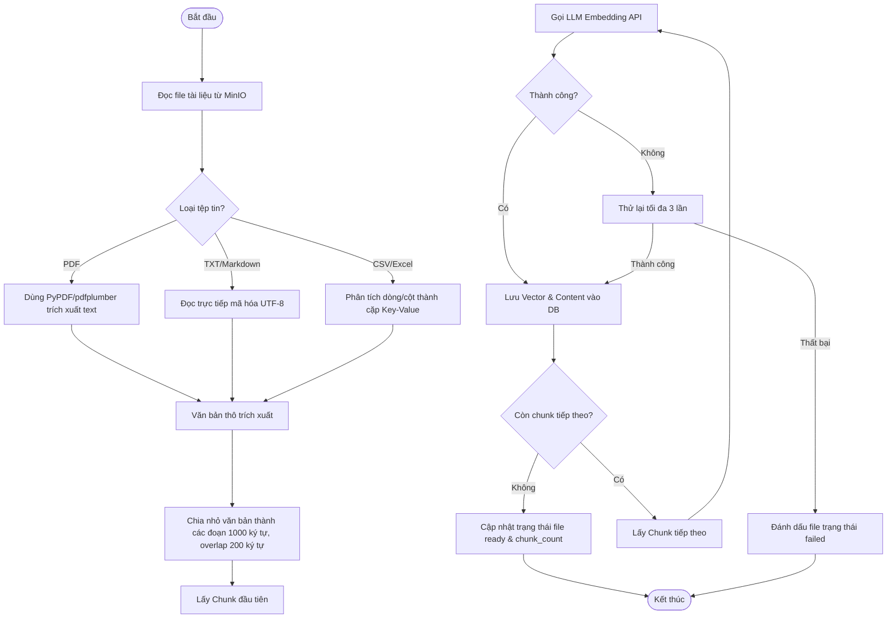
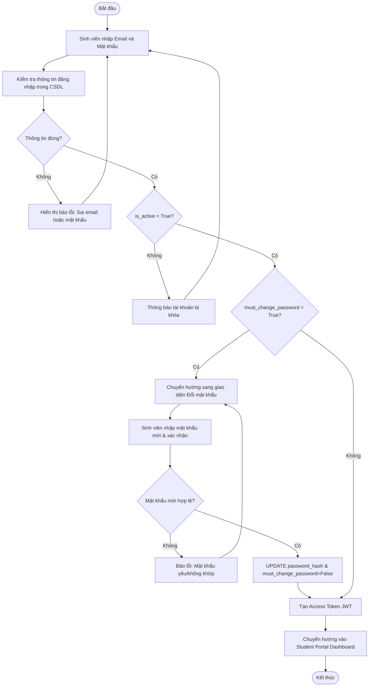
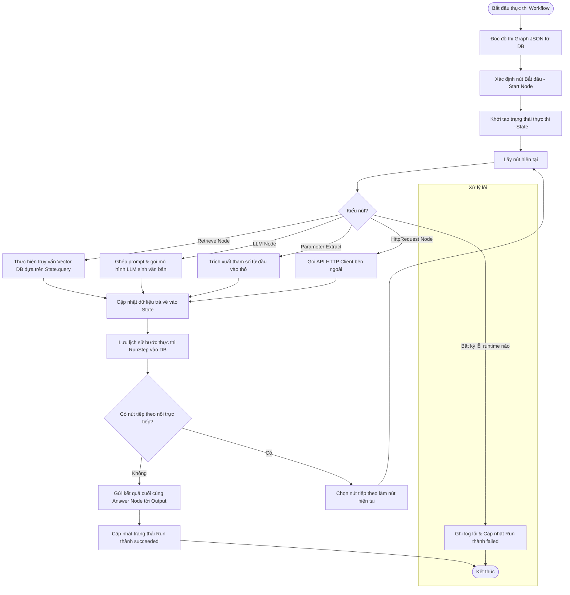

# TÀI LIỆU PHÂN TÍCH VÀ THIẾT KẾ CHI TIẾT HỆ THỐNG (QUERION PROJECT)

> **Querion (Mini-Dify):** Nền tảng xây dựng ứng dụng AI hỗ trợ quản lý tri thức đa không gian làm việc (multi-workspace datasets), thiết kế luồng xử lý (workflow canvas), và cổng thông tin hội thoại thời gian thực (SSE streaming chat) tích hợp nguồn trích dẫn tài liệu (citations).

---

## 1. PHÂN TÍCH TÁC NHÂN (ACTORS) & VAI TRÒ HỆ THỐNG

Hệ thống Querion phân chia quyền hạn và các hành vi thông qua 4 tác nhân chính:

| Tác nhân (Actor) | Phạm vi hoạt động | Vai trò & Trách nhiệm chính |
|---|---|---|
| **Super Admin** | Toàn hệ thống | Quản trị viên tối cao. Quản lý danh sách các Workspace, quản trị tài khoản Admin, phân quyền người dùng hệ thống và cấu hình kết nối API của các AI Provider. |
| **Workspace Owner** | Trong Workspace | Chủ sở hữu Workspace. Quản lý việc mời, phân quyền và xóa thành viên trong Workspace của mình. Có toàn quyền quản lý tài nguyên (Datasets, Workflows, Apps) và có quyền xóa Workspace. |
| **Workspace Editor** | Trong Workspace | Biên tập viên Workspace. Có quyền thực hiện các thao tác thêm, sửa, xóa (CRUD) các tài nguyên của Workspace bao gồm Datasets, Documents, Workflows, Apps. |
| **Workspace Viewer** | Trong Workspace | Người xem Workspace. Chỉ có quyền đọc và thử nghiệm (Read-only) các tài nguyên của Workspace, không được chỉnh sửa cấu hình hay xóa tài nguyên. |
| **Student** | Student Portal | Sinh viên / Người dùng cuối. Đăng nhập vào cổng thông tin độc lập, tương tác với các ứng dụng (Apps) đã được xuất bản (Published), quản lý lịch sử trò chuyện của riêng mình. |

---

## 2. DANH SÁCH USE CASE HỆ THỐNG (USE CASE LIST)

Dưới đây là danh sách các Use Case (UC) được chia nhỏ thành các đơn vị chức năng nhỏ nhất của hệ thống Querion:

### Nhóm 1: Quản trị Hệ thống & Phân quyền (Workspace & RBAC)
*   **UC1.1: Đăng nhập Admin** (Actor: Super Admin, Admin)
*   **UC1.2: Tạo Không gian làm việc (Workspace)** (Actor: Super Admin)
*   **UC1.3: Quản lý danh sách Workspace** (Actor: Super Admin)
*   **UC1.4: Mời thành viên vào Workspace** (Actor: Super Admin, Workspace Owner)
*   **UC1.5: Cập nhật vai trò thành viên (ws_role)** (Actor: Super Admin, Workspace Owner)
*   **UC1.6: Xóa thành viên khỏi Workspace** (Actor: Super Admin, Workspace Owner)
*   **UC1.7: Xem danh sách thành viên Workspace** (Actor: Super Admin, Workspace Owner, Editor, Viewer)
*   **UC1.8: Chuyển đổi Workspace (Workspace Switcher)** (Actor: Admin)

### Nhóm 2: Quản lý Tri thức & Xử lý tài liệu (Datasets & RAG)
*   **UC2.1: Tạo mới Dataset** (Actor: Workspace Owner, Editor)
*   **UC2.2: Xem danh sách Dataset** (Actor: Workspace Owner, Editor, Viewer)
*   **UC2.3: Xem chi tiết Dataset & danh sách tài liệu** (Actor: Workspace Owner, Editor, Viewer)
*   **UC2.4: Xóa Dataset** (Actor: Workspace Owner, Editor)
*   **UC2.5: Tải lên tài liệu (Upload Document)** (Actor: Workspace Owner, Editor)
*   **UC2.6: Kích hoạt xử lý tài liệu (Index Document)** (Actor: Workspace Owner, Editor)
*   **UC2.7: Xem danh sách phân mảnh tài liệu (Chunk Preview)** (Actor: Workspace Owner, Editor, Viewer)
*   **UC2.8: Chỉnh sửa nội dung phân mảnh & tạo lại Vector nhúng (Edit & Re-embed Chunk)** (Actor: Workspace Owner, Editor)
*   **UC2.9: Xóa tài liệu (Delete Document)** (Actor: Workspace Owner, Editor)

### Nhóm 3: Thiết kế Đồ thị Luồng công việc (Workflow Canvas Builder)
*   **UC3.1: Tạo mới sơ đồ Workflow** (Actor: Workspace Owner, Editor)
*   **UC3.2: Lưu sơ đồ Workflow (Graph JSON)** (Actor: Workspace Owner, Editor)
*   **UC3.3: Kiểm tra tính hợp lệ của luồng (Validate Graph)** (Actor: Workspace Owner, Editor)
*   **UC3.4: Chạy thử nghiệm luồng trên Canvas (Test Run)** (Actor: Workspace Owner, Editor, Viewer)
*   **UC3.5: Xem danh sách & chi tiết Workflow** (Actor: Workspace Owner, Editor, Viewer)
*   **UC3.6: Xóa Workflow** (Actor: Workspace Owner, Editor)

### Nhóm 4: Quản lý Ứng dụng & Giám sát (Apps & Observability)
*   **UC4.1: Tạo mới ứng dụng (App)** (Actor: Workspace Owner, Editor)
*   **UC4.2: Cấu hình loại ứng dụng (Pure Chat, Simple RAG, Workflow-bound)** (Actor: Workspace Owner, Editor)
*   **UC4.3: Xuất bản Ứng dụng (Publish App)** (Actor: Workspace Owner, Editor)
*   **UC4.4: Tạo lại API Key ứng dụng** (Actor: Workspace Owner, Editor)
*   **UC4.5: Xem danh sách nhật ký thực thi (Observability Runs)** (Actor: Workspace Owner, Editor, Viewer)
*   **UC4.6: Xem chi tiết bước chạy & thời gian thực thi các Node (Run Steps)** (Actor: Workspace Owner, Editor, Viewer)

### Nhóm 5: Quản lý tài khoản Sinh viên (Student Account Management)
*   **UC5.1: Tạo mới tài khoản sinh viên thủ công** (Actor: Workspace Owner, Editor)
*   **UC5.2: Nhập danh sách sinh viên hàng loạt từ CSV/Excel/Word** (Actor: Workspace Owner, Editor)
*   **UC5.3: Xem danh sách sinh viên** (Actor: Workspace Owner, Editor, Viewer)
*   **UC5.4: Cập nhật thông tin sinh viên** (Actor: Workspace Owner, Editor)
*   **UC5.5: Xóa tài khoản sinh viên** (Actor: Workspace Owner, Editor)

### Nhóm 6: Cổng thông tin Sinh viên (Student Portal)
*   **UC6.1: Đăng nhập Cổng sinh viên** (Actor: Student)
*   **UC6.2: Đổi mật khẩu bắt buộc ở lần đầu tiên** (Actor: Student)
*   **UC6.3: Xem danh sách các ứng dụng được xuất bản (Published Apps)** (Actor: Student)
*   **UC6.4: Tạo hội thoại mới** (Actor: Student)
*   **UC6.5: Gửi tin nhắn & nhận câu trả lời dạng Streaming (SSE Chat)** (Actor: Student)
*   **UC6.6: Xem nguồn trích dẫn dữ liệu & tải tài liệu (Citations & S3 Presigned)** (Actor: Student)
*   **UC6.7: Xem lịch sử hội thoại & Xóa hội thoại** (Actor: Student)

### Nhóm 7: Cấu hình nhà cung cấp AI (AI Providers Config)
*   **UC7.1: Thêm mới/Cấu hình API Key nhà cung cấp AI** (Actor: Super Admin)
*   **UC7.2: Xem danh sách nhà cung cấp AI & danh sách Model** (Actor: Super Admin)
*   **UC7.3: Cập nhật trạng thái kích hoạt nhà cung cấp** (Actor: Super Admin)
*   **UC7.4: Xóa cấu hình nhà cung cấp** (Actor: Super Admin)

---

## 3. ĐẶC TẢ CHI TIẾT CÁC USE CASE TIÊU BIỂU (USE CASE SPECIFICATIONS)

### UC2.6: Kích hoạt xử lý tài liệu (Index Document)
*   **Actor:** Workspace Owner, Workspace Editor.
*   **Mô tả:** Người dùng yêu cầu hệ thống đọc, chia nhỏ (chunking), tạo vector nhúng và lưu trữ tài liệu đã tải lên vào cơ sở dữ liệu vector.
*   **Tiền điều kiện:** 
    *   Tài liệu đã được tải lên MinIO thành công (trạng thái tài liệu là `uploaded`).
    *   Người dùng có quyền Editor hoặc Owner trong Workspace hiện tại.
*   **Luồng sự kiện chính (Main Flow):**
    1. Người dùng chọn tài liệu cần xử lý trong Dataset và bấm nút "Kích hoạt xử lý" (Index).
    2. API Backend nhận request, cập nhật trạng thái tài liệu thành `indexing` trong database.
    3. API Backend đẩy một tác vụ chạy ngầm `index_document` vào hàng đợi công việc Redis Queue.
    4. API Backend phản hồi ngay lập tức cho Frontend với mã trạng thái `202 Accepted`.
    5. Python RQ Worker lấy tác vụ từ Redis Queue và thực hiện:
        - Tải file từ MinIO về thư mục tạm.
        - Phân tích cú pháp (Parser) trích xuất nội dung văn bản thô.
        - Chia nhỏ văn bản thô thành các Chunk (1000 ký tự, overlap 200 ký tự).
        - Gọi API AI Provider đã cấu hình để lấy Vector Embedding cho từng Chunk.
        - Lưu trữ hàng loạt (Bulk Insert) các Chunk và Embeddings vào CSDL PostgreSQL (pgvector).
    6. Worker cập nhật trạng thái tài liệu trong CSDL thành `ready` và tăng biến đếm `chunk_count`.
*   **Luồng sự kiện phụ (Alternate Flow):**
    *   *Trường hợp lỗi trích xuất hoặc nhúng:* Nếu có bất kỳ bước nào trong Worker bị lỗi (file lỗi, API LLM bị quá giới hạn/sai API key), Worker sẽ ghi log lỗi, cập nhật trạng thái tài liệu thành `failed`.
*   **Hậu điều kiện:** Nội dung của tài liệu được chuyển đổi sang vector ngữ nghĩa trong database, sẵn sàng cho việc truy vấn RAG.

### UC4.3: Xuất bản Ứng dụng (Publish App)
*   **Actor:** Workspace Owner, Workspace Editor.
*   **Mô tả:** Người dùng chuyển đổi trạng thái của Ứng dụng (App) sang chế độ xuất bản để người dùng cuối (Student) có thể truy cập và sử dụng cấu hình mới nhất.
*   **Tiền điều kiện:** Ứng dụng đã được tạo thành công trong Workspace.
*   **Luồng sự kiện chính (Main Flow):**
    1. Người dùng truy cập vào trang cấu hình App, thực hiện chỉnh sửa cấu hình (đổi workflow, cập nhật prompt...) và bấm nút "Publish".
    2. Frontend gửi yêu cầu PATCH `/v1/apps/{app_id}` đính kèm `is_published: true`.
    3. API Backend xác thực quyền của người dùng trong Workspace hiện hành.
    4. API Backend cập nhật cột `is_published = true` trong bảng `apps` trong database.
    5. API Backend phản hồi thành công và trả về thông tin App đã xuất bản.
    6. Sinh viên mở cổng Student Portal sẽ thấy ứng dụng xuất hiện trên thanh Sidebar và có thể trò chuyện với phiên bản cấu hình mới này.
*   **Luồng sự kiện phụ (Alternate Flow):**
    *   *Ứng dụng liên kết với Workflow bị lỗi:* Nếu ứng dụng liên kết với một Workflow chưa hợp lệ (chưa cấu hình nút Input/Output), hệ thống sẽ từ chối xuất bản và trả về thông báo lỗi chi tiết.
*   **Hậu điều kiện:** Cấu hình mới nhất của ứng dụng được công khai bên phía cổng của Sinh viên.

### UC6.5: Gửi tin nhắn & nhận câu trả lời dạng Streaming (SSE Chat)
*   **Actor:** Student.
*   **Mô tả:** Sinh viên gửi câu hỏi cho ứng dụng và nhận câu trả lời từng từ theo thời gian thực dưới dạng Server-Sent Events (SSE) kèm theo nguồn trích dẫn tài liệu.
*   **Tiền điều kiện:** Sinh viên đã đăng nhập thành công vào cổng Student Portal và ứng dụng đó đã được xuất bản (`is_published: true`).
*   **Luồng sự kiện chính (Main Flow):**
    1. Sinh viên nhập nội dung tin nhắn và bấm gửi trong giao diện chat của ứng dụng.
    2. Frontend gửi request POST `/v1/student/apps/{app_id}/chat` đính kèm nội dung tin nhắn và `conversation_id` (nếu có).
    3. API Backend xác thực token của sinh viên, tìm kiếm thông tin ứng dụng trong CSDL.
    4. API tạo mới cuộc hội thoại nếu `conversation_id` trống và lưu tin nhắn của người dùng vào bảng `messages`.
    5. API Backend thực hiện xử lý nghiệp vụ:
        - **Trường hợp RAG App/Workflow App:** Thực hiện tìm kiếm ngữ nghĩa trên PostgreSQL bằng truy vấn pgvector để lấy các phân mảnh tài liệu liên quan nhất (`top_k = 5`).
        - Dựng Prompt hệ thống (System Prompt + Document Context).
    6. API Backend giải mã API Key của LLM Provider đang kích hoạt và tạo kết nối HTTP streaming tới LLM API.
    7. API Backend trả về response dưới dạng `text/event-stream` và liên tục đẩy (yield) các gói dữ liệu SSE về client:
        - Gói đầu tiên: `conversation_id` của cuộc hội thoại.
        - Gói chứa danh sách nguồn trích dẫn: `type: "sources"` kèm tên tài liệu và trích đoạn.
        - Các gói chứa token văn bản: `type: "token"` chứa từ tiếp theo của câu trả lời.
    8. Giao diện Frontend hiển thị hiệu ứng máy đánh chữ và các nút trích dẫn cho sinh viên tương tác.
    9. Khi LLM trả về hết ký tự, API gửi tín hiệu kết thúc `[DONE]` và lưu câu trả lời của AI cùng nguồn trích dẫn vào bảng `messages`.
*   **Luồng sự kiện phụ (Alternate Flow):**
    *   *Trường hợp lỗi kết nối LLM:* Nếu kết nối tới API của nhà cung cấp LLM bị ngắt quãng giữa chừng, API Backend sẽ đẩy gói tin `type: "error"` chứa mô tả lỗi và kết thúc luồng.
*   **Hậu điều kiện:** Hội thoại được cập nhật và hiển thị đầy đủ trên màn hình của sinh viên, tài nguyên thực thi được ghi nhận vào nhật ký.

---

## 4. THIẾT KẾ CƠ SỞ DỮ LIỆU (ENTITY RELATIONSHIP DIAGRAM - ERD)

Dưới đây là mô hình quan hệ thực thể (ERD) mô tả cấu trúc dữ liệu của dự án Querion được kết xuất từ các tệp tin cấu hình CSDL:

```mermaid
erDiagram
    users {
        uuid id PK
        string email UK
        string password_hash
        string role "super_admin | admin"
        datetime created_at
    }

    workspaces {
        uuid id PK
        string name
        datetime created_at
    }

    user_workspaces {
        uuid user_id PK, FK
        uuid workspace_id PK, FK
        string ws_role "owner | editor | viewer"
        datetime created_at
    }

    datasets {
        uuid id PK
        uuid workspace_id FK
        string name
        string description
        datetime created_at
    }

    documents {
        uuid id PK
        uuid dataset_id FK
        string filename
        string storage_key
        string status "uploaded | indexing | ready | failed"
        integer chunk_count
        datetime created_at
    }

    chunks {
        uuid id PK
        uuid dataset_id FK
        uuid document_id FK
        integer chunk_index
        string content
        datetime created_at
    }

    embeddings {
        uuid chunk_id PK, FK
        vector embedding "1536 dims"
        string model_name
    }

    workflows {
        uuid id PK
        uuid workspace_id FK
        uuid dataset_id FK "nullable"
        string name
        string type "workflow | chatflow"
        json graph_json
        datetime created_at
    }

    apps {
        uuid id PK
        uuid workspace_id FK
        uuid workflow_id FK "nullable"
        uuid dataset_id FK "nullable"
        string name
        string description
        string app_key
        string system_prompt
        boolean is_published
        datetime created_at
    }

    students {
        uuid id PK
        string email UK
        string password_hash
        string name
        string student_id "MSSV - nullable"
        boolean is_active
        boolean must_change_password
        datetime created_at
    }

    conversations {
        uuid id PK
        uuid workspace_id FK
        uuid dataset_id FK "nullable"
        uuid student_id FK "nullable"
        uuid app_id FK "nullable"
        string title
        datetime created_at
        datetime updated_at
    }

    messages {
        uuid id PK
        uuid conversation_id FK
        string role "user | assistant"
        string content
        json sources "citations"
        datetime created_at
    }

    runs {
        uuid id PK
        uuid app_id FK
        uuid workflow_id FK "nullable"
        string status "running | succeeded | failed"
        integer latency_ms
        datetime started_at
    }

    run_steps {
        uuid id PK
        uuid run_id FK
        string node_id
        string node_type
        string node_name
        json inputs
        json outputs
        string error
        integer elapsed_ms
        datetime started_at
    }

    ai_providers {
        uuid id PK
        string provider_name "openai | google | anthropic | openrouter"
        string display_name
        string api_key_encrypted
        string model_name
        string purpose "embedding | llm"
        boolean is_active
        datetime created_at
    }

    %% Relationships
    users ||--o{ user_workspaces : "has"
    workspaces ||--o{ user_workspaces : "contains"
    workspaces ||--o{ datasets : "owns"
    workspaces ||--o{ workflows : "owns"
    workspaces ||--o{ apps : "owns"
    workspaces ||--o{ conversations : "context"

    datasets ||--o{ documents : "contains"
    datasets ||--o{ chunks : "split into"
    datasets ||--o{ apps : "RAG reference"
    datasets ||--o{ workflows : "reference"
    datasets ||--o{ conversations : "RAG source"

    documents ||--o{ chunks : "divided to"
    chunks ||--|| embeddings : "has"

    workflows ||--o{ apps : "defines logic"
    workflows ||--o{ runs : "monitored by"
    apps ||--o{ runs : "generates"
    runs ||--o{ run_steps : "consists of"

    students ||--o{ conversations : "initiates"
    apps ||--o{ conversations : "serves"
    conversations ||--o{ messages : "contains"

---

## 5. THIẾT KẾ LỚP (CLASS DIAGRAM)

Mô hình thiết kế các lớp (Class Diagram) thể hiện cấu trúc các Model ORM trong Backend API và các mối tương quan logic:

```mermaid
classDiagram
    class Base {
        +datetime created_at
        +datetime updated_at
    }

    class User {
        +UUID id
        +string email
        +string password_hash
        +string role
        +list~UserWorkspace~ workspace_memberships
    }

    class Workspace {
        +UUID id
        +string name
        +list~UserWorkspace~ members
        +list~Dataset~ datasets
        +list~Workflow~ workflows
    }

    class UserWorkspace {
        +UUID user_id
        +UUID workspace_id
        +WsRole ws_role
        +User user
        +Workspace workspace
    }

    class Dataset {
        +UUID id
        +UUID workspace_id
        +string name
        +string description
        +list~Document~ documents
    }

    class Document {
        +UUID id
        +UUID dataset_id
        +string filename
        +string storage_key
        +DocumentStatus status
        +int chunk_count
        +Dataset dataset
    }

    class Chunk {
        +UUID id
        +UUID dataset_id
        +UUID document_id
        +int chunk_index
        +string content
    }

    class Embedding {
        +UUID chunk_id
        +list~float~ embedding
        +string model_name
    }

    class Workflow {
        +UUID id
        +UUID workspace_id
        +UUID dataset_id
        +string name
        +string type
        +json graph_json
    }

    class App {
        +UUID id
        +UUID workspace_id
        +UUID workflow_id
        +UUID dataset_id
        +string name
        +string description
        +string app_key
        +string system_prompt
        +boolean is_published
    }

    class Student {
        +UUID id
        +string email
        +string password_hash
        +string name
        +string student_id
        +boolean is_active
        +boolean must_change_password
    }

    class Conversation {
        +UUID id
        +UUID workspace_id
        +UUID dataset_id
        +UUID student_id
        +UUID app_id
        +string title
        +list~Message~ messages
    }

    class Message {
        +UUID id
        +UUID conversation_id
        +string role
        +string content
        +json sources
    }

    class Run {
        +UUID id
        +UUID app_id
        +UUID workflow_id
        +string status
        +int latency_ms
        +list~RunStep~ steps
    }

    class RunStep {
        +UUID id
        +UUID run_id
        +string node_id
        +string node_type
        +string node_name
        +json inputs
        +json outputs
        +string error
        +int elapsed_ms
    }

    class AiProvider {
        +UUID id
        +string provider_name
        +string display_name
        +string api_key_encrypted
        +string model_name
        +string purpose
        +boolean is_active
    }

    %% Inheritance
    Base <|-- User
    Base <|-- Workspace
    Base <|-- UserWorkspace
    Base <|-- Dataset
    Base <|-- Document
    Base <|-- Chunk
    Base <|-- Workflow
    Base <|-- App
    Base <|-- Student
    Base <|-- Conversation
    Base <|-- Message
    Base <|-- Run
    Base <|-- RunStep
    Base <|-- AiProvider

    %% Associations
    User "1" *-- "many" UserWorkspace
    Workspace "1" *-- "many" UserWorkspace
    Workspace "1" *-- "many" Dataset
    Workspace "1" *-- "many" Workflow
    Workspace "1" *-- "many" App
    Dataset "1" *-- "many" Document
    Document "1" *-- "many" Chunk
    Chunk "1" -- "1" Embedding
    App "many" o-- "0..1" Workflow
    App "many" o-- "0..1" Dataset
    App "1" *-- "many" Run
    Run "1" *-- "many" RunStep
    Student "1" *-- "many" Conversation
    Conversation "1" *-- "many" Message
```

---

## 6. BIỂU ĐỒ TRÌNH TỰ (SEQUENCE DIAGRAMS)

### 6.1 Trình tự xử lý và nhúng tài liệu (RAG Document Indexing Pipeline)
Mô tả cách thức tài liệu được upload lên MinIO S3, đưa vào hàng đợi Redis Queue, chia mảnh bởi Worker, nhúng vector bằng LLM API và lưu vào Postgres pgvector:



### 6.2 Trình tự hội thoại thời gian thực (SSE Streaming Chat with Citations)
Mô tả luồng nhắn tin từ Student Portal, thực hiện tìm kiếm ngữ nghĩa, sinh câu trả lời streaming SSE và hiển thị nguồn trích dẫn:



---

## 7. BIỂU ĐỒ HOẠT ĐỘNG (ACTIVITY DIAGRAMS)

### 7.1 Hoạt động phân mảnh & nhúng vector tài liệu (Document Processing Lifecycle)



### 7.2 Hoạt động kiểm tra mật khẩu sinh viên khi đăng nhập lần đầu



### 7.3 Vòng lặp duyệt các Node trong Workflow Runtime (LangGraph-based Execution)



---

## 8. TỔNG KẾT
Tài liệu trên đã làm rõ toàn bộ cấu trúc kiến trúc của hệ thống **Querion (Mini-Dify)** bằng cách bóc tách đến từng Use Case nhỏ nhất, xác lập vai trò của từng tác nhân, thiết kế quan hệ bảng CSDL (ERD), định hình thiết kế mã nguồn các lớp (Class Diagram) và mô phỏng trực quan các luồng hoạt động phức tạp (Sequence & Activity Diagrams). Bản thiết kế này là cơ sở vững chắc cho việc triển khai, nâng cấp và vận hành toàn hệ thống.

