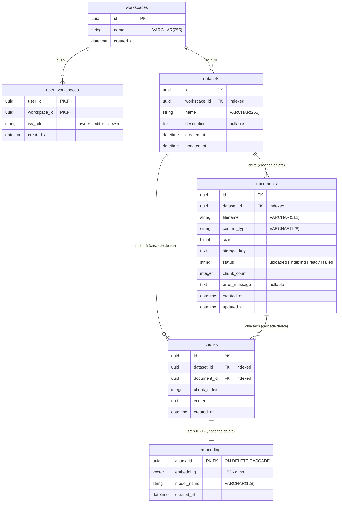

# SƠ ĐỒ SCHEMA KHO TRI THỨC (KNOWLEDGE BASE SCHEMA)

Tài liệu này mô tả chi tiết thiết kế Schema của hệ thống **Knowledge Base (Kho tri thức)** trong dự án **Querion**. Đây là hạ tầng nền tảng lưu trữ và quản lý tài liệu, hỗ trợ phân chia không gian làm việc cô lập (Multi-Tenant Workspace) và cung cấp nguồn ngữ cảnh chất lượng cho công cụ tìm kiếm ngữ nghĩa (RAG).

---

## 1. SƠ ĐỒ QUAN HỆ THỰC THỂ (ERD - ENTITY RELATIONSHIP DIAGRAM)

### 1.1 Sơ đồ hình ảnh (Visual Diagram)

### 1.2 Sơ đồ Mermaid ERD
Dưới đây là sơ đồ chi tiết biểu diễn mối quan hệ phân tầng từ cấp Không gian làm việc (Workspace) đến từng phân mảnh dữ liệu (Chunk) và Vector nhúng (Embedding):

---

## 2. CHI TIẾT CẤU TRÚC BẢNG TRONG KHO TRI THỨC

### 2.1 Bảng `workspaces`
Phân vùng cấp cao nhất để quản lý và cô lập dữ liệu giữa các phòng ban hoặc tổ chức (Đa khách thuê - Multi-Tenancy).

| Tên cột | Kiểu dữ liệu | Ràng buộc | Mô tả |
| :--- | :--- | :--- | :--- |
| `id` | `UUID` | `PRIMARY KEY` | Khóa chính tự động sinh. |
| `name` | `VARCHAR(255)` | `NOT NULL` | Tên của Không gian làm việc. |
| `created_at` | `TIMESTAMP WITH TIME ZONE` | `NOT NULL` | Thời điểm tạo workspace. |

### 2.2 Bảng `user_workspaces`
Bảng trung gian (Pivot) phân quyền truy cập của người dùng đối với từng Workspace.

| Tên cột | Kiểu dữ liệu | Ràng buộc | Mô tả |
| :--- | :--- | :--- | :--- |
| `user_id` | `UUID` | `PRIMARY KEY`, `FOREIGN KEY` | Tham chiếu tới `users.id` (`ON DELETE CASCADE`). |
| `workspace_id` | `UUID` | `PRIMARY KEY`, `FOREIGN KEY` | Tham chiếu tới `workspaces.id` (`ON DELETE CASCADE`). |
| `ws_role` | `VARCHAR(50)` | `NOT NULL` | Vai trò: `owner` (Chủ sở hữu), `editor` (Biên tập viên), `viewer` (Xem). |
| `created_at` | `TIMESTAMP WITH TIME ZONE` | `NOT NULL` | Thời điểm phân quyền. |

### 2.3 Bảng `datasets`
Tập hợp các tài liệu tri thức có chung chủ đề hoặc mục đích sử dụng.

| Tên cột | Kiểu dữ liệu | Ràng buộc | Mô tả |
| :--- | :--- | :--- | :--- |
| `id` | `UUID` | `PRIMARY KEY` | Khóa chính. |
| `workspace_id` | `UUID` | `FOREIGN KEY`, `NOT NULL`, `INDEX` | Thuộc về Workspace nào (`ON DELETE CASCADE`). |
| `name` | `VARCHAR(255)` | `NOT NULL` | Tên tập tri thức (ví dụ: "Quy chế tuyển sinh"). |
| `description` | `TEXT` | `NULL` | Mô tả tóm tắt nội dung tri thức. |
| `created_at`/`updated_at` | `TIMESTAMP WITH TIME ZONE` | `NOT NULL` | Thời gian tạo và cập nhật gần nhất. |

### 2.4 Bảng `documents`
Quản lý các tài liệu vật lý tải lên hệ thống. Tệp tin gốc được lưu trữ tách biệt trên MinIO.

| Tên cột | Kiểu dữ liệu | Ràng buộc | Mô tả |
| :--- | :--- | :--- | :--- |
| `id` | `UUID` | `PRIMARY KEY` | Khóa chính. |
| `dataset_id` | `UUID` | `FOREIGN KEY`, `NOT NULL`, `INDEX` | Thuộc về Dataset nào (`ON DELETE CASCADE`). |
| `filename` | `VARCHAR(512)` | `NOT NULL` | Tên tệp tin gốc. |
| `content_type`| `VARCHAR(128)` | `NOT NULL` | Kiểu định dạng (ví dụ: `application/pdf`). |
| `size` | `BIGINT` | `NOT NULL` | Dung lượng file (bytes). |
| `storage_key` | `TEXT` | `NOT NULL` | Key duy nhất trỏ tới file lưu trên MinIO S3 bucket. |
| `status` | `VARCHAR(50)` (Enum) | `NOT NULL` | Trạng thái: `uploaded` -> `indexing` -> `ready`/`failed`. |
| `chunk_count` | `INTEGER` | `NOT NULL`, Default `0` | Số đoạn văn tách ra từ file. |
| `error_message`| `TEXT` | `NULL` | Chi tiết lỗi nếu tiến trình xử lý thất bại. |

### 2.5 Bảng `chunks` & `embeddings`
*   `chunks`: Lưu trữ các đoạn văn bản trích xuất dài tối đa 1000 ký tự (Overlap 200 ký tự).
*   `embeddings`: Lưu trữ vector biểu diễn 1536 chiều được tạo bởi mô hình Embedding của AI Provider.

---

## 3. CƠ CHẾ BẢO MẬT & DỌN DẸP DỮ LIỆU TỰ ĐỘNG

1.  **Cô lập Workspace (Multi-Tenant Isolation):**
    Mỗi truy vấn liên quan đến tài liệu hoặc tìm kiếm đều phải đính kèm điều kiện `workspace_id` lọc từ thông tin xác thực JWT (`X-Workspace-Id` Header) để ngăn chặn rò rỉ dữ liệu giữa các Workspace.
2.  **Xóa tầng (Cascade Deletion):**
    Ràng buộc khóa ngoại `ON DELETE CASCADE` được định nghĩa thống nhất từ mức Workspace đến các bảng liên quan. Khi một Workspace hoặc Dataset bị xóa, toàn bộ tệp tin (`documents`), đoạn văn (`chunks`) và vector nhúng (`embeddings`) tương ứng sẽ được cơ sở dữ liệu dọn dẹp sạch sẽ để giải phóng dung lượng.
