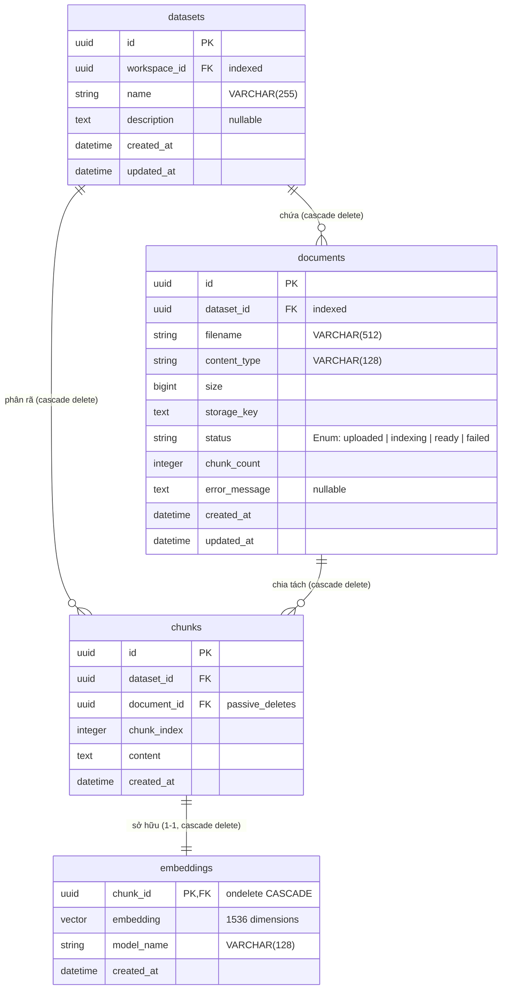

# SƠ ĐỒ SCHEMA DỮ LIỆU VECTOR (VECTOR DATABASE SCHEMA)

Tài liệu này mô tả chi tiết thiết kế Schema của Cơ sở dữ liệu Vector (Vector Database) trong hệ thống **Querion**. Hệ thống sử dụng cơ sở dữ liệu quan hệ **PostgreSQL 16** kết hợp với tiện ích mở rộng **pgvector** để lưu trữ và truy vấn tương đồng ngữ nghĩa.

---

## 1. SƠ ĐỒ QUAN HỆ THỰC THỂ (ERD - ENTITY RELATIONSHIP DIAGRAM)

### 1.1 Sơ đồ hình ảnh (Visual Diagram)


### 1.2 Sơ đồ Mermaid ERD
Dưới đây là sơ đồ Mermaid ERD biểu diễn mối quan hệ giữa các bảng liên quan đến dữ liệu Vector trong hệ thống:



---

## 2. CHI TIẾT CẤU TRÚC CÁC BẢNG (TABLE SCHEMAS)

### 2.1 Bảng `datasets` (Tập dữ liệu Tri thức)
Bảng này đóng vai trò phân nhóm logic các tài liệu tri thức thuộc cùng một không gian làm việc (Workspace).

| Tên cột | Kiểu dữ liệu | Ràng buộc | Mô tả |
| :--- | :--- | :--- | :--- |
| `id` | `UUID` | `PRIMARY KEY` | Khóa chính tự động sinh (`uuid.uuid4`). |
| `workspace_id` | `UUID` | `FOREIGN KEY`, `NOT NULL`, `INDEX` | Liên kết tới `workspaces.id` (`ON DELETE CASCADE`). |
| `name` | `VARCHAR(255)` | `NOT NULL` | Tên của tập dữ liệu tri thức. |
| `description` | `TEXT` | `NULL` | Mô tả chi tiết về tập dữ liệu. |
| `created_at` | `TIMESTAMP WITH TIME ZONE` | `NOT NULL` | Thời gian khởi tạo (mặc định UTC). |
| `updated_at` | `TIMESTAMP WITH TIME ZONE` | `NOT NULL` | Thời gian cập nhật gần nhất. |

### 2.2 Bảng `documents` (Tài liệu nguồn)
Bảng này lưu trữ thông tin về các file tài liệu được tải lên hệ thống (ví dụ: PDF, TXT, DOCX, CSV).

| Tên cột | Kiểu dữ liệu | Ràng buộc | Mô tả |
| :--- | :--- | :--- | :--- |
| `id` | `UUID` | `PRIMARY KEY` | Khóa chính tự động sinh (`uuid.uuid4`). |
| `dataset_id` | `UUID` | `FOREIGN KEY`, `NOT NULL`, `INDEX` | Liên kết tới `datasets.id` (`ON DELETE CASCADE`). |
| `filename` | `VARCHAR(512)` | `NOT NULL` | Tên tệp tin gốc. |
| `content_type`| `VARCHAR(128)` | `NOT NULL` | Định dạng MIME của file. |
| `size` | `BIGINT` | `NOT NULL` | Kích thước file tính bằng bytes. |
| `storage_key` | `TEXT` | `NOT NULL` | Đường dẫn (key) lưu trữ trên MinIO Object Storage. |
| `status` | `VARCHAR(50)` (Enum) | `NOT NULL` | Trạng thái xử lý: `uploaded`, `indexing`, `ready`, `failed`. |
| `chunk_count` | `INTEGER` | `NOT NULL`, Default `0` | Tổng số đoạn văn bản sau khi chia tách. |
| `error_message`| `TEXT` | `NULL` | Ghi nhận chi tiết lỗi nếu xử lý thất bại. |
| `created_at` | `TIMESTAMP WITH TIME ZONE` | `NOT NULL` | Thời gian tải lên tài liệu. |
| `updated_at` | `TIMESTAMP WITH TIME ZONE` | `NOT NULL` | Thời gian cập nhật trạng thái mới nhất. |

### 2.3 Bảng `chunks` (Phân đoạn văn bản)
Tài liệu thô sau khi Parser trích xuất text sẽ được chia nhỏ thành các đoạn văn ngắn có độ chồng lấp (overlapping) để làm context cho mô hình LLM.

| Tên cột | Kiểu dữ liệu | Ràng buộc | Mô tả |
| :--- | :--- | :--- | :--- |
| `id` | `UUID` | `PRIMARY KEY` | Khóa chính tự động sinh (`uuid.uuid4`). |
| `dataset_id` | `UUID` | `FOREIGN KEY`, `NOT NULL` | Liên kết tới `datasets.id` (`ON DELETE CASCADE`). |
| `document_id` | `UUID` | `FOREIGN KEY`, `NOT NULL` | Liên kết tới `documents.id` (`ON DELETE CASCADE`). |
| `chunk_index` | `INTEGER` | `NOT NULL` | Thứ tự của chunk trong tài liệu (bắt đầu từ `0`). |
| `content` | `TEXT` | `NOT NULL` | Nội dung văn bản thô của phân đoạn (mặc định 1000 ký tự). |
| `created_at` | `TIMESTAMP WITH TIME ZONE` | `NOT NULL` | Thời gian tạo phân đoạn. |

### 2.4 Bảng `embeddings` (Vector nhúng)
Bảng này lưu trữ biểu diễn toán học (vector) của các chunk tương ứng bằng kiểu dữ liệu `vector` của pgvector.

| Tên cột | Kiểu dữ liệu | Ràng buộc | Mô tả |
| :--- | :--- | :--- | :--- |
| `chunk_id` | `UUID` | `PRIMARY KEY`, `FOREIGN KEY` | Khóa chính và Khóa ngoại liên kết `1-1` tới `chunks.id` (`ON DELETE CASCADE`). |
| `embedding` | `VECTOR(1536)` | `NOT NULL` | Vector nhúng 1536 chiều (phù hợp với các mô hình OpenAI, Google, OpenRouter). |
| `model_name` | `VARCHAR(128)` | `NOT NULL` | Tên mô hình tạo vector (ví dụ: `text-embedding-3-small`). |
| `created_at` | `TIMESTAMP WITH TIME ZONE` | `NOT NULL` | Thời gian tạo vector nhúng. |

---

## 3. THIẾT KẾ RÀNG BUỘC VÀ XÓA BẮT BUỘC (CASCADE DELETION)

Hệ thống áp dụng cơ chế tự động dọn dẹp dữ liệu vector mồ côi (orphaned vectors) ở mức Cơ sở dữ liệu:
*   Mối quan hệ **1-Many** giữa `datasets -> documents -> chunks` và quan hệ **1-1** giữa `chunks -> embeddings` đều được ràng buộc bởi `ON DELETE CASCADE`.
*   Khi người dùng xóa một **Dataset** hoặc một **Document**, PostgreSQL sẽ tự động xóa sạch các bản ghi tương ứng trong bảng `chunks` và `embeddings`.
*   Phía SQLAlchemy Model sử dụng `cascade="all, delete-orphan"` kết hợp với `passive_deletes=True` để tối ưu hóa hiệu năng, giảm thiểu số câu lệnh `UPDATE` hoặc `DELETE` trung gian từ client.

---

## 4. CHIẾN LƯỢC ĐÁNH CHỈ MỤC & TRUY VẤN NGỮ NGHĨA (INDEX & QUERY RETRIEVAL)

### 4.1 Đánh Chỉ mục Vector (Vector Indexing)
Để đảm bảo tốc độ tìm kiếm dưới **50ms** khi dữ liệu tăng trưởng lên hàng triệu vector, hệ thống sử dụng thuật toán **HNSW (Hierarchical Navigable Small World)** trên cột `embedding` với phép đo **Cosine Distance**:

```sql
-- Tạo chỉ mục HNSW trên bảng embeddings phục vụ tìm kiếm khoảng cách cosine
CREATE INDEX idx_embeddings_hnsw_cosine ON embeddings 
USING hnsw (embedding vector_cosine_ops) 
WITH (m = 16, ef_construction = 64);
```

### 4.2 Câu lệnh Tìm kiếm tương đồng ngữ nghĩa (Semantic Search SQL)
FastAPI Backend gọi câu lệnh SQL sau để lấy ra top $K$ đoạn văn bản có độ tương đồng ngữ nghĩa cao nhất thuộc một tập dữ liệu cụ thể:

```sql
SELECT 
    c.id AS chunk_id,
    c.content AS content,
    d.filename AS doc_name,
    c.chunk_index AS chunk_index,
    (1 - (e.embedding <=> :query_vector)) AS similarity -- Quy đổi Cosine Distance thành Cosine Similarity (0 -> 1)
FROM chunks c
JOIN embeddings e ON c.id = e.chunk_id
JOIN documents d ON c.document_id = d.id
WHERE c.dataset_id = :dataset_id
  AND e.model_name = :model_name
ORDER BY e.embedding <=> :query_vector -- Khoảng cách nhỏ nhất tương ứng với tương đồng lớn nhất
LIMIT :top_k;
```
