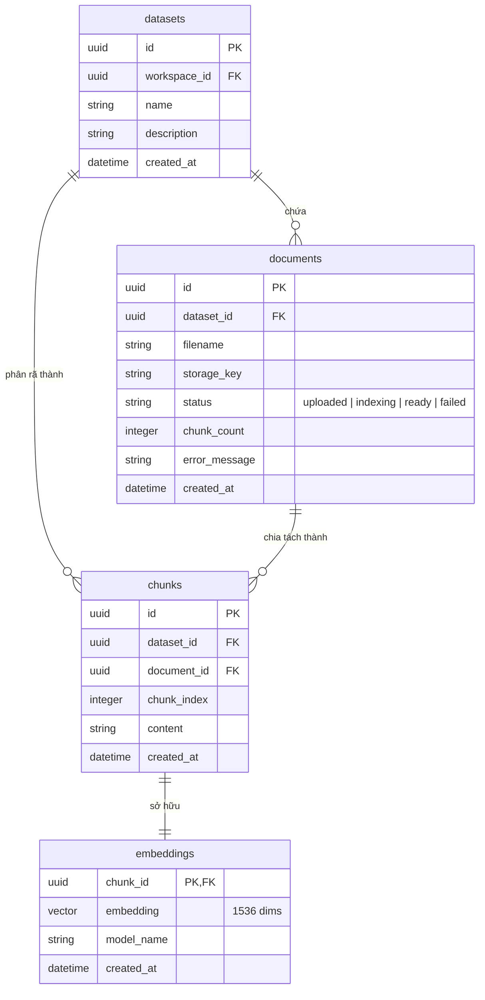
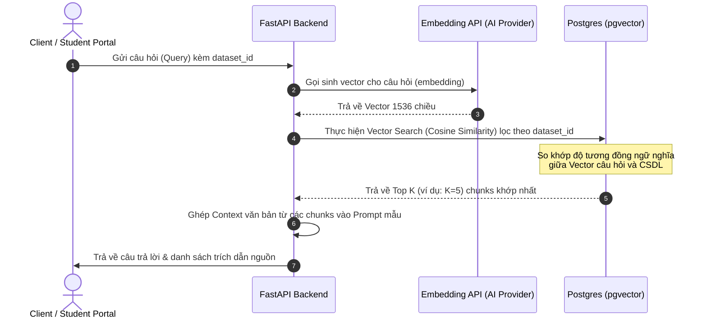

# THIẾT KẾ CHI TIẾT KNOWLEDGE BASE VÀ VECTOR DATABASE

Tài liệu này đặc tả chi tiết thiết kế hệ thống **Knowledge Base (Cơ sở tri thức)** và **Vector Database (Cơ sở dữ liệu Vector)** cho dự án Querion. Đây là thành phần cốt lõi để triển khai kiến trúc RAG (Retrieval-Augmented Generation), giúp hệ thống AI có khả năng truy xuất thông tin ngữ nghĩa từ các tài liệu nội bộ một cách nhanh chóng và chính xác.

---

## 1. TỔNG QUAN HỆ THỐNG
Trong kiến trúc RAG, hệ thống được chia làm 2 pha chính:
1. **Pha nạp dữ liệu (Data Ingestion/Indexing Pipeline):** Tài liệu thô được tải lên, trích xuất văn bản, chia nhỏ (chunking), chuyển đổi thành vector (embeddings) và lưu vào Vector Database.
2. **Pha truy xuất (Retrieval Pipeline):** Khi người dùng đặt câu hỏi, câu hỏi được chuyển đổi thành vector và truy vấn các đoạn văn bản có độ tương đồng ngữ nghĩa cao nhất để làm ngữ cảnh (Context) gửi kèm prompt tới LLM.

```mermaid
flowchart TD
    subgraph Indexing Pipeline (Pha Nạp)
        A[Tài liệu thô: PDF/TXT/CSV] --> B[MinIO Object Storage]
        B --> C[Worker Parser]
        C --> D[Text Chunker]
        D --> E[Embedding API]
        E --> F[(Vector Database: pgvector)]
    end

    subgraph Retrieval Pipeline (Pha Truy xuất)
        Q[Câu hỏi của người dùng] --> QE[Embedding API]
        QE --> QS[Vector Search Query]
        F -->|Top K Chunks| QS
        QS --> Prompt[Dựng Prompt Context]
        Prompt --> LLM[LLM Generation]
        LLM --> Response[Câu trả lời kèm trích dẫn]
    end
```

---

## 2. THIẾT KẾ KNOWLEDGE BASE (KHO TRI THỨC)

Knowledge Base trong hệ thống Querion được tổ chức theo cấp bậc:
*   **Workspace (Không gian làm việc):** Phân vùng cấp cao nhất để cô lập dữ liệu giữa các phòng ban hoặc dự án.
*   **Dataset (Tập dữ liệu):** Nhóm các tài liệu có chung chủ đề (ví dụ: "Quy chế đào tạo", "Hướng dẫn sử dụng").
*   **Document (Tài liệu):** Các file vật lý được tải lên (PDF, TXT, CSV, DOCX).
*   **Chunk (Phân đoạn):** Các đoạn văn bản nhỏ được cắt ra từ tài liệu gốc nhằm giới hạn context window của LLM.

### 2.1 Quy trình nạp và xử lý tài liệu (Ingestion Pipeline)

Quy trình nạp tài liệu được thiết kế bất đồng bộ sử dụng hàng đợi **Redis Queue (RQ)** để tránh nghẽn luồng API chính:

1.  **Upload:** Client upload trực tiếp tài liệu lên **MinIO Object Storage** (S3 compatible) để lấy `storage_key`.
2.  **Đăng ký tài liệu:** Gọi API `/v1/datasets/{dataset_id}/documents/upload` lưu thông tin tài liệu vào CSDL PostgreSQL với trạng thái `uploaded`.
3.  **Kích hoạt Indexing:** API gọi `/v1/documents/{document_id}/index` cập nhật trạng thái thành `indexing` và đẩy job `index_document` vào Redis Queue.
4.  **Xử lý ngầm (Worker Task):**
    *   Tải file từ MinIO về thư mục tạm.
    *   **Parser (Trích xuất văn bản):** Phân tích định dạng file để lấy văn bản thô (UTF-8).
    *   **Chunker (Phân mảnh):** Sử dụng thuật toán cắt text theo kích thước cố định kèm khoảng chồng lấp.
    *   **Embedder (Tạo Vector nhúng):** Gọi API nhúng của AI Provider (ví dụ: OpenAI `text-embedding-3-small` hoặc Google Embedding).
    *   **Store (Lưu trữ):** Thực hiện bulk insert vào bảng `chunks` và `embeddings`.
    *   **Update:** Cập nhật trạng thái tài liệu thành `ready` và đếm số lượng chunk thành công.

### 2.2 Chiến lược phân mảnh văn bản (Chunking Strategy)

Để đảm bảo các đoạn văn giữ nguyên được ngữ nghĩa liên tục mà không bị mất mát thông tin ở biên, hệ thống áp dụng cơ chế **Fixed-size Chunking với Overlap (Chồng lấp)**:

| Tham số | Giá trị cấu hình | Mô tả |
| :--- | :--- | :--- |
| **Chunk Size** | 1000 ký tự | Giới hạn độ dài tối đa của một đoạn văn bản. |
| **Overlap Size** | 200 ký tự | Phần văn bản lặp lại giữa chunk hiện tại và chunk kế trước để duy trì ngữ cảnh liền mạch. |
| **Quy tắc phân tách** | Dấu xuống dòng kép (`\n\n`), dấu xuống dòng đơn (`\n`), khoảng trắng (` `) | Cố gắng không cắt đôi từ hoặc câu nếu chưa đạt giới hạn ký tự. |

---

## 3. THIẾT KẾ VECTOR DATABASE

Hệ thống sử dụng **PostgreSQL** kết hợp extension **pgvector** để lưu trữ và truy vấn vector. Điều này giúp tối giản hóa hạ tầng hệ thống (không cần cài thêm dịch vụ ngoài như Pinecone, Milvus hay Qdrant) mà vẫn đảm bảo tính nhất quán (ACID) của CSDL quan hệ.

### 3.1 Thiết kế Schema CSDL



#### Bảng `chunks`
Bảng này lưu trữ nội dung văn bản thô của từng đoạn sau khi chunking.

```sql
CREATE TABLE chunks (
    id UUID PRIMARY KEY DEFAULT gen_random_uuid(),
    dataset_id UUID NOT NULL REFERENCES datasets(id) ON DELETE CASCADE,
    document_id UUID NOT NULL REFERENCES documents(id) ON DELETE CASCADE,
    chunk_index INT NOT NULL,
    content TEXT NOT NULL,
    created_at TIMESTAMP WITH TIME ZONE NOT NULL DEFAULT NOW()
);

-- Tối ưu hóa truy vấn lọc theo dataset và document
CREATE INDEX idx_chunks_dataset_document ON chunks(dataset_id, document_id);
```

#### Bảng `embeddings`
Bảng này lưu trữ vector nhúng kết hợp khóa ngoại liên kết 1-1 tới bảng `chunks`. Sử dụng kiểu dữ liệu `vector` từ pgvector.

```sql
CREATE TABLE embeddings (
    chunk_id UUID PRIMARY KEY REFERENCES chunks(id) ON DELETE CASCADE,
    embedding VECTOR(1536) NOT NULL, -- Độ dài vector 1536 chiều (mặc định của OpenAI/OpenRouter)
    model_name VARCHAR(128) NOT NULL,
    created_at TIMESTAMP WITH TIME ZONE NOT NULL DEFAULT NOW()
);
```

### 3.2 Tối ưu hóa chỉ mục Vector (Vector Indexing)

Khi kích thước tập dữ liệu lớn lên đến hàng triệu chunk, việc quét toàn bộ bảng (Exact Search / Flat) sẽ làm chậm tốc độ tìm kiếm. Do đó, hệ thống áp dụng chỉ mục **HNSW (Hierarchical Navigable Small World)** hoặc **IVFFlat** cho pgvector.

*   **Lựa chọn: Chỉ mục HNSW**
    *   **Ưu điểm:** Tốc độ tìm kiếm cực nhanh (lên đến 95-99% recall accuracy), hiệu suất vượt trội hơn IVFFlat đối với dữ liệu động có cập nhật thường xuyên.
    *   **Khoảng cách đo đạc:** **Cosine Distance** (`<=>`) - phù hợp nhất với các mô hình ngôn ngữ lớn hiện nay.

```sql
-- Tạo chỉ mục HNSW trên cột embedding bằng công thức khoảng cách cosine
CREATE INDEX idx_embeddings_hnsw_cosine ON embeddings 
USING hnsw (embedding vector_cosine_ops) 
WITH (m = 16, ef_construction = 64);
```

---

## 4. QUY TRÌNH TRUY VẤN VÀ TÌM KIẾM NGỮ NGHĨA (RETRIEVAL)

Quy trình truy vết thông tin để cung cấp cho mô hình ngôn ngữ lớn thực hiện theo các bước sau:



### 4.1 Câu lệnh truy vấn SQL Tìm kiếm ngữ nghĩa

FastAPI Backend sử dụng câu lệnh SQL sau để tìm kiếm các phân đoạn có độ tương đồng ngữ nghĩa cao nhất thuộc về một Dataset cụ thể:

```sql
SELECT 
    c.id AS chunk_id,
    c.content AS content,
    d.filename AS doc_name,
    c.chunk_index AS chunk_index,
    (1 - (e.embedding <=> :query_vector)) AS similarity -- Quy đổi Cosine Distance thành Cosine Similarity (0 -> 1)
FROM chunks c
JOIN embeddings e ON c.id = e.chunk_id
JOIN documents d ON c.document_id = d.id
WHERE c.dataset_id = :dataset_id
  AND e.model_name = :model_name
ORDER BY e.embedding <=> :query_vector -- Khoảng cách nhỏ nhất <=> Tương đồng lớn nhất
LIMIT :top_k;
```

---

## 5. THIẾT KẾ CÁC API QUẢN LÝ VÀ TRUY VẤN

Dưới đây là danh sách các API Core phục vụ việc tương tác với hệ thống Knowledge Base & Vector DB:

| Method | Endpoint | Quyền hạn | Mô tả |
| :--- | :--- | :--- | :--- |
| **POST** | `/v1/datasets` | Editor / Owner | Tạo mới một Dataset trong Workspace. |
| **GET** | `/v1/datasets` | Viewer / Editor / Owner | Lấy danh sách Dataset trong Workspace kèm số lượng file. |
| **DELETE** | `/v1/datasets/{id}` | Editor / Owner | Xóa Dataset và toàn bộ Documents/Chunks/Embeddings liên quan. |
| **POST** | `/v1/datasets/{id}/documents/upload` | Editor / Owner | Đăng ký thông tin tài liệu mới sau khi tải lên MinIO. |
| **POST** | `/v1/documents/{id}/index` | Editor / Owner | Kích hoạt tiến trình trích xuất, chunking và embedding tài liệu. |
| **GET** | `/v1/documents/{id}` | Viewer / Editor / Owner | Kiểm tra trạng thái xử lý tài liệu (`uploaded`, `indexing`, `ready`, `failed`). |
| **GET** | `/v1/documents/{id}/chunks` | Viewer / Editor / Owner | Xem trước danh sách các chunk đã phân tách của tài liệu đó. |
| **POST** | `/v1/datasets/{id}/retrieve` | System Internal | Thực hiện truy vấn tương đồng ngữ nghĩa trực tiếp (dùng cho debug/test). |

---

## 6. PHƯƠNG ÁN TỐI ƯU HÓA VÀ KHẮC PHỤC SỰ CỐ

### 6.1 Giới hạn Rate-Limit của Embedding API
*   **Vấn đề:** Khi index một tài liệu rất lớn (hàng ngàn chunk), việc gọi API Embedding liên tục có thể dẫn đến lỗi HTTP `429 Too Many Requests` (đặc biệt khi dùng OpenAI hoặc OpenRouter).
*   **Giải pháp:**
    1.  **Batching:** Gộp các chunks thành từng mẻ (batch) từ 16 - 32 chunks để gửi trong 1 request nhúng duy nhất.
    2.  **Backoff & Retry:** Áp dụng thuật toán Exponential Backoff trong Worker Task để tự động thử lại khi gặp lỗi rate-limit.

### 6.2 Dọn dẹp dữ liệu thừa (Cascade Deletion)
*   **Vấn đề:** Khi xóa một tài liệu hoặc dataset, các vector tương ứng phải được dọn dẹp sạch sẽ để tránh lãng phí dung lượng lưu trữ của Vector DB.
*   **Giải pháp:** Ràng buộc khóa ngoại `ON DELETE CASCADE` được định nghĩa giữa bảng `datasets` -> `documents` -> `chunks` -> `embeddings` đảm bảo khi xóa ở mức trên, toàn bộ vector nhúng ở mức dưới sẽ được cơ sở dữ liệu dọn dẹp tự động một cách an toàn.

### 6.3 Xử lý ký tự đặc biệt và mã hóa lỗi (Unicode Encoding)
*   **Vấn đề:** Các tài liệu chứa tiếng Việt hoặc ký tự đặc biệt dễ gây lỗi khi trích xuất text (UnicodeEncodeError) trên môi trường Windows/Linux.
*   **Giải pháp:** Ép kiểu mã hóa UTF-8 ở tất cả các khâu đọc và lưu file thô, đồng thời chuẩn hóa chuỗi Unicode (Unicode Normalization NFC) trước khi đưa vào mô hình nhúng vector.
