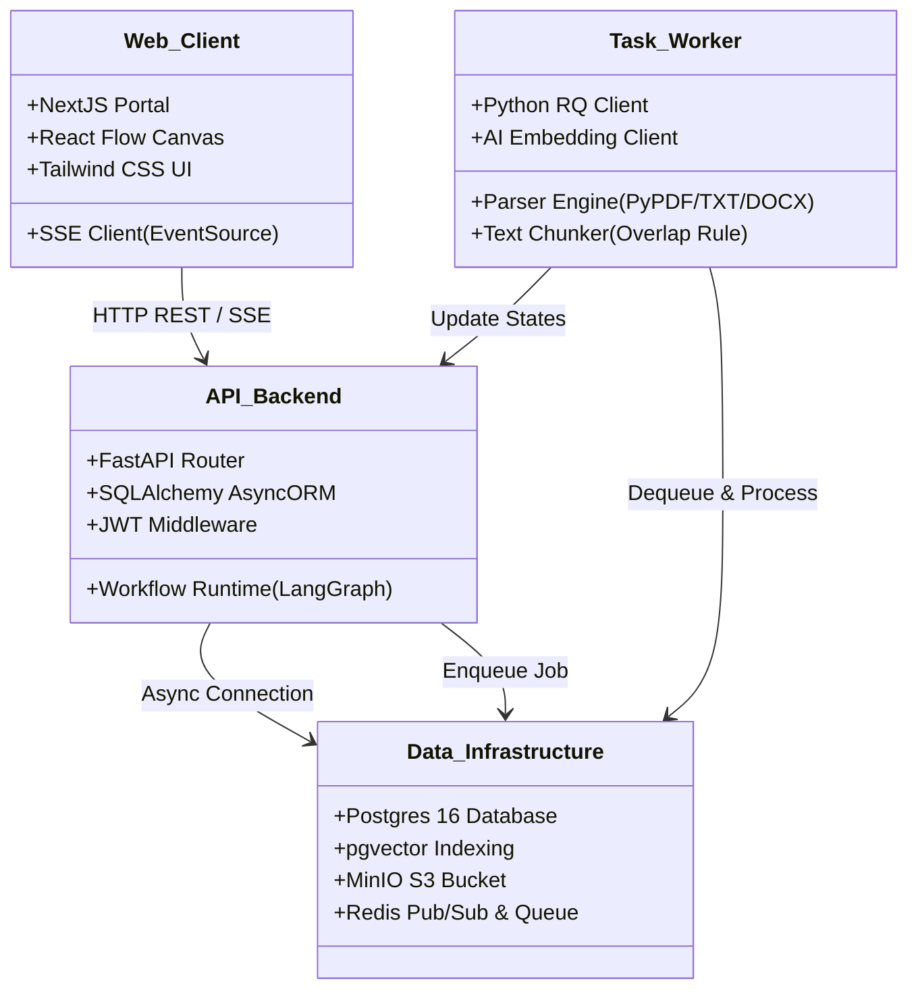
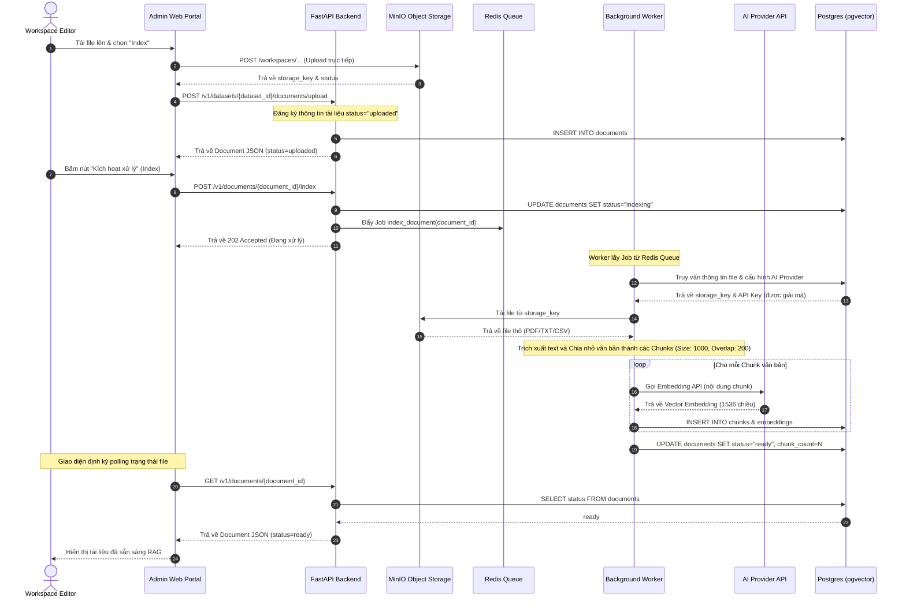
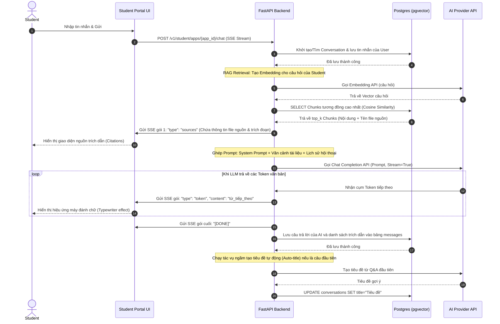
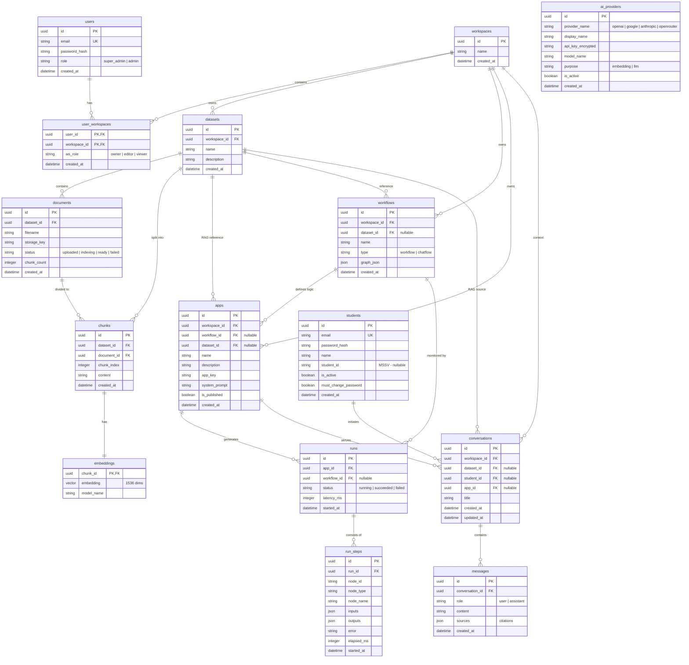

# TÀI LIỆU THIẾT KẾ KIẾN TRÚC TỔNG THỂ VÀ THÀNH PHẦN HỆ THỐNG (QUERION)

Tài liệu này trình bày thiết kế kiến trúc tổng thể, sơ đồ khối phân tầng, các thành phần hệ thống, cấu trúc thư mục, sơ đồ luồng dữ liệu (sequence flows) và phương thức giao tiếp của nền tảng **Querion (Mini-Dify)**. Tài liệu được thiết kế làm nền tảng kỹ thuật phục vụ phát triển, tối ưu hóa hiệu năng và triển khai vận hành.

---

## 1. TỔNG QUAN HỆ THỐNG

**Querion (Mini-Dify)** là một nền tảng xây dựng ứng dụng AI hỗ trợ quản lý tri thức đa không gian làm việc (multi-workspace datasets), thiết kế luồng xử lý bằng giao diện kéo thả (workflow canvas), và cung cấp cổng thông tin hội thoại thời gian thực (SSE streaming chat) tích hợp nguồn trích dẫn tài liệu (citations). 

Hệ thống được thiết kế theo mô hình **Đa khách thuê (Multi-Tenancy)** và kiến trúc **Microservices chia tách trách nhiệm (Decoupled Microservices)**. Các tác vụ nặng như xử lý tài liệu, phân đoạn văn bản và tạo vector nhúng (embedding) được đưa vào hàng đợi chạy ngầm (background job queue) để xử lý bất đồng bộ, giúp duy trì thời gian phản hồi dưới 50ms cho người dùng cuối trên luồng API Gateway chính.

---

## 2. THIẾT KẾ KIẾN TRÚC TỔNG THỂ (OVERALL SYSTEM ARCHITECTURE)

### 2.1 Sơ đồ Kiến trúc Tổng thể (System Architecture Diagram)

```mermaid
graph TD
  subgraph Presentation Layer (Tầng hiển thị)
    AdminWeb[Next.js Portal - Admin/Builder Workspace]
    StudentWeb[Next.js Portal - Student App UI]
  end

  subgraph Application & Gateway Layer (Tầng ứng dụng)
    FastAPI[FastAPI REST Engine]
    AuthLayer[JWT Security Middleware]
    WF_Engine[LangGraph Workflow Runtime]
    
    FastAPI --> AuthLayer
    FastAPI --> WF_Engine
  end

  subgraph Message Queue & Cache Layer (Tầng hàng đợi & bộ nhớ đệm)
    Redis[(Redis Queue & Cache)]
  end

  subgraph Processing Layer (Tầng xử lý ngầm)
    Worker[Python RQ Document Worker]
  end

  subgraph Storage & Infrastructure (Tầng lưu trữ dữ liệu)
    MinIO[(MinIO Object Storage - S3)]
    PG[(Postgres 16 + pgvector)]
  end

  subgraph External AI Services (Dịch vụ AI bên ngoài)
    LLM((External LLM - OpenAI / Gemini / OpenRouter))
  end

  %% Connections
  AdminWeb <-->|REST API / JSON| FastAPI
  StudentWeb <-->|SSE Streaming Chat| FastAPI
  
  FastAPI <-->|SQL / AsyncPG| PG
  FastAPI -->|S3 Upload Client| MinIO
  FastAPI -->|Enqueue Jobs / PubSub| Redis
  FastAPI <-->|API Request / Stream| LLM

  Worker <-->|Dequeue Tasks| Redis
  Worker -->|Tải file tạm| MinIO
  Worker -->|Lưu Chunks & Vectors| PG
  Worker <-->|Tạo Embeddings| LLM
```

### 2.2 Phân tầng Kiến trúc (Architectural Layers)

Hệ thống được chia thành 4 lớp kiến trúc chính nhằm đảm bảo tính tái sử dụng và khả năng mở rộng (Scalability):

1.  **Tầng trình diễn (Presentation Layer):**
    *   **Next.js (React Framework):** Ứng dụng client-side phục vụ hai đối tượng chính:
        *   *Admin/Builder Workspace:* Cho phép Workspace Editor và Owner tạo lập Dataset, cấu hình App và thiết kế đồ thị luồng công việc (Workflow canvas) trực quan qua thư viện **React Flow (@xyflow/react)**.
        *   *Student Portal:* Cổng hội thoại tối giản dành cho sinh viên để giao tiếp trực tiếp với AI thông qua luồng Server-Sent Events (SSE).
    *   **Tailwind CSS:** Thiết kế giao diện hiện đại hỗ trợ tự động đổi giao diện Dark Mode / Light Mode, cấu trúc Responsive thích ứng tốt với mọi độ phân giải thiết bị di động, tablet và desktop.

2.  **Tầng API Gateway & Logic Nghiệp vụ (Application Layer):**
    *   **FastAPI Backend Engine:** Lựa chọn ngôn ngữ Python và framework FastAPI tối ưu hóa khả năng xử lý bất đồng bộ (`async/await`), giúp giảm thiểu tài nguyên tiêu hao khi duy trì hàng ngàn kết nối stream.
    *   **Security Middleware:** Bộ lọc JWT đóng vai trò phân luồng người dùng, áp dụng phân quyền vai trò (Role-Based Access Control - RBAC) và bảo mật Multi-Tenant chống rò rỉ dữ liệu chéo giữa các workspace (`X-Workspace-Id`).
    *   **LangGraph-based Workflow Engine:** Runtime phân tích và vận hành đồ thị tuần tự (Directed Acyclic Graph - DAG) từ cấu hình JSON của Admin Flow gửi lên, gọi tuần tự các node logic (Retrieve, LLM, Http Request, v.v.).

3.  **Tầng Hàng đợi & Công nhân Chạy ngầm (Processing Layer):**
    *   **Redis (Task Queue):** Đóng vai trò môi trường trao đổi tác vụ tạm thời giữa API Backend và Worker Nodes.
    *   **Python RQ (Redis Queue Worker):** Service công nhân chạy ngầm xử lý các tác vụ tiêu tốn nhiều CPU và bộ nhớ RAM như tải tệp tin PDF/Word/TXT dung lượng lớn, bóc tách chuỗi thô (parsing), băm nhỏ dữ liệu văn bản (chunking) và thực hiện nhúng vector hàng loạt (bulk embedding inserts).

4.  **Tầng Hạ tầng và Lưu trữ (Infrastructure & Storage Layer):**
    *   **PostgreSQL 16 & pgvector:** Lưu trữ toàn bộ dữ liệu quan hệ có cấu trúc (thành viên, quyền hạn, cấu hình workflow, lịch sử hội thoại). Phần mở rộng **pgvector** hỗ trợ tìm kiếm khoảng cách ngữ nghĩa (Vector Cosine Distance) tích hợp trực tiếp, cài đặt chỉ mục đồ thị HNSW tối ưu hóa thời gian so khớp dưới 50ms cho kho dữ liệu lớn.
    *   **MinIO Object Storage:** Hệ thống lưu trữ đối tượng dạng S3-compatible cục bộ, lưu trữ các file tài liệu gốc tải lên từ client một cách an toàn và cấp phát qua mã token tạm thời (Presigned URL) khi hiển thị trích dẫn (Citations).

---

## 3. THIẾT KẾ CHI TIẾT CÁC THÀNH PHẦN HỆ THỐNG (SYSTEM COMPONENTS)

Hệ thống được cấu thành từ 4 component chính chạy độc lập trong các Docker containers riêng biệt:



### 3.1 Thành phần Web Client (`apps/web`)

*   **Chức năng:** Cung cấp giao diện người dùng để cấu hình hệ thống, quản lý dataset, vẽ workflow và chat.
*   **Cấu trúc chính:**
    *   `src/app/admin/`: Các màn hình quản trị hệ thống dành cho Super Admin (quản lý workspace, users, cài đặt).
    *   `src/app/apps/`: Giao diện cấu hình ứng dụng AI (Pure Chat, Simple RAG, Workflow).
    *   `src/app/datasets/`: Màn hình quản lý dataset, tải lên tài liệu, xem trước chunk.
    *   `src/app/workflows/`: Canvas vẽ luồng công việc kéo thả dựa trên React Flow.
    *   `src/app/student/`: Cổng thông tin dành cho sinh viên (Đăng nhập, Đổi mật khẩu, Giao diện Chat SSE).
    *   `src/lib/api/`: Thư viện Client-side gọi RESTful API tới Backend.

### 3.2 Thành phần API Backend Gateway (`apps/api`)

*   **Chức năng:** Nhận request, xác thực, phân quyền, xử lý CRUD, điều phối LangGraph workflow và chat streaming.
*   **Cấu trúc chính:**
    *   `app/models/`: Định nghĩa các model SQLAlchemy ánh xạ tới PostgreSQL.
    *   `app/routers/`: Chứa các API controller phân loại theo tài nguyên (`datasets.py`, `documents.py`, `workflows.py`, `apps.py`, `student_auth.py`, `students.py`, v.v.).
    *   `app/services/`: Logic nghiệp vụ lõi (`chat.py`, `retrieval.py`, `workflow_runtime.py`, `encryption.py`).
    *   `app/auth/`: Chứa Middleware xử lý JWT token và context kiểm soát multi-tenant.
    *   `app/config.py`: Đọc cấu hình từ biến môi trường.
    *   `app/db.py` & `app/storage.py`: Thiết lập pool kết nối Postgres và MinIO client.

### 3.3 Thành phần Background Worker (`apps/worker`)

*   **Chức năng:** Nhận tác vụ nạp tài liệu từ Redis, xử lý logic chuyển đổi file thô thành vector.
*   **Cấu trúc chính:**
    *   `worker/tasks/index_document.py`: Trái tim của pipeline xử lý tệp tin.
    *   `worker/pipeline/downloader.py`: Quản lý việc kết nối và tải file từ MinIO S3.
    *   `worker/pipeline/parser.py`: Trích xuất text từ các định dạng PDF, TXT, CSV, Excel, DOCX.
    *   `worker/pipeline/chunker.py`: Thuật toán băm văn bản với cơ chế chồng lấp (overlapping).
    *   `worker/pipeline/embedder.py`: Tích hợp các SDK gọi API nhúng của OpenAI/OpenRouter/Google/Anthropic.

### 3.4 Thành phần Cơ sở hạ tầng (Database & Services)

*   **Postgres + pgvector Container:** Chạy trên cổng 5432, tự động khởi tạo extension `pgvector` phục vụ việc truy vấn khoảng cách Cosine.
*   **MinIO Storage Container:** Lưu trữ tệp tin trên phân vùng cô lập, chạy cổng API 9000 và Console điều hướng 9001.
*   **Redis Container:** Cơ sở dữ liệu In-memory chạy cổng 6379, lưu trữ metadata các Job và làm kênh truyền Pub/Sub hỗ trợ theo dõi trạng thái các bước chạy (Runs).

---

## 4. CẤU TRÚC THƯ MỤC VÀ TỔ CHỨC MÃ NGUỒN

Dưới đây là sơ đồ cấu trúc thư mục chi tiết của dự án Querion:

```
.
├── apps
│   ├── api                             # FASTAPI BACKEND GATEWAY
│   │   ├── alembic                     # Quản lý migration cơ sở dữ liệu
│   │   │   └── versions                # Các file script migration từ 0001 đến 0013
│   │   ├── app
│   │   │   ├── auth                    # Xác thực & Phân quyền JWT
│   │   │   ├── models                  # SQLAlchemy Models (User, Dataset, App, Workflow...)
│   │   │   ├── routers                 # REST API Endpoints (apps, datasets, workflows...)
│   │   │   ├── schemas                 # Pydantic Schemas (data validation)
│   │   │   ├── services                # Nghiệp vụ logic (workflow_runtime, retrieval...)
│   │   │   ├── config.py               # File cấu hình ứng dụng
│   │   │   ├── db.py                   # Quản lý session DB (AsyncSession)
│   │   │   ├── main.py                 # Điểm khởi chạy API Gateway
│   │   │   └── storage.py              # Kết nối và thao tác với MinIO
│   │   ├── Dockerfile
│   │   └── pyproject.toml
│   ├── web                             # NEXT.JS FRONTEND PORTAL
│   │   ├── src
│   │   │   ├── app                     # Next.js App Router (admin, student, workflows...)
│   │   │   ├── components              # Các UI Component (canvas, datasets, layout...)
│   │   │   ├── lib                     # API Client SDK và cấu hình chung
│   │   │   └── locales                 # Đa ngôn ngữ (i18n) tiếng Anh (en) và tiếng Việt (vi)
│   │   ├── Dockerfile
│   │   └── package.json
│   └── worker                          # REDIS QUEUE BACKGROUND WORKER
│       ├── worker
│       │   ├── pipeline                # Pipeline xử lý tài liệu (downloader, parser, chunker, embedder)
│       │   ├── tasks                   # Task chạy ngầm định nghĩa cho RQ (index_document.py)
│       │   ├── config.py
│       │   ├── db.py
│       │   └── main.py                 # Khởi chạy Worker lắng nghe hàng đợi Redis
│       ├── Dockerfile
│       └── requirements.txt
├── docs                                # TÀI LIỆU DỰ ÁN
│   ├── plan                            # Kế hoạch phát triển các Phase
│   ├── starter                         # Đặc tả kỹ thuật ban đầu
│   ├── THIET_KE_TONG_THE_HE_THONG.md
│   └── THIET_KE_KNOWLEDGE_BASE_VECTOR_DB.md
├── infra                               # HẠ TẦNG DOCKER
│   └── docker
│       ├── docker-compose.yml          # Compose quản lý Postgres, Redis, MinIO
│       └── init-db.sql                 # Script khởi tạo database ban đầu
├── start.ps1                           # Script PowerShell khởi chạy toàn bộ hệ thống
└── stop.ps1                            # Script PowerShell dừng hệ thống
```

---

## 5. QUY TRÌNH LUỒNG DỮ LIỆU (KEY SEQUENCE FLOWS)

### 5.1 Quy trình Nạp và Xử lý Tài liệu (RAG Ingestion Pipeline)

Quy trình nạp tài liệu được thiết kế bất đồng bộ sử dụng hàng đợi **Redis Queue (RQ)** để tránh nghẽn luồng API chính:



### 5.2 Quy trình Hội thoại thời gian thực (SSE Streaming Chat with Citations)

Mô tả luồng nhắn tin từ Student Portal, thực hiện tìm kiếm ngữ nghĩa, sinh câu trả lời streaming SSE và hiển thị nguồn trích dẫn:



---

## 6. MÔ HÌNH DỮ LIỆU (ENTITY RELATIONSHIP DIAGRAM - ERD)

Dưới đây là mô hình quan hệ thực thể (ERD) mô tả cấu trúc dữ liệu của dự án Querion:



---

## 7. BẢO MẬT & PHÂN TÁCH DỮ LIỆU ĐA KHÁCH THUÊ (MULTI-TENANCY)

Bảo mật Multi-Tenant được triển khai ngay tại tầng CSDL và được kiểm tra nghiêm ngặt tại Tầng API qua các bước:

1.  **Nhận diện khách thuê (Tenant Identity):** Mỗi khi Admin gửi request, API yêu cầu cung cấp Header `X-Workspace-Id` đi kèm token xác thực JWT hợp lệ.
2.  **Kiểm tra phân quyền (RBAC Check):** Hệ thống thực thi truy vấn bảng Pivot `user_workspaces` để xác định role (`owner`, `editor`, `viewer`) của người dùng đối với Workspace yêu cầu.
3.  **Cô lập truy vấn (Query Isolation):** Mọi câu lệnh SQL truy vấn Database đều bắt buộc phải đính kèm điều kiện lọc theo `workspace_id` hiện hành. Ví dụ:
    ```sql
    SELECT * FROM datasets WHERE workspace_id = :current_workspace_id;
    ```
    Điều này loại bỏ hoàn toàn khả năng truy cập chéo dữ liệu trái phép giữa các workspace.
4.  **Mã hóa thông tin nhạy cảm:** Các khóa API Key của AI Provider được mã hóa bằng thuật toán đối xứng **AES-GCM (256-bit)** với khóa bí mật được lưu an toàn trong biến môi trường hệ thống. API Key chỉ được giải mã tạm thời trong bộ nhớ khi thực hiện các cuộc gọi API nhúng vector hoặc chat tới AI Provider.

---

## 8. PHƯƠNG ÁN TỐI ƯU HÓA VÀ XỬ LÝ SỰ CỐ

### 8.1 Giới hạn Rate-Limit của Embedding API (HTTP 429)
*   **Vấn đề:** Khi tiến hành nạp tài liệu rất lớn, việc gửi các request tạo embedding liên tục dễ làm quá tải rate-limit của AI Provider.
*   **Giải pháp:**
    1.  *Batching:* Gộp các chunks thành từng nhóm (batch) từ 16 - 32 chunks để gửi trong một request API nhúng duy nhất.
    2.  *Exponential Backoff & Retry:* Áp dụng cơ chế tự động thử lại trong Worker Task với khoảng thời gian chờ tăng dần theo cấp số nhân khi gặp lỗi HTTP 429 hoặc lỗi kết nối.

### 8.2 Dọn dẹp Dữ liệu thừa (Cascade Deletion)
*   **Vấn đề:** Tránh việc các vector mồ côi chiếm dung lượng Vector DB khi tài liệu hoặc dataset bị xóa.
*   **Giải pháp:** Áp dụng ràng buộc khóa ngoại `ON DELETE CASCADE` ở mức cơ sở dữ liệu từ `datasets` -> `documents` -> `chunks` -> `embeddings`. Khi một Dataset hoặc Document bị xóa, Postgres sẽ tự động dọn dẹp sạch toàn bộ các bản ghi chunk và vector tương ứng.

### 8.3 Xử lý tiếng Việt và Mã hóa ký tự (Unicode Normalization)
*   **Vấn đề:** Tài liệu tiếng Việt hoặc chứa các ký tự Unicode đặc biệt dễ gây lỗi trích xuất văn bản hoặc giảm độ chính xác khi so khớp tương đồng ngữ nghĩa.
*   **Giải pháp:** Áp dụng chuẩn hóa chuỗi Unicode Normalization (NFC) trước khi gửi dữ liệu sang mô hình nhúng vector, đồng thời ép kiểu mã hóa UTF-8 ở tất cả các khâu đọc/ghi file thô.
