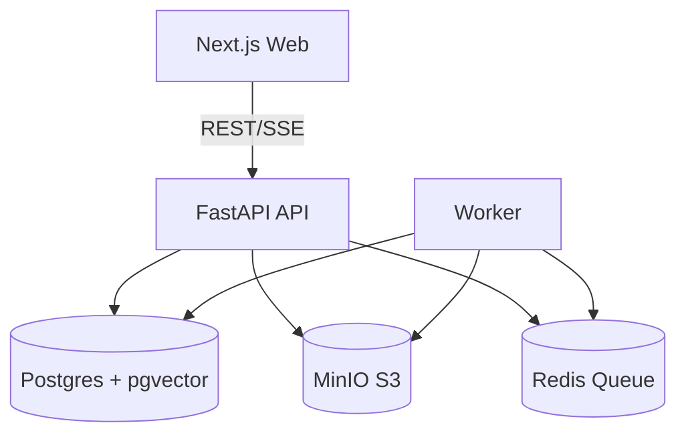
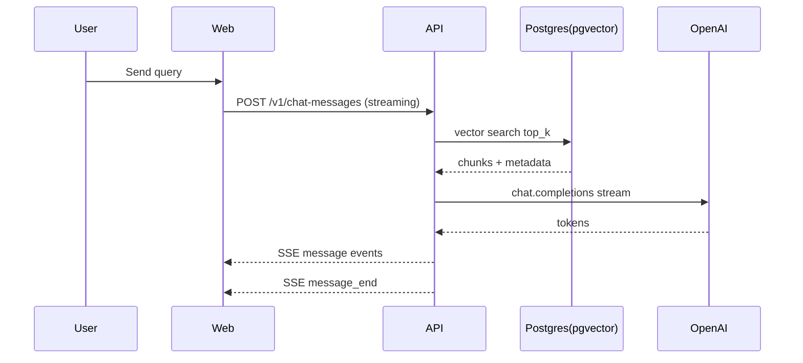

# Architecture

## Services
- Web (Next.js): Admin + Builder + Chat UI
- API (FastAPI): Auth, Datasets, Workflows, Apps, Chat SSE
- Worker: indexing jobs (parse/chunk/embed)
- Postgres + pgvector: metadata + embeddings
- MinIO: S3 compatible object storage
- Redis: queues + caching

Vector search uses pgvector:
https://github.com/pgvector/pgvector

Workflow runtime uses LangGraph:
https://github.com/langchain-ai/langgraph

SSE streaming contract aligned with Dify:
https://docs.dify.ai/api-reference/chat/send-chat-message

---

## Request flows (sequence)

### A) Upload + Index
User -> Web -> API (upload multipart)
API -> MinIO (put_object)
API -> Postgres (document row status=uploaded)
User clicks "Index"
Web -> API (enqueue)
API -> Redis queue
Worker -> MinIO (get_object)
Worker -> parse/chunk/embed
Worker -> Postgres (chunks + embeddings, status=ready)

### B) Chat (streaming)
User -> Web -> API POST /v1/chat-messages response_mode=streaming
API -> Workflow runtime (LangGraph)
Node retrieve -> Postgres pgvector top_k
Node llm_generate -> OpenAI stream tokens
API -> Web via SSE events
Web -> render streaming answer + sources

---

## Mermaid diagrams

### Components

### Chat streaming

